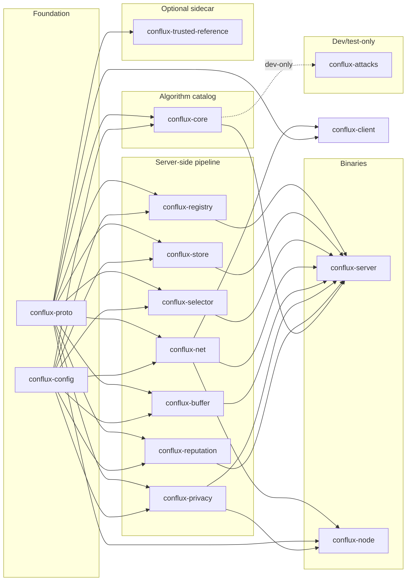

# Conflux Federated Learning Framework (Conflux-FL)

[](https://github.com/conflux-fl/conflux-fl/actions/workflows/ci.yml)

**A configurable, extensible, Rust-native federated learning framework.**

Python (PyTorch) stays entirely client-side for model training; Rust
owns networking, orchestration, aggregation, privacy, and reputation.
One codebase supports four deployment topologies — cross-silo,
cross-device, crowdsource, edge — selected by configuration, not by
forking code. The name captures the core metaphor: many independent,
heterogeneous client contributions *conflux*-ing into one stronger
global model.

```
 client A ─┐
 client B ─┼─▶ Conflux round pipeline ─▶ one global model
 client C ─┘ (select · train · aggregate · repeat)
```

## What it offers

- **A faithful, extensible catalog of published aggregation methods** —
 FedAvg, Krum, Multi-Krum, Trimmed Mean, Median, FABA, Bulyan,
 Geometric Median (RFA), Median-of-Means, Divide-and-Conquer, and
 FoolsGold, eleven methods today, each a literal implementation of a
 specific cited paper, not a framework-modified variant. See
 [`docs/AGGREGATION_LANDSCAPE.md`](docs/AGGREGATION_LANDSCAPE.md) for
 the full landscape, including what's deliberately not built yet and
 why.
- **Four deployment topologies from one codebase** — `cross_silo`
 (institutions, push+mTLS), `cross_device` (phones, pull+JWT),
 `crowdsource` (public participants, stricter reputation), `edge`
 (IoT) — selected entirely by configuration.
- **A layered, explainable configuration system** — every parameter
 resolves through a fixed six-tier precedence chain (builtin →
 topology → mode → experiment file → env var → CLI), and every
 resolved value logs which tier it came from, so a misconfigured
 deployment is debuggable without reading source.
- **Differential privacy and epsilon accounting** — clip + Gaussian
 noise (Abadi et al., 2016), RDP composition (Mironov 2017).
- **Real backends, not just an in-memory demo** — `RedisRegistry`,
 `PostgresStore`, `S3Store`, mTLS, node authentication, all tested
 against real Docker-backed infrastructure, not mocks.
- **A dev-only attack simulation crate** (`conflux-attacks`) — cited
 implementations of known FL attacks and application-level
 attack-vs-defense tests, structurally incapable of shipping in the
 production server binary (never even a dependency of it).
- **Extensibility as a first-class design goal** — adding a new
 aggregation method, selector, or privacy mechanism is typically a
 ~10–30 line trait implementation plus one registry line; the server
 never needs to change. See [Extending Conflux](#extending-conflux)
 below.

## Quick start

```bash
cargo build --workspace
cargo test --workspace
```

Run the full three-process pipeline locally (a real `conflux-server`, a
real `conflux-node`, and a stub Python client, all talking over real
gRPC) — see **[docs/USAGE.md](docs/USAGE.md)** for the complete
walkthrough, durable-backend setup (Redis/Postgres/MinIO), mTLS, and
every configuration knob.

## Train a real model with it

Two complete, working end-to-end demos train a real model across
several simulated clients through the real Conflux pipeline — not a
toy, actual gradient descent with real convergence numbers:

```bash
cd python/conflux_client
python3 -m venv .venv && .venv/bin/pip install -r requirements.txt \
 -r examples/e2e_pytorch_mnist/requirements.txt
./generate_proto.sh && source .venv/bin/activate
cd examples/e2e_pytorch_mnist
./run_demo.sh krum 5 15 --poison --no-reputation
```

```
=== centralized baseline (target accuracy) ===
held_out_accuracy=0.8890

=== 5 trainer clients + 1 eval client, one persistent attacker present every round ===
round=2 held_out_accuracy=0.7210
round=6 held_out_accuracy=0.8810
round=15 held_out_accuracy=0.9050
```

A real PyTorch MLP on real MNIST, federated across 5 clients, matching a
centralized baseline within a couple points — **despite a persistent
large-magnitude attacker submitting every round**, because `krum` is
doing exactly what Blanchard et al. (2017) says it should.

- **[Option A — NumPy logistic regression](python/conflux_client/examples/e2e_numpy_logreg/README.md)**: the simplest possible real demo, no PyTorch dependency, best first read.
- **[Option B — PyTorch + real MNIST](python/conflux_client/examples/e2e_pytorch_mnist/README.md)**: the higher-fidelity version above, including a real bug it surfaced (zero-init breaking a ReLU network) and how it was fixed.
- **[docs/E2E_TESTING.md](docs/E2E_TESTING.md)**: the design rationale behind both, and what they found.

## The crates

Fifteen crates, dependency graph is acyclic. Full reference — purpose,
why each is its own crate, and how to extend it — in
**[docs/CRATES.md](docs/CRATES.md)**; architecture and build history in
**[docs/ARCHITECTURE.md](docs/ARCHITECTURE.md)**.



| Crate | In one line |
|---|---|
| [`conflux-proto`](crates/conflux-proto) | Wire schema shared by the network hop *and* the local client hop |
| [`conflux-config`](crates/conflux-config) | Layered config resolution + the strategy registry every algorithm registers into |
| [`conflux-registry`](crates/conflux-registry) | Client lifecycle — register, heartbeat, evict |
| [`conflux-store`](crates/conflux-store) | Model checkpoints + experiment metadata persistence |
| [`conflux-selector`](crates/conflux-selector) | Who gets asked to train this round |
| [`conflux-net`](crates/conflux-net) | Dual-mode (push/pull) gRPC transport + mTLS |
| [`conflux-buffer`](crates/conflux-buffer) | Quorum/timeout staging of a round's submitted deltas |
| [`conflux-privacy`](crates/conflux-privacy) | DP clip+noise, epsilon accounting |
| [`conflux-reputation`](crates/conflux-reputation) | Opt-in per-client contribution scoring |
| [`conflux-core`](crates/conflux-core) | **The aggregation catalog** — where a new published method gets added |
| [`conflux-attacks`](crates/conflux-attacks) | *(dev/test-only)* Known FL attacks + attack-vs-defense tests, never shippable in production |
| [`conflux-server`](crates/conflux-server) | *(binary)* Integrates everything into the round pipeline |
| [`conflux-trusted-reference`](crates/conflux-trusted-reference) | *(optional sidecar)* Server-side trusted-dataset training for `fltrust` — a separate process, never a server dependency |
| [`conflux-node`](crates/conflux-node) | *(binary)* Thin client-side bridge to the local `ClientApp` (Python or Rust) |
| [`conflux-client`](crates/conflux-client) | Rust-native `ClientApp` SDK — train in Rust, no Python in the loop |

## Extending Conflux

Adding a new aggregation method — the most common extension — is a new
trait impl plus one registry line, with **zero changes to
`conflux-server`**:

```rust
// crates/conflux-core/src/robust.rs
pub struct MyFilter { pub byzantine_fraction: f32 }
impl UpdateFilter for MyFilter {
 fn filter(&self, updates: &[ClientDelta]) -> Result<SelectionResult, AggregatorError> {
 // score, select, return the indices you trust
 }
}
```

```rust
// crates/conflux-core/src/lib.rs
inventory::submit! {
 StrategyEntry { kind: StrategyKind::Aggregator, name: "my_method" }
}
// + one match arm in build_aggregator
```

`aggregator = "my_method"` in any experiment's config now resolves and
constructs it. The same pattern (trait impl + `inventory::submit!` +
one registry match arm) adds a new client selector or privacy
mechanism. Full step-by-step guide, including which of four aggregation
"shapes" to pick and the citation discipline every shipped method
follows: **[docs/EXTENDING.md](docs/EXTENDING.md)**.

## Documentation map

| Doc | Read it for |
|---|---|
| [docs/ARCHITECTURE.md](docs/ARCHITECTURE.md) | How the pieces fit together — start here |
| [docs/CRATES.md](docs/CRATES.md) | Crate-by-crate reference and extension points |
| [docs/USAGE.md](docs/USAGE.md) | Building, running, testing, configuration, durable backends, mTLS |
| [docs/EXTENDING.md](docs/EXTENDING.md) | Step-by-step: add an aggregator, selector, privacy mechanism, or attack |
| [docs/AGGREGATION_LANDSCAPE.md](docs/AGGREGATION_LANDSCAPE.md) | The wider aggregation-method literature vs. what's shipped |
| [docs/E2E_TESTING.md](docs/E2E_TESTING.md) | Real-model/real-dataset test harness design and findings |
| [docs/WEB_APP_INTEGRATION.md](docs/WEB_APP_INTEGRATION.md) | Integrating the HTTP admin API into an external application |
| [CHANGELOG.md](CHANGELOG.md) | What changed in each release |
| [CONTRIBUTING.md](CONTRIBUTING.md) | How to build, what gets merged, and the four things this project is opinionated about |
| [SECURITY.md](SECURITY.md) | Reporting a vulnerability, and what is deliberately out of scope |

### A note on `ADR NNNN`

Doc comments throughout the code cite decisions as `ADR 0004`,
`ADR 0012`, and so on. Each is a numbered architecture decision — the
*why* behind something the code cannot explain about itself, usually
because a reasonable-looking alternative was considered and rejected.

The citation is deliberately terse so it does not crowd the comment that
carries it. (`spec §N` is the same convention pointing into the original
v1 design specification.) The decision records themselves are published as a reference
on the documentation site rather than kept in this repository, which is
scoped to the framework and its use.

Where a decision matters for using or extending Conflux, the relevant
document says so in full — [EXTENDING.md](docs/EXTENDING.md) and
[API_STABILITY.md](docs/API_STABILITY.md) in particular do not assume
you have read anything else.

## Project status

**501 tests** pass workspace-wide, including a cross-round adversarial
suite that holds every aggregation method to "never panic, never return
a non-finite aggregate". `cargo fmt --check` and
`cargo clippy --workspace --all-targets` are clean, the latter under
`-D warnings`.

Twenty-two server-side aggregation methods across five families, plus
FedProx client-side. Both client SDKs (Python and Rust) ship. Durable
Redis / Postgres / S3 backends, mTLS and JWT node authentication, and
differential privacy with epsilon accounting that survives a restart.

Version `0.1.0`. The `0.x` is deliberate and
[documented](docs/API_STABILITY.md): the public API is still moving, and
a `1.0` would be a compatibility promise this codebase is not ready to
make. Breaking changes land in minor versions until then.

Unpublished research built *on* Conflux lives in a separate repository,
not here — this one ships literal, cited implementations of published
methods (ADR 0008).

## License

Licensed under the [Apache License, Version 2.0](LICENSE).

Copyright the Conflux FL authors.

Unless you explicitly state otherwise, any contribution intentionally
submitted for inclusion in this work shall be licensed as above, without
any additional terms or conditions.
