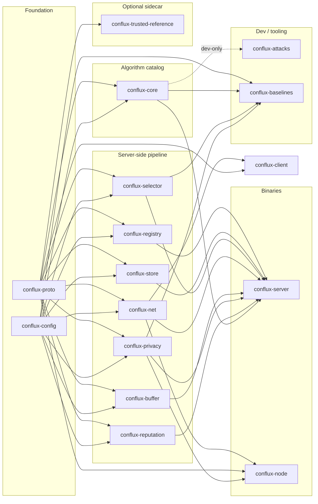

# Conflux Federated Learning Framework (Conflux-FL)

[](https://github.com/conflux-fl/conflux-fl/actions/workflows/ci.yml)
[](https://confluxfl.dev)

**A configurable, extensible, Rust-native federated learning framework.**

> 📖 **Documentation, tutorials, and reference live at [confluxfl.dev](https://confluxfl.dev).**
> This repository holds the framework's code and development files.

Python (PyTorch) stays entirely client-side for model training; Rust
owns networking, orchestration, aggregation, privacy, and reputation.
One codebase supports four deployment topologies — cross-silo,
cross-device, crowdsource, edge — selected by configuration, not by
forking code. The name captures the core metaphor: many independent,
heterogeneous client contributions *conflux*-ing into one stronger
global model.

```
 client A ─┐
 client B ─┼─▶ Conflux round pipeline ─▶ one global model
 client C ─┘ (select · train · aggregate · repeat)
```

## What it offers

- **A faithful, extensible catalog of published aggregation methods** —
  twenty-two server-side methods across five families (`averaging`,
  `robust`, `temporal`, `trusted`, `optimization`): FedAvg, Krum,
  Multi-Krum, Trimmed Mean, Median, Bulyan, FoolsGold, FLTrust, Zeno,
  SCAFFOLD, FedNova, q-FedAvg, FedAdam/Yogi/Adagrad, and more — each a
  literal implementation of a specific cited paper, not a
  framework-modified variant. [Aggregation
  catalog →](https://confluxfl.dev/reference/aggregation-catalog/)
- **Baselines that reproduce the papers** — `baselines/` holds
  reproduction recipes (a manifest naming a cataloged method plus the
  paper's setup and expected result), each runnable through a **Python
  (PyTorch)** and/or **Rust (Burn)** client, driven and verified by the
  `conflux-baselines` runner. [Baselines
  →](https://confluxfl.dev/guides/baselines/)
- **Four deployment topologies from one codebase** — `cross_silo`
  (institutions, push+mTLS), `cross_device` (phones, pull+JWT),
  `crowdsource` (public participants, stricter reputation), `edge`
  (IoT) — selected entirely by configuration.
- **A layered, explainable configuration system** — every parameter
  resolves through a fixed precedence chain (builtin → topology → mode →
  experiment file → env var), profiles can `inherit` and extend a
  builtin, values are validated for ranges *and* combinations before
  startup, and every resolved value logs which tier it came from.
  [Configuration →](https://confluxfl.dev/guides/configuration/)
- **Differential privacy and epsilon accounting** — clip + Gaussian
  noise (Abadi et al., 2016), RDP composition (Mironov 2017).
- **Real backends and real auth** — `RedisRegistry`, `PostgresStore`,
  `S3Store`; node admission by allow-list, per-client token/JWT, or mTLS
  (the node resolves plaintext / server-authenticated / mutual TLS from
  its env) — all tested against real Docker-backed infrastructure, not
  mocks.
- **Two client SDKs** — a Python `ClientApp` for PyTorch, and a
  Rust-native `ClientApp` (`conflux-client`) that trains with no Python
  in the loop, including an opt-in [Burn](https://burn.dev) example.
- **A dev-only attack simulation crate** (`conflux-attacks`) — cited
  implementations of known FL attacks and attack-vs-defense tests,
  structurally incapable of shipping in the production server binary.
- **Extensibility as a first-class design goal** — a new aggregation
  method, selector, or privacy mechanism is typically a ~10–30 line
  trait implementation plus one registry line; the server never
  changes. [Extending →](https://confluxfl.dev/guides/extending/)

## Quick start

```bash
cargo build --workspace
cargo test --workspace
```

Then run the full pipeline locally (a real `conflux-server`, a real
`conflux-node`, and a client, all over real gRPC): **[Getting
started →](https://confluxfl.dev/getting-started/)**.

## Train a real model with it

Four end-to-end harnesses train real models across simulated clients
through the real pipeline — NumPy logistic regression, PyTorch MNIST,
CIFAR-10, and a Shakespeare character model — with real convergence
numbers, and a persistent attacker to defend against:

```bash
cd python/conflux_client
python3 -m venv .venv && .venv/bin/pip install -r requirements.txt \
  -r examples/e2e_pytorch_mnist/requirements.txt
./generate_proto.sh && source .venv/bin/activate
cd examples/e2e_pytorch_mnist
./run_demo.sh krum 5 15 --poison --no-reputation
```

```
=== centralized baseline (target accuracy) ===
held_out_accuracy=0.8890

=== 5 trainer clients + 1 eval client, one persistent attacker present every round ===
round=2  held_out_accuracy=0.7210
round=15 held_out_accuracy=0.9050
```

A real PyTorch MLP on real MNIST, federated across 5 clients, matching a
centralized baseline within a couple of points — **despite a
large-magnitude attacker submitting every round**, because `krum` does
what Blanchard et al. (2017) says it should.

- **[Tutorial: train a real model →](https://confluxfl.dev/tutorial/)**
- **[The harnesses, and the bugs they surfaced →](https://confluxfl.dev/guides/e2e-harnesses/)**
- **[Reproduce a paper as a baseline →](https://confluxfl.dev/guides/baselines-add/)**

## Deploy it

`deploy/run_client.sh` launches a participant (node + trainer) on any
machine; `deploy/allowlist.sh` admits clients to a running server. The
realistic paths to 10–20 real clients — trusted-network, token/JWT, or
mTLS — are in **[Deploying 10–20 real
clients →](https://confluxfl.dev/guides/deploying-clients/)**, with the
server side in [Deployment](https://confluxfl.dev/guides/deployment/) and
[Durable backends, the sidecar, and
mTLS](https://confluxfl.dev/guides/backends-and-sidecar/).

## The crates

Sixteen crates; the dependency graph is acyclic. Crate-by-crate
reference: **[Crates →](https://confluxfl.dev/reference/crates/)**; how
they fit: **[Architecture →](https://confluxfl.dev/guides/architecture/)**;
a lesson per crate: **[Crate deep dives →](https://confluxfl.dev/crate-deep-dives/)**.



| Crate | In one line |
|---|---|
| [`conflux-proto`](crates/conflux-proto) | Wire schema shared by the network hop *and* the local client hop |
| [`conflux-config`](crates/conflux-config) | Layered config resolution + the strategy registry every algorithm registers into |
| [`conflux-registry`](crates/conflux-registry) | Client lifecycle — register, heartbeat, evict; the node allow-list |
| [`conflux-store`](crates/conflux-store) | Model checkpoints + experiment metadata persistence |
| [`conflux-selector`](crates/conflux-selector) | Who gets asked to train this round |
| [`conflux-net`](crates/conflux-net) | Dual-mode (push/pull) gRPC transport + TLS/mTLS builders |
| [`conflux-buffer`](crates/conflux-buffer) | Quorum/timeout staging of a round's submitted deltas |
| [`conflux-privacy`](crates/conflux-privacy) | DP clip+noise, epsilon accounting |
| [`conflux-reputation`](crates/conflux-reputation) | Opt-in per-client contribution scoring |
| [`conflux-core`](crates/conflux-core) | **The aggregation catalog** — where a new published method gets added |
| [`conflux-attacks`](crates/conflux-attacks) | *(dev/test-only)* Known FL attacks + attack-vs-defense tests, never shippable in production |
| [`conflux-baselines`](crates/conflux-baselines) | *(tool)* Runs and verifies the paper reproductions in [`baselines/`](baselines/) |
| [`conflux-server`](crates/conflux-server) | *(binary)* Integrates everything into the round pipeline |
| [`conflux-trusted-reference`](crates/conflux-trusted-reference) | *(optional sidecar)* Server-side trusted-dataset training for `fltrust`/`zeno` — a separate process, never a server dependency |
| [`conflux-node`](crates/conflux-node) | *(binary)* Thin client-side bridge to the local `ClientApp` (Python or Rust) |
| [`conflux-client`](crates/conflux-client) | Rust-native `ClientApp` SDK — train in Rust, no Python in the loop |

## Extending Conflux

Adding a new aggregation method — the most common extension — is a new
trait impl plus one registry line, with **zero changes to
`conflux-server`**:

```rust
// crates/conflux-core/src/robust.rs
pub struct MyFilter { pub byzantine_fraction: f32 }
impl UpdateFilter for MyFilter {
    fn filter(&self, updates: &[ClientDelta]) -> Result<SelectionResult, AggregatorError> {
        // score, select, return the indices you trust
    }
}
```

```rust
// crates/conflux-core/src/lib.rs
inventory::submit! {
    StrategyEntry { kind: StrategyKind::Aggregator, name: "my_method", /* citation, family, params */ }
}
// + one match arm in build_aggregator
```

`aggregator = "my_method"` in any experiment's config now resolves and
constructs it. The same pattern adds a selector or privacy mechanism.
Full guide, including which of four aggregation "shapes" to pick and the
citation discipline every shipped method follows:
**[Extending →](https://confluxfl.dev/guides/extending/)**.

## Documentation

Everything user-facing is on **[confluxfl.dev](https://confluxfl.dev)**:

| | |
|---|---|
| [Getting started](https://confluxfl.dev/getting-started/) | Build, test, run the pipeline locally |
| [Tutorials](https://confluxfl.dev/tutorial/) | Train a real model · compare methods · reproduce FedAvg · profiles · validation |
| [Architecture](https://confluxfl.dev/guides/architecture/) · [Crates](https://confluxfl.dev/reference/crates/) | How the pieces fit; crate-by-crate reference |
| [Configuration](https://confluxfl.dev/guides/configuration/) · [Config catalog](https://confluxfl.dev/reference/configuration-catalog/) | Topologies, modes, profiles, validation, every knob |
| [Aggregation catalog](https://confluxfl.dev/reference/aggregation-catalog/) · [Baselines](https://confluxfl.dev/guides/baselines/) | The 22 cited methods; reproducing the papers |
| [Extending](https://confluxfl.dev/guides/extending/) · [Attack testing](https://confluxfl.dev/guides/attack-testing/) | Add a method, selector, mechanism, or attack |
| [Deployment](https://confluxfl.dev/guides/deployment/) · [Deploying clients](https://confluxfl.dev/guides/deploying-clients/) · [Backends & sidecar](https://confluxfl.dev/guides/backends-and-sidecar/) | Running it for real |
| [Client distribution](https://confluxfl.dev/guides/client-distribution/) · [Client simulation](https://confluxfl.dev/guides/client-simulation/) | Getting the client out; real vs. virtual clients |
| [Web-app integration](https://confluxfl.dev/guides/web-app-integration/) · [API stability](https://confluxfl.dev/reference/api-stability/) | The HTTP admin surface; what is promised before 1.0 |
| [Crate deep dives](https://confluxfl.dev/crate-deep-dives/) · [Blog](https://confluxfl.dev/blog/) | A Rust lesson per crate; concepts in plain terms |

In this repository: [CHANGELOG.md](CHANGELOG.md) · [CONTRIBUTING.md](CONTRIBUTING.md) ·
[SECURITY.md](SECURITY.md) · [`deploy/`](deploy/README.md) · [`baselines/`](baselines/README.md).
`docs/` keeps only the generated aggregation catalog (a golden-file test artifact).

### A note on `ADR NNNN`

Doc comments throughout the code cite decisions as `ADR 0004`,
`ADR 0012`, and so on — each a numbered architecture decision, the *why*
behind something the code cannot explain about itself, usually because a
reasonable-looking alternative was considered and rejected. (`spec §N`
is the same convention pointing into the original v1 design
specification.) The citation is deliberately terse so it does not crowd
the comment that carries it.

A one-line summary of each decision is on the site under
[Architecture → Architecture decisions](https://confluxfl.dev/guides/architecture/#architecture-decisions);
the full records live in the project's engineering log, kept outside this
repository. Where a decision matters for using or extending Conflux, the
relevant guide says so in full — [Extending](https://confluxfl.dev/guides/extending/)
and [API stability](https://confluxfl.dev/reference/api-stability/) in
particular do not assume you have read anything else.

## Project status

**536 tests** pass workspace-wide, including a cross-round adversarial
suite that holds every aggregation method to "never panic, never return
a non-finite aggregate". `cargo fmt --check` and
`cargo clippy --workspace --all-targets` are clean, the latter under
`-D warnings`; `cargo deny` gates advisories and licenses.

Twenty-two server-side aggregation methods across five families, plus
FedProx client-side. Both client SDKs (Python and Rust) ship, with four
paper reproductions in `baselines/` verified through the Rust edge.
Durable Redis / Postgres / S3 backends, allow-list / token-JWT / mTLS
node authentication, and differential privacy with epsilon accounting
that survives a restart.

Version `0.1.0`. The `0.x` is deliberate and
[documented](https://confluxfl.dev/reference/api-stability/): the public
API is still moving, and a `1.0` would be a compatibility promise this
codebase is not ready to make. Breaking changes land in minor versions
until then.

Unpublished research built *on* Conflux lives in a separate repository,
not here — this one ships literal, cited implementations of published
methods (ADR 0008).

## License

Licensed under the [Apache License, Version 2.0](LICENSE).

Copyright the Conflux FL authors.

Unless you explicitly state otherwise, any contribution intentionally
submitted for inclusion in this work shall be licensed as above, without
any additional terms or conditions.
