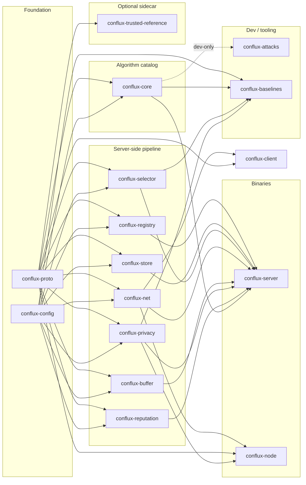

<p align="center">
  
</p>

<h1 align="center">Conflux FL</h1>

<p align="center">
  <b>A configurable, extensible, Rust-native federated learning framework.</b><br>
  <sub>Rust owns the pipeline. Train in PyTorch — or in pure Rust. Four deployment topologies from one codebase.</sub>
</p>

<p align="center">
  <a href="https://github.com/conflux-fl/conflux-fl/actions/workflows/ci.yml"></a>
  <a href="https://confluxfl.dev"></a>
  
  
  
</p>

<p align="center">
  <a href="https://confluxfl.dev/getting-started/"><b>Getting started</b></a> &nbsp;·&nbsp;
  <a href="https://confluxfl.dev/tutorial/"><b>Tutorials</b></a> &nbsp;·&nbsp;
  <a href="https://confluxfl.dev/reference/aggregation-catalog/"><b>Catalog</b></a> &nbsp;·&nbsp;
  <a href="https://confluxfl.dev/guides/baselines/"><b>Baselines</b></a> &nbsp;·&nbsp;
  <a href="https://confluxfl.dev/guides/deploying-clients/"><b>Deploy</b></a> &nbsp;·&nbsp;
  <a href="https://confluxfl.dev/crate-deep-dives/"><b>Deep dives</b></a>
</p>

---

Conflux FL puts Rust in charge of everything between the clients and the
global model — networking, orchestration, client selection,
Byzantine-robust aggregation, differential privacy, reputation — while
training stays wherever your model lives: a PyTorch `ClientApp` in
Python, or a pure-Rust client (optionally on [Burn](https://burn.dev))
that ships as a single binary. Twenty-two published aggregation methods
are implemented literally from their papers and selected by name; four
deployment topologies — cross-silo, cross-device, crowdsource, edge —
come from one codebase by configuration, not by forking; and the parts
that usually get faked are real: Redis/Postgres/S3 backends, allow-list /
JWT / mTLS node authentication, and privacy accounting that survives a
restart, all tested against real infrastructure. The name is the idea —
many independent, heterogeneous contributions *conflux*-ing into one
stronger model.

```
   ┌────────────────┐    ┌────────────────┐    ┌────────────────┐
   │  client A      │    │  client B      │    │  client C      │
   │  PyTorch or    │    │  PyTorch or    │    │  PyTorch or    │
   │  Rust ClientApp│    │  Rust ClientApp│    │  Rust ClientApp│
   └───────┬────────┘    └───────┬────────┘    └───────┬────────┘
           │ loopback gRPC       │                     │
   ┌───────▼────────┐    ┌───────▼────────┐    ┌───────▼────────┐
   │  conflux-node  │    │  conflux-node  │    │  conflux-node  │
   └───────┬────────┘    └───────┬────────┘    └───────┬────────┘
           └─────────────────────┼─────────────────────┘
                                 │  gRPC · pull or push · TLS
                     ┌───────────▼────────────┐
                     │     conflux-server     │
                     │  select · collect      │
                     │  privacy · reputation  │
                     │  aggregate · checkpoint│
                     └───────────┬────────────┘
                                 ▼
                         one global model
                        ⟲ next round, repeat
```

<table align="center">
  <tr>
    <td align="center"><b>22</b><br><sub>aggregation methods</sub></td>
    <td align="center"><b>5</b><br><sub>method families</sub></td>
    <td align="center"><b>4</b><br><sub>deployment topologies</sub></td>
    <td align="center"><b>16</b><br><sub>crates</sub></td>
    <td align="center"><b>2</b><br><sub>client SDKs</sub></td>
    <td align="center"><b>536</b><br><sub>tests</sub></td>
  </tr>
</table>

## ✨ Why Conflux FL

<table>
  <tr>
    <td width="50%" valign="top">
      <b>Cited, not approximated.</b><br>
      Twenty-two server-side aggregation methods across five families —
      FedAvg, Krum, Multi-Krum, Trimmed Mean, Median, Bulyan, FoolsGold,
      FLTrust, Zeno, SCAFFOLD, FedNova, q-FedAvg, FedAdam/Yogi/Adagrad, and
      more — each a literal implementation of a specific paper.
      <a href="https://confluxfl.dev/reference/aggregation-catalog/">Catalog →</a>
    </td>
    <td width="50%" valign="top">
      <b>Reproduce the papers.</b><br>
      <code>baselines/</code> holds reproduction recipes — a manifest naming a
      cataloged method plus the paper's setup and expected result — each
      runnable through a Python or a Rust client and verified by the
      <code>conflux-baselines</code> runner.
      <a href="https://confluxfl.dev/guides/baselines/">Baselines →</a>
    </td>
  </tr>
  <tr>
    <td width="50%" valign="top">
      <b>Four topologies, one codebase.</b><br>
      <code>cross_silo</code> (institutions, push + mTLS), <code>cross_device</code>
      (phones, pull + JWT), <code>crowdsource</code> (public participants, stricter
      reputation), <code>edge</code> (IoT) — selected entirely by configuration.
    </td>
    <td width="50%" valign="top">
      <b>Configuration you can explain.</b><br>
      Every value resolves through a fixed precedence chain, profiles can
      <code>inherit</code> a builtin, ranges <i>and</i> combinations are validated
      before startup, and every resolved value logs which tier set it.
      <a href="https://confluxfl.dev/guides/configuration/">Configuration →</a>
    </td>
  </tr>
  <tr>
    <td width="50%" valign="top">
      <b>Real backends, real auth.</b><br>
      <code>RedisRegistry</code>, <code>PostgresStore</code>, <code>S3Store</code>;
      node admission by allow-list, per-client token/JWT, or mTLS — the node
      resolves plaintext / server-authenticated / mutual TLS from its env.
      All tested against real Docker-backed infrastructure, not mocks.
    </td>
    <td width="50%" valign="top">
      <b>Two client SDKs.</b><br>
      A Python <code>ClientApp</code> for PyTorch, and a Rust-native
      <code>ClientApp</code> (<code>conflux-client</code>) that trains with no
      Python in the loop — including an opt-in <a href="https://burn.dev">Burn</a>
      example. Same contract, field for field.
    </td>
  </tr>
  <tr>
    <td width="50%" valign="top">
      <b>Privacy with accounting.</b><br>
      Clip + Gaussian noise (Abadi et al., 2016) and Rényi-DP epsilon
      composition (Mironov, 2017) that survives a server restart. A dev-only
      <code>conflux-attacks</code> crate runs cited attacks against every method
      and is structurally incapable of shipping in the server.
    </td>
    <td width="50%" valign="top">
      <b>Extensible by design.</b><br>
      A new aggregation method, selector, or privacy mechanism is typically a
      10–30 line trait implementation plus one registry line. The server never
      changes.
      <a href="https://confluxfl.dev/guides/extending/">Extending →</a>
    </td>
  </tr>
</table>

## 🚀 Quick start

Needs Rust **1.94.1+** to build the whole workspace (`conflux-store` and
`conflux-server` pull in `aws-sdk-s3`, which requires it); the library
crates themselves promise **1.88**.

```bash
cargo build --workspace
cargo test --workspace
```

Then run the full pipeline locally — a real `conflux-server`, a real
`conflux-node`, and a client, all over real gRPC:
**[Getting started →](https://confluxfl.dev/getting-started/)**

## 🧪 Train a real model

Four end-to-end harnesses train real models across simulated clients
through the real pipeline — NumPy logistic regression, PyTorch MNIST,
CIFAR-10, and a Shakespeare character model — with real convergence
numbers, and a persistent attacker to defend against:

```bash
cd python/conflux_client
python3 -m venv .venv && .venv/bin/pip install -r requirements.txt \
  -r examples/e2e_pytorch_mnist/requirements.txt
./generate_proto.sh && source .venv/bin/activate
cd examples/e2e_pytorch_mnist
./run_demo.sh krum 5 15 --poison --no-reputation
```

```
=== centralized baseline (target accuracy) ===
held_out_accuracy=0.8890

=== 5 trainer clients + 1 eval client, one persistent attacker present every round ===
round=2  held_out_accuracy=0.7210
round=15 held_out_accuracy=0.9050
```

A real PyTorch MLP on real MNIST, federated across five clients, matching
a centralized baseline within a couple of points — **despite a
large-magnitude attacker submitting every round** — because `krum` does
what Blanchard et al. (2017) says it should.

<p>
  <a href="https://confluxfl.dev/tutorial/"><b>Tutorial: train a real model →</b></a><br>
  <a href="https://confluxfl.dev/guides/e2e-harnesses/"><b>The harnesses, and the bugs they surfaced →</b></a><br>
  <a href="https://confluxfl.dev/guides/baselines-add/"><b>Reproduce a paper as a baseline →</b></a>
</p>

## 🌐 Deploy it

`deploy/run_client.sh` launches a participant (node + trainer) on any
machine; `deploy/allowlist.sh` admits clients to a running server. The
realistic paths to 10–20 real clients — trusted-network, token/JWT, or
mTLS — are in **[Deploying 10–20 real clients →](https://confluxfl.dev/guides/deploying-clients/)**,
with the server side in [Deployment](https://confluxfl.dev/guides/deployment/)
and [Durable backends, the sidecar, and mTLS](https://confluxfl.dev/guides/backends-and-sidecar/).

## 📦 The crates

Sixteen crates; the dependency graph is acyclic.
**[Crates →](https://confluxfl.dev/reference/crates/)** ·
**[Architecture →](https://confluxfl.dev/guides/architecture/)** ·
**[Crate deep dives →](https://confluxfl.dev/crate-deep-dives/)**

<details>
<summary><b>Dependency graph and one line per crate</b></summary>



| Crate | In one line |
|---|---|
| [`conflux-proto`](crates/conflux-proto) | Wire schema shared by the network hop *and* the local client hop |
| [`conflux-config`](crates/conflux-config) | Layered config resolution + the strategy registry every algorithm registers into |
| [`conflux-registry`](crates/conflux-registry) | Client lifecycle — register, heartbeat, evict; the node allow-list |
| [`conflux-store`](crates/conflux-store) | Model checkpoints + experiment metadata persistence |
| [`conflux-selector`](crates/conflux-selector) | Who gets asked to train this round |
| [`conflux-net`](crates/conflux-net) | Dual-mode (push/pull) gRPC transport + TLS/mTLS builders |
| [`conflux-buffer`](crates/conflux-buffer) | Quorum/timeout staging of a round's submitted deltas |
| [`conflux-privacy`](crates/conflux-privacy) | DP clip+noise, epsilon accounting |
| [`conflux-reputation`](crates/conflux-reputation) | Opt-in per-client contribution scoring |
| [`conflux-core`](crates/conflux-core) | **The aggregation catalog** — where a new published method gets added |
| [`conflux-attacks`](crates/conflux-attacks) | *(dev/test-only)* Known FL attacks + attack-vs-defense tests, never shippable in production |
| [`conflux-baselines`](crates/conflux-baselines) | *(tool)* Runs and verifies the paper reproductions in [`baselines/`](baselines/) |
| [`conflux-server`](crates/conflux-server) | *(binary)* Integrates everything into the round pipeline |
| [`conflux-trusted-reference`](crates/conflux-trusted-reference) | *(optional sidecar)* Server-side trusted-dataset training for `fltrust`/`zeno` — a separate process, never a server dependency |
| [`conflux-node`](crates/conflux-node) | *(binary)* Thin client-side bridge to the local `ClientApp` (Python or Rust) |
| [`conflux-client`](crates/conflux-client) | Rust-native `ClientApp` SDK — train in Rust, no Python in the loop |

</details>

## 🧩 Extending

Adding a new aggregation method — the most common extension — is a new
trait impl plus one registry line, with **zero changes to
`conflux-server`**. Full guide, including which of four aggregation
"shapes" to pick and the citation discipline every shipped method
follows: **[Extending →](https://confluxfl.dev/guides/extending/)**

<details>
<summary><b>What that looks like</b></summary>

```rust
// crates/conflux-core/src/robust.rs
pub struct MyFilter { pub byzantine_fraction: f32 }
impl UpdateFilter for MyFilter {
    fn filter(&self, updates: &[ClientDelta]) -> Result<SelectionResult, AggregatorError> {
        // score, select, return the indices you trust
    }
}
```

```rust
// crates/conflux-core/src/lib.rs
inventory::submit! {
    StrategyEntry { kind: StrategyKind::Aggregator, name: "my_method", /* citation, family, params */ }
}
// + one match arm in build_aggregator
```

`aggregator = "my_method"` in any experiment's config now resolves and
constructs it. The same pattern adds a selector or privacy mechanism.

</details>

## 📚 Documentation

Everything user-facing is on **[confluxfl.dev](https://confluxfl.dev)**.

| | |
|---|---|
| [Getting started](https://confluxfl.dev/getting-started/) | Build, test, run the pipeline locally |
| [Tutorials](https://confluxfl.dev/tutorial/) | Train a real model · compare methods · reproduce FedAvg · profiles · validation |
| [Architecture](https://confluxfl.dev/guides/architecture/) · [Crates](https://confluxfl.dev/reference/crates/) | How the pieces fit; crate-by-crate reference |
| [Configuration](https://confluxfl.dev/guides/configuration/) · [Config catalog](https://confluxfl.dev/reference/configuration-catalog/) | Topologies, modes, profiles, validation, every knob |
| [Aggregation catalog](https://confluxfl.dev/reference/aggregation-catalog/) · [Baselines](https://confluxfl.dev/guides/baselines/) | The 22 cited methods; reproducing the papers |
| [Extending](https://confluxfl.dev/guides/extending/) · [Attack testing](https://confluxfl.dev/guides/attack-testing/) | Add a method, selector, mechanism, or attack |
| [Deployment](https://confluxfl.dev/guides/deployment/) · [Deploying clients](https://confluxfl.dev/guides/deploying-clients/) · [Backends & sidecar](https://confluxfl.dev/guides/backends-and-sidecar/) | Running it for real |
| [Client distribution](https://confluxfl.dev/guides/client-distribution/) · [Client simulation](https://confluxfl.dev/guides/client-simulation/) | Getting the client out; real vs. virtual clients |
| [Web-app integration](https://confluxfl.dev/guides/web-app-integration/) · [API stability](https://confluxfl.dev/reference/api-stability/) | The HTTP admin surface; what is promised before 1.0 |
| [Crate deep dives](https://confluxfl.dev/crate-deep-dives/) · [Blog](https://confluxfl.dev/blog/) | A Rust lesson per crate; concepts in plain terms |

In this repository: [CHANGELOG](CHANGELOG.md) · [CONTRIBUTING](CONTRIBUTING.md) ·
[SECURITY](SECURITY.md) · [`deploy/`](deploy/README.md) · [`baselines/`](baselines/README.md).
`docs/` keeps only the generated aggregation catalog, a golden-file test artifact.

## 📊 Project status

| | |
|---|---|
| **Tests** | 536 pass workspace-wide, including a cross-round adversarial suite that holds every method to "never panic, never return a non-finite aggregate" |
| **Lints** | `cargo fmt --check` and `cargo clippy --workspace --all-targets` clean under `-D warnings`; `cargo deny` gates advisories and licenses |
| **Catalog** | 22 server-side methods across 5 families, plus FedProx client-side |
| **Clients** | Python and Rust SDKs ship; four paper reproductions in `baselines/` verified through the Rust edge |
| **Operations** | Redis / Postgres / S3, allow-list / JWT / mTLS auth, DP accounting across restarts |
| **Version** | `0.1.0` — the `0.x` is deliberate and [documented](https://confluxfl.dev/reference/api-stability/): the public API is still moving, and breaking changes land in minor versions until `1.0` is a promise this codebase can keep |

Unpublished research built *on* Conflux lives in a separate repository,
not here — this one ships literal, cited implementations of published
methods.

## 📄 License

Licensed under the [Apache License, Version 2.0](LICENSE). Copyright the
Conflux FL authors. Unless you explicitly state otherwise, any
contribution intentionally submitted for inclusion in this work shall be
licensed as above, without any additional terms or conditions.
