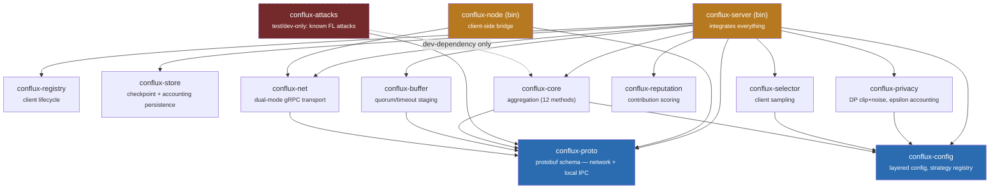
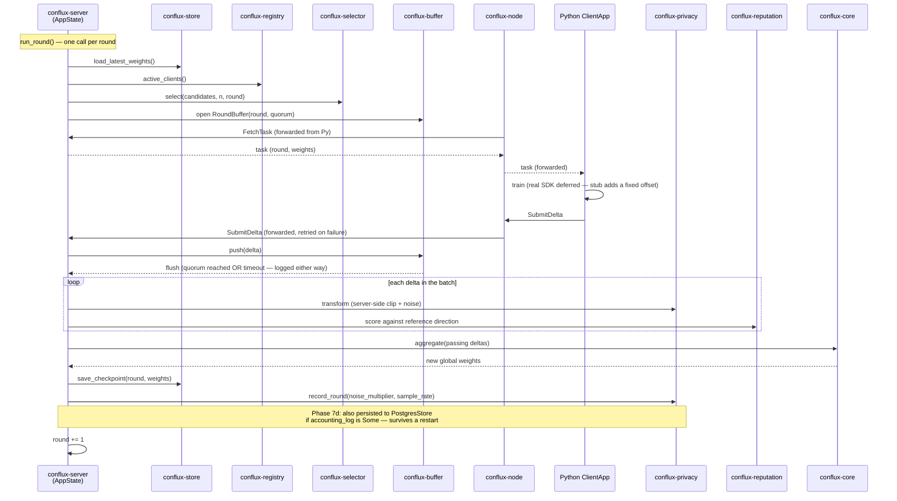
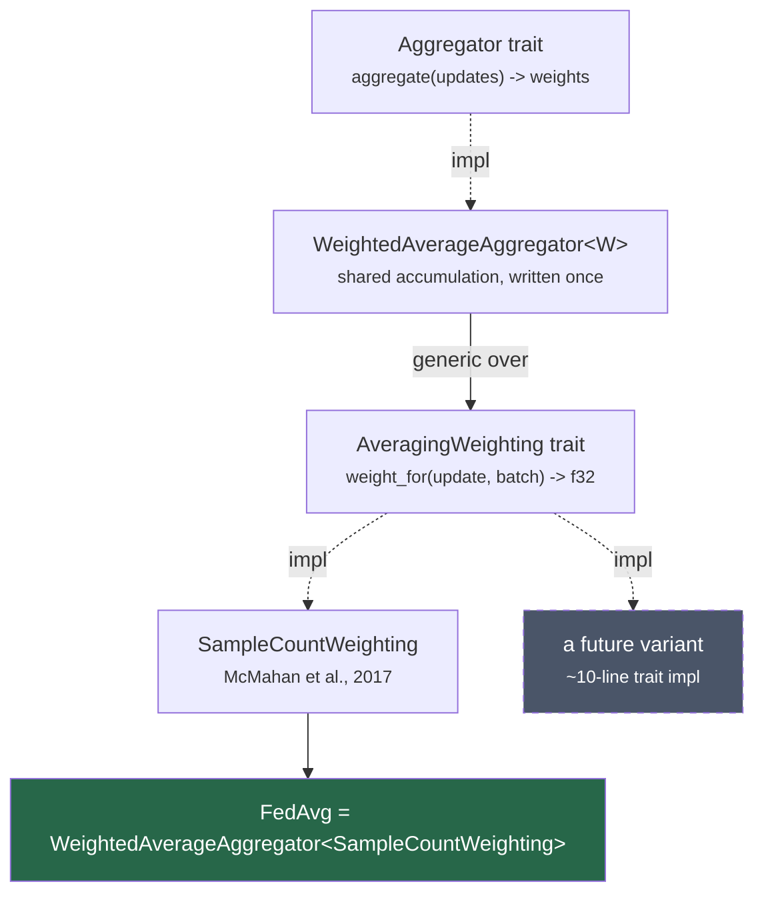
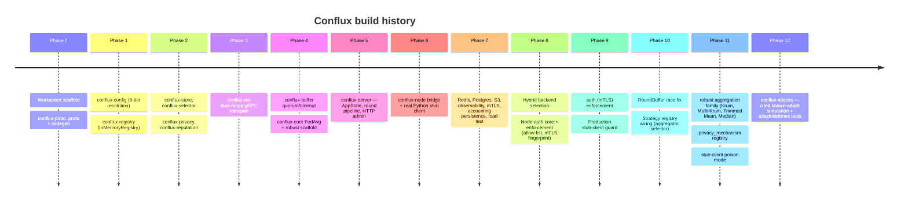
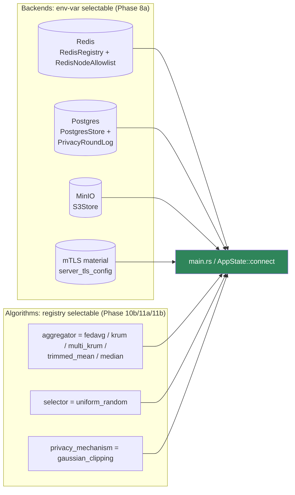

# Conflux Architecture

What Conflux is, how its pieces fit together, and how the project was
actually built, session by session. For step-by-step build/run
instructions, see [USAGE.md](USAGE.md). For the authoritative design
spec, see [`spec/conflux-spec-v1.md`](spec/conflux-spec-v1.md); for the
reasoning behind individual decisions, see [`adr/`](adr/).

## What Conflux is

Conflux is a configurable, extensible, Rust-native federated learning
framework. Python (PyTorch) stays entirely client-side for model
training; Rust owns networking, orchestration, aggregation, privacy, and
reputation. One codebase supports four deployment topologies —
cross-silo, cross-device, crowdsource, edge — selected by configuration,
not by forking code. The name captures the core metaphor: many
independent, heterogeneous client contributions *conflux*-ing into one
stronger global model (ADR 0009).

## Workspace layout

Fourteen crates, dependency graph is acyclic:

`conflux-attacks` (Phase 12, ADR 0010) is deliberately outside
`conflux-server`'s dependency graph entirely — dashed in the diagram to
mark it as test/dev-only, never reachable from a production binary.
`cargo tree -p conflux-server` never lists it.

`conflux-proto` and `conflux-config` sit at the bottom with zero internal
dependencies. `conflux-net` and `conflux-buffer` depend only on
`conflux-proto`. `conflux-core`, `conflux-selector`, and `conflux-privacy`
each additionally depend on `conflux-config` (Phase 10b/11b) — each
registers its family's members into `conflux-config`'s `inventory`
strategy registry (ADR 0002) so `config.aggregator.value = "fedavg"`/
`config.selector.value = "uniform_random"`/`config.privacy_mechanism.value
= "gaussian_clipping"` actually construct the right implementation,
rather than `conflux-server` hardcoding one — all three spec §5 families,
not some of them. `conflux-registry`, `conflux-store`, and
`conflux-reputation` are leaf crates with **no** internal dependencies at
all — deliberately: they operate on plain `String`/`&[f32]` rather than
importing `conflux-proto`'s network types, so `conflux-server` (the one
crate that touches everything) is responsible for converting at the
integration boundary.
`conflux-node` depends only on `conflux-proto` and `conflux-net` — it's a
thin bridge, not a second copy of the server's logic.

`python/conflux_client/` sits outside the Rust workspace entirely — the
real Python `ClientApp` SDK design is deferred (ADR 0005); today it holds
only a stub client for pipeline testing.

## The round pipeline

One `.proto` schema (the `FlTransport` gRPC service) serves two hops with
the same message types: the network hop between `conflux-server` and
`conflux-node`, and the local loopback hop between `conflux-node` and the
Python `ClientApp` (ADR 0004). `conflux-node` is a *bridge*: every RPC a
local Python client makes is forwarded to the real server, with
retry/backoff, and nothing else.

`run_round` returns after one round; the caller (`main.rs`, or a test)
decides whether to call it again. On `AggregatorError::EmptyBatch`
(nothing submitted yet — the common case before any client has
registered), `main.rs`'s loop retries after a short delay rather than
treating it as fatal; on `BudgetExhausted` or a store/registry failure, it
stops.

## Configuration: two orthogonal axes

Every parameter resolves through a fixed six-tier precedence chain, and
**every resolved value logs which tier it came from** — this is mandatory
(ADR 0007), not optional verbosity, and it's what makes a misconfigured
deployment debuggable without reading source.

**Topology** (`cross_silo | cross_device | crowdsource | edge`) answers
"what kind of participants and network?" — it owns `connection_mode`,
`auth`, `round_timeout_secs`, `min_reputation_score`, and
`client_registry_ttl`. **Mode** (`research | production`) answers "am I
iterating, or running a live deployment?" — it owns `seed_mode`,
`budget_exhausted_action`, `accounting_scope`, `allow_stub_client`, and
`config_log_format`. The two axes own disjoint parameter sets by design
(ADR 0001), so layering never conflicts, and `inherits` lets a new special
case extend a base profile without a code change.

## The family pattern

Published FL research produces many variants of the same underlying
mechanism. A *family* factors out the shared accumulation/selection logic
once, and captures what varies in a small trait (ADR 0002):

The `robust` (Byzantine-resilient) aggregation family applies the same
pattern **twice** (Phase 11a), not once — Krum/Multi-Krum select a
*subset of whole updates* (`UpdateFilter` + `FilteredAggregator<F, C>`,
reusing `DistanceMatrix`, built Phase 4b); Trimmed Mean/Median combine
*one coordinate at a time across every client*
(`CoordinateWiseRobustStatistic` + `CoordinateWiseAggregator<S>`), which
doesn't fit the first shape at all — there's no "selected whole update"
per client when the combination is coordinate-wise. See
`docs/phases/phase-11a-robust-aggregation.md` for the redesign that
produced this split, and `docs/EXTENDING.md` for how to add a new member
to either shape.

## How the project was built

Conflux was built as a sequence of scoped phases, each with a written
brief (`docs/phases/phase-N-*.md`) *before* implementation, and a
`docs/STATUS.md` update *after* — the durable record that lets a new
session (or a new contributor) pick up without reconstructing context from
chat history. Every phase's Definition of Done required the full
workspace to build, lint clean, and pass its tests before moving on.

Each phase's brief stated scope, explicit non-goals, inputs, deliverables,
and a test plan — and every phase actually ran real verification, not
just `cargo build`: real over-the-wire gRPC tests from Phase 3 onward,
real Docker-backed Redis/Postgres/MinIO from Phase 7, a real three-process
cross-language smoke test in Phase 6, and a real concurrent-load test in
Phase 7g.

### Real gaps found and fixed along the way

Several genuine bugs surfaced during implementation — not hypothetical
edge cases, but things that actually broke a build or a test run — and
each was fixed rather than worked around, with the fix documented in the
relevant phase brief and `STATUS.md`:

| Found in | The gap | The fix |
|---|---|---|
| Phase 5 | `DeltaChunk` (the wire streaming format) never carried `num_samples`, so a reassembled `ClientDelta` had no input for FedAvg's weighting | Added `num_samples` to the `.proto`, repeated on every chunk |
| Phase 6 | `conflux-server`'s round loop treated *any* `run_round` error as fatal, including the ordinary "no submissions yet" case — the server would exit before a client could ever connect | Retry on `EmptyBatch`, keep `BudgetExhausted` fatal |
| Phase 7a | `RedisRegistry` tests shared one Redis key and raced under `cargo test`'s parallel execution; a first "fix" (a per-process counter) still collided across separate `cargo test` invocations against the same persistent Redis | Per-test key incorporating both a counter *and* the process id |
| Phase 7a/7b | `Registry`/`Store` trait methods were synchronous (fine for an in-process `HashMap`, impossible for real network I/O) | Converted both traits to native `async fn` (stable, no `async-trait` needed) |
| Phase 7e | A first draft of the mTLS rejection test asserted `connect()` itself fails — it doesn't, because the TLS handshake completes lazily | Assert on the first RPC failing instead, which is what actually proves rejection |
| Phase 7f | Adding `aws-sdk-s3` (pulls in `rustls`/`aws-lc-rs`) alongside `conflux-net`'s existing `ring`-based TLS caused a runtime crypto-provider panic — but only under `cargo test --workspace`, never `cargo test -p conflux-net` alone, because workspace-wide feature unification links both providers into every crate's test binaries | Aligned `conflux-net` on `tls-aws-lc` to match |

## Architecture decisions

| ADR | Decision |
|---|---|
| [0001](adr/0001-two-axis-configuration.md) | Topology × mode are orthogonal config axes |
| [0002](adr/0002-family-pattern.md) | New algorithms extend a shared family base, not a whole trait from scratch |
| [0003](adr/0003-no-multi-tenancy.md) | One server process = one experiment |
| [0004](adr/0004-client-server-split-local-grpc.md) | One `.proto` schema serves both the network and local-loopback hops |
| [0005](adr/0005-python-sdk-deferred.md) | Real Python SDK is deferred; a stub client stands in for pipeline testing |
| [0006](adr/0006-global-epsilon-accounting.md) | `Global` epsilon accounting ships first; `PerClient` is Phase 8 |
| [0007](adr/0007-explainable-config-resolution.md) | Every resolved config parameter logs its source — mandatory |
| [0008](adr/0008-cited-baseline-implementations.md) | Shipped baselines are literal, cited implementations of specific papers |
| [0009](adr/0009-project-name-conflux.md) | Project name: Conflux |

## Current status

200 tests pass workspace-wide as of Phase 12's completion; `cargo fmt
--check` and `cargo clippy --workspace --all-targets` are both clean. See
[`STATUS.md`](STATUS.md) for the exact per-phase breakdown, what's next,
and every known deviation from the spec (each with the *why*, so spec and
reality don't silently drift apart). See [`EXTENDING.md`](EXTENDING.md)
for how to add a new aggregator, selector, privacy mechanism, or attack
without touching `conflux-server`.

Every Phase 7 backend, Phase 9's TLS material, and all three spec §5
families (`aggregator`, `selector`, `privacy_mechanism`, Phase 10b/11a/
11b) are now selected by env var / resolved config value alone — no code
change required to pick one, and choosing an aggregator name now covers
five real methods, not one. What's still hardcoded or missing: `main.rs`
itself doesn't yet expose `CONFLUX_AGGREGATOR`/`CONFLUX_SELECTOR`/
`CONFLUX_PRIVACY_MECHANISM`/`CONFLUX_ROBUST_BYZANTINE_FRACTION` env vars
the way it does for backend selection (spec §11 Open Item 2 — the
registry-construction path is proven end-to-end via `conflux-server`'s
own tests and `Overrides`, just not yet reachable from the compiled
binary without code), and config-*file* parsing (`Overrides` still comes
from env vars/CLI only, not a TOML file).
