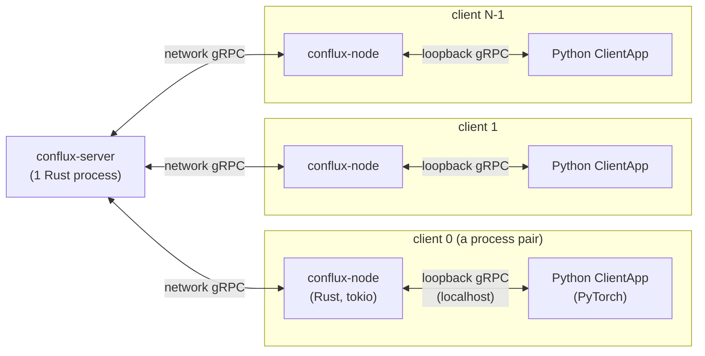
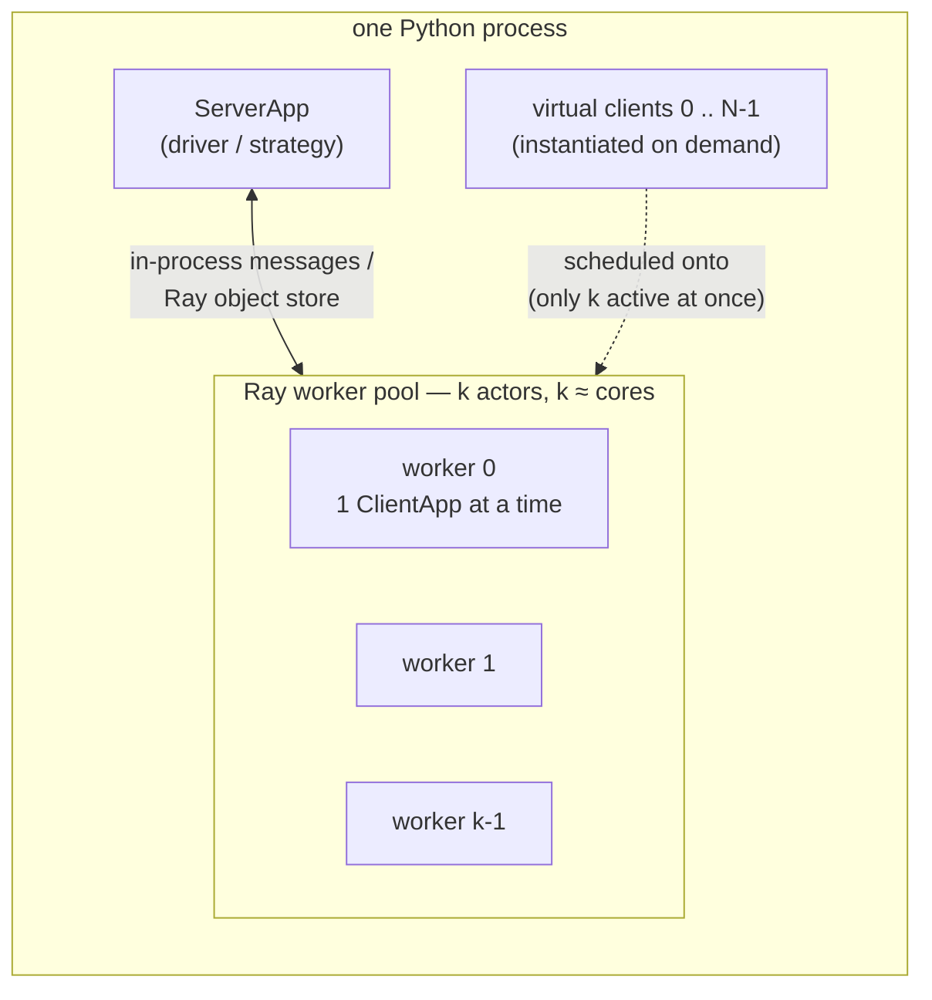

# Client Simulation, Part 1: Two Models and Why

**How do you run "many clients" of a federated-learning system on one
machine?** There are two very different answers, and Conflux FL and
Flower each pick a different one. This guide explains both — what each
*is*, *why* it was chosen, *what* it serves, and *how* it works — then
says plainly which is closer to real training. [Part 2](CLIENT_SIMULATION_COST.md)
does the arithmetic: CPU, processes, and memory for a 20- and a
30-client run on each.

If you've followed the [reproduction tutorial](https://github.com/conflux-fl/conflux-web)
and wondered "can I just run 100 clients like Flower does?", this is the
answer to *why the two frameworks feel so different when you try.*

> **TL;DR.** Conflux FL runs **one real OS process per client** — the
> same processes a production deployment uses, just on localhost. Flower's
> *local simulation* runs **many virtual clients inside one process**, on
> a bounded worker pool. The first is a scaled-down *real deployment*; the
> second is a *simulation harness*. Conflux is closer to real training;
> Flower's simulation scales to far more clients on the same laptop. The
> difference is not an accident — it falls straight out of each project's
> core architectural decision.

---

## What "client simulation" even means

In real federated learning, a *client* is an independent participant —
a hospital's server, a phone, a bank branch — training on data that never
leaves it. To develop or study an FL system you need *many* clients, but
you have *one* machine. "Client simulation" is how a framework fakes that
plurality locally. The two frameworks fake it at different layers:

- Conflux FL fakes only the **network distance** — the clients are real,
  they're just all on `localhost`.
- Flower's simulation fakes the **clients themselves** — they're virtual,
  time-sharing a small pool of workers.

That single choice cascades into everything else.

---

## Model A — Conflux FL: one real process per client

### What it is

When you run Conflux FL's demo with N clients, you get **2N + 3 real
operating-system processes**:

| Process | Count | Language | Role |
|---|---|---|---|
| `conflux-server` | 1 | Rust | Orchestration, aggregation, the round loop |
| `conflux-node` | N (+1 eval) | Rust | Per-client relay: talks to the server, hosts a local listener |
| Python `ClientApp` | N (+1 eval) | Python/PyTorch | The actual training, one per client |

Each *client* is a **pair**: a `conflux-node` (Rust) and a Python
`ClientApp` (PyTorch), joined by a local gRPC hop. The node speaks to the
server over the network; the Python process trains. This pairing isn't
incidental — it's the framework's central design decision (ADR 0004:
Rust owns everything except training; Python owns only training), and it
is *why* a client can't be anything smaller than a process.

### Structure

**Two gRPC hops, one schema.** Server↔node is the network hop; node↔Python
is the loopback hop. Both carry the *same* `conflux-proto` messages —
there is no simulated stand-in anywhere in the path. Everything that runs
here is what runs in production.

### Why this decision was made

1. **The client/server split (ADR 0004) forces it.** Conflux FL is
   Rust-native: Rust owns networking, orchestration, aggregation,
   privacy, reputation. Python owns *only* training. The seam between them
   is a gRPC loopback. So a "client" is intrinsically (Rust node + Python
   trainer) — there is no in-Rust way to *be* a Python-training client
   without a Python process.
2. **The test path equals the production path.** Because the demo spawns
   real processes talking real gRPC, an end-to-end run exercises the
   *actual* transport, the *actual* registration/heartbeat/eviction
   (`conflux-registry`), the *actual* quorum-or-timeout flush
   (`conflux-buffer`), and the *actual* aggregation. A bug in any of those
   shows up in the demo because the demo *is* the system — not a model of
   it.
3. **Fidelity over scale, deliberately.** The framework's job is to
   orchestrate real, distributed, heterogeneous clients. Validating it
   with a shortcut that skips the network would validate a different
   thing.

### What it serves

- **End-to-end correctness**: the wire contract, registration, buffering,
  quorum, aggregation, checkpointing — all under real concurrency.
- **Convergence validation** on real models and data (the four e2e
  harnesses: numpy-logreg, MNIST, CIFAR-10, Shakespeare).
- **A faithful preview of a deployment**: what you run on one laptop is,
  process-for-process, what you'd run across many machines.

It does **not** serve large-scale client studies — 100s or 1000s of
clients — on a single machine. That's the trade, and [Part 2](CLIENT_SIMULATION_COST.md)
shows exactly where the wall is.

### How it works

`run_demo.sh` is the orchestrator. In order: build the Rust binaries →
partition the dataset into N shards → start the server → start N node
processes (each registers with the server) → start N trainer processes
(each connects to its node's loopback) → drive R rounds. Each round, the
server selects clients, dispatches the current global model, waits for a
**quorum** of submissions (the demo sets `QUORUM = N`, so *all* must
report), aggregates, checkpoints, repeats. Every arrow in that sentence
is a real gRPC call.

---

## Model B — Flower: many virtual clients in one process

### What it is

Flower's *local simulation* (the Simulation Engine, Ray-backed by
default) runs the whole federation **inside one Python process**. You
write a `ServerApp` (the strategy/driver) and a `ClientApp` (one client's
behavior), and call `run_simulation(...)`. Flower then creates a **bounded
pool of workers** (Ray actors, sized to your CPUs/GPUs) and schedules your
N *virtual* clients onto it. A virtual client is typically **ephemeral**:
instantiated when it's picked for a round, run, and torn down — so N can
be far larger than the number of workers or the amount of RAM a single
copy of all N clients would need.

### Structure

The clients don't talk over a network — messages move as serialized
objects through Ray's object store. Only **k** clients (k ≈ your core
count, or fewer if each client is told it needs more resources) are alive
at any instant, regardless of whether N is 20 or 2,000.

### Why this decision was made

FL *research* needs scale: hundreds to thousands of clients, strong
non-IID partitions, many rounds, repeated across seeds — the kind of
sweep that is impossible as real processes on a workstation. Flower's
simulation exists to make that tractable on one machine (and to scale the
*same code* up to a Ray cluster). It optimizes for **iteration speed and
client count**, accepting simulated boundaries as the price.

### What it serves

- **Large-N experimentation** on modest hardware — the headline feature.
- **Non-IID and client-sampling studies** where you *need* 100+ clients
  for the question to make sense.
- **Reproducible research** that scales from a laptop to a cluster without
  a rewrite.

### How it works

Ray schedules virtual clients onto the worker pool according to
`client_resources` (e.g. `num_cpus=1` ⇒ one client per core at a time;
`num_cpus=2` ⇒ half as many concurrently). Clients are constructed on
demand, run their round, return an update as an object, and are collected.
The driver aggregates and starts the next round. No OS process per client,
no network stack, no registration handshake — those are exactly the things
being abstracted away.

> **Note.** Flower *also* has a separate **Deployment Engine** (real
> `SuperLink` + `SuperNode` processes) for production — that path *is*
> real-process, much like Conflux FL. This guide compares Conflux FL's
> model against Flower's **simulation** engine specifically, because that
> is the "run 100 clients locally" feature the question is about.

---

## Which is closer to real training?

**Conflux FL's model, unambiguously** — and by construction:

| Property | Conflux FL (real processes) | Flower simulation (virtual) |
|---|---|---|
| Client isolation | real OS processes | shared pool, ephemeral objects |
| Transport | real gRPC (two hops) | in-process / object store |
| Registration, heartbeat, quorum | real, exercised | abstracted away |
| Per-client state across rounds | naturally persistent (the process lives) | reconstructed unless you add state |
| Distance from production | **localhost instead of WAN — that's all** | a faithful *model* of a federation |

Conflux FL's local run differs from a real deployment in essentially one
respect: the processes share a host and talk over `localhost` instead of
across a network. Swap `localhost` for real addresses and it *is* the
deployment. Flower's simulation, by contrast, is an excellent *model* of a
federation optimized for studying learning behavior at scale — not the
transport, orchestration, or failure semantics.

Neither is "better." They answer different questions: *does my FL system
work end-to-end?* (Conflux FL's strength) versus *how does this algorithm
behave across 500 non-IID clients?* (Flower simulation's strength).

---

## The Rust point of view

Why is "one real process per client" even *affordable* for Conflux FL?
Because Rust makes the *orchestration* half of each client nearly free,
and the expensive half is training — which costs the same under *any*
approach.

- **The `conflux-node` is a cheap async relay.** It's a Rust/`tokio`
  process: no garbage collector, no interpreter, a small static binary
  whose job is to await gRPC on two sockets and forward bytes. Idle
  between rounds it costs almost nothing; its resident memory is on the
  order of megabytes, not the hundreds of megabytes a language runtime
  per client would demand. Running 20 or 30 of them is not the problem —
  and *that's the point*. If the per-client orchestration layer were
  itself a JVM or a second Python interpreter, real-process-per-client
  would collapse well before 20. Rust's zero-cost async is what keeps the
  model viable.
- **The server multiplexes N clients on one runtime.** `conflux-server`
  is a single `tokio` process handling N concurrent gRPC streams
  (`tonic`) plus an HTTP admin surface (`axum`) — no thread-per-client, no
  process-per-connection. The concurrency that would be a scaling headache
  in a synchronous server is ordinary here.
- **The real cost is PyTorch, and Rust can't discount it.** Each client's
  Python trainer loads the framework and a model into its own address
  space. *This is the memory wall* ([Part 2](CLIENT_SIMULATION_COST.md)),
  and it exists in Flower's simulation too — Flower just amortizes it by
  keeping only *k* trainers alive at once. Conflux FL keeps all N alive,
  because in a real deployment all N *are* alive.

**And here's the deep reason Conflux FL can't simply copy Flower's trick.**
Flower's simulation works because a `ClientApp`'s training runs in the
*same* Python/Ray runtime the engine schedules — so it can hold N clients
as objects and animate k of them at a time. Conflux FL's training runs in
a *separate Python process by design* (ADR 0004: the Rust core never
imports PyTorch, never runs user training in-process). A "many virtual
clients in one process" mode would therefore have to fight the very
architecture that makes the framework Rust-native — either by running many
Python trainers behind a shared scheduler (re-inventing Ray, against the
GIL) or by accepting a Rust-only *stub* trainer that doesn't do real
PyTorch training at all. That is why a single-process simulation mode is a
genuine, non-trivial framework decision, not a script someone forgot to
write. It's discussed as an open question in the (internal) CLI/roadmap
notes precisely because the architecture makes it interesting.

---

## Where to go next

- **[Part 2 — Compute, Memory, and Worked Examples](CLIENT_SIMULATION_COST.md)**:
  the numbers. Processes, CPU contention, and memory for **20 and 30
  clients** on each approach, with diagrams of how a laptop actually
  spends its cores and RAM — and where each model hits a wall.
- [E2E_TESTING.md](E2E_TESTING.md): the real harnesses this model powers.
- [ARCHITECTURE.md](ARCHITECTURE.md): the client/server split (ADR 0004)
  that makes a client a process pair in the first place.
