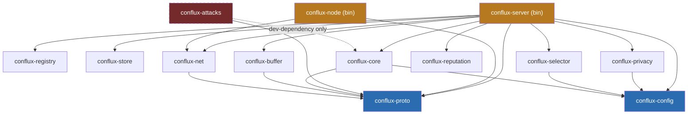

# Crate Reference

A one-stop reference for what each of Conflux's fifteen crates does,
why it exists as its own crate rather than living inside another one,
what it depends on, and the fastest way to extend it. For the *build
history* and the *round pipeline* these crates implement together, see
[ARCHITECTURE.md](ARCHITECTURE.md); for concrete "add a new X" steps,
see [EXTENDING.md](EXTENDING.md) — this page is the map, those are the
tour and the toolbox.

## Dependency graph

Three things worth knowing before the table below:

- **`conflux-proto` and `conflux-config` sit at the bottom**, zero
 internal dependencies — the shared vocabulary (wire schema, resolved
 configuration) everything else builds on.
- **`conflux-registry`, `conflux-store`, and `conflux-reputation` are
 leaf crates with no internal dependencies at all**, deliberately —
 they operate on plain `String`/`&[f32]` rather than importing
 `conflux-proto`'s network types, so `conflux-server` (the one crate
 that touches everything) does the conversion at the integration
 boundary, not each library crate individually.
- **`conflux-attacks` is dashed and never reachable from `conflux-server`**
 — it depends on `conflux-core` only as a *dev-dependency*, and nothing
 in `conflux-server`'s own dependency tree ever points to it (ADR 0010).
 `cargo tree -p conflux-server` will never list it; this is enforced by
 the dependency graph itself, not a convention someone has to remember.

## The crates

### Foundation — no internal dependencies

| Crate | What it owns | Why it's its own crate | Extend by |
|---|---|---|---|
| **`conflux-proto`** | The protobuf schema (`FlTransport` gRPC service: `Register`, `Heartbeat`, `FetchTask`/`SubscribeTasks`, `SubmitDelta`) and the little-endian `f32` weight codec (`encode_weights`/`decode_weights`). | One schema serves *two* hops — the real network hop (server↔node) and the local-loopback hop (node↔Python `ClientApp`) — so it can't live inside either side; it's the shared contract both depend on (ADR 0004). | Adding a field to `ClientDelta` or a new RPC — see ADR 0012 for the current worked example (FedNova/SCAFFOLD's proto needs). |
| **`conflux-config`** | The six-tier config resolution chain (builtin → topology → mode → experiment file → env var → CLI), and the `inventory`-based strategy registry every algorithm family registers into. | Every other crate needs to read *some* resolved parameter or register *some* strategy name — putting this at the bottom means nothing has a circular need to configure something that configures it. | A new resolvable parameter follows `robust_byzantine_fraction`'s (Overrides-only) or `require_node_auth`'s (mode-owned) precedent — see [EXTENDING.md](EXTENDING.md). |

### Server-side pipeline components

| Crate | What it owns | Why it's its own crate | Extend by |
|---|---|---|---|
| **`conflux-registry`** | Client lifecycle — register, heartbeat, evict on TTL expiry. `InMemoryRegistry` and `RedisRegistry` behind one trait. | A client-tracking concern entirely separate from *how* clients are selected for a round (that's `conflux-selector`) or *what* they're trusted to submit (`conflux-reputation`) — three independent axes, three crates. | A new backend implements the `Registry` trait; wire it into `AnyRegistry`'s enum-delegation pattern. |
| **`conflux-store`** | Model checkpoint persistence and experiment metadata. `InMemoryStore`, `FileStore`, `PostgresStore`, `S3Store` behind one trait — also the durable home for `conflux-privacy`'s accountant history when `accounting_log` is configured. | Checkpointing has completely different durability/scaling needs from client lifecycle tracking, even though both are "state the server keeps between rounds." | A new backend implements the `Store` trait; wire into `AnyStore`. |
| **`conflux-selector`** | Client sampling strategy for a round — who gets asked to train this round out of everyone currently registered. Ships `UniformRandomSelector` (McMahan et al., 2017). | A pluggable strategy family in its own right (spec §5) — cross-silo wants `all_available`, cross-device wants `uniform_random`, a future edge deployment wants resource-aware selection — same registry pattern as aggregation. | Implement `ClientSelector`, `inventory::submit!`, one `build_selector` match arm — see [EXTENDING.md](EXTENDING.md#adding-a-new-client-selector). |
| **`conflux-net`** | Dual-mode (push/pull) gRPC transport — the actual `FlTransport` service implementation, plus mTLS builders. | Transport concerns (streaming vs. polling, TLS handshakes) are orthogonal to what's being transported — keeping this separate from `conflux-server`'s round logic means the round pipeline never has to know which mode a given deployment uses. | Push-mode client-side wiring for `conflux-node` is a real, still-open gap — see its phase brief. |
| **`conflux-buffer`** | Async staging of submitted deltas within a round — flushes on quorum or timeout, whichever comes first, and logs which one (ADR 0007). Closed a real lost-update race. | The exact moment a round's batch is considered "done" is a genuinely separate concern from either transport (`conflux-net`) or aggregation (`conflux-core`) — and one with real concurrency hazards worth isolating and testing on their own. | Not a registry-wired family today — `RoundBuffer`'s quorum/timeout logic is currently the only implementation; a second flush policy would be a natural new type here. |
| **`conflux-privacy`** | Client-side and server-side differential privacy (clip + Gaussian noise, Abadi et al., 2016) and epsilon accounting (`RdpAccountant`, Mironov 2017 / Wang, Balle & Kasiviswanathan 2019). | DP mechanism and DP *accounting* are two different published-methods families (spec §5) that happen to compose — keeping them in one crate, two traits, mirrors that they're usually discussed together in the literature without conflating them into one interface. | Implement `PrivacyMechanism`, `inventory::submit!` — see [EXTENDING.md](EXTENDING.md#adding-a-new-privacy-mechanism). Client-side wiring into `conflux-node` is done — the node applies the mechanism before submitting, off by default (`client_side_privacy_transform`). |
| **`conflux-reputation`** | Per-client contribution scoring against a reference direction. Off by default (`reputation_filter_enabled`) — every aggregator's own behavior should match its cited paper with zero framework-imposed interference; this is an opt-in extra, not a mandatory gate. | Scoring/filtering logic that any deployer *might* want in front of *any* aggregator is a cross-cutting concern that doesn't belong baked into one specific method — see its phase brief for why this used to be mandatory and isn't anymore. | New `ContributionScorer` implementations plug into the same `score(update, reference)` call site `round.rs` already uses. |

### The algorithm catalog

| Crate | What it owns | Why it's its own crate | Extend by |
|---|---|---|---|
| **`conflux-core`** | Aggregation — the actual "combine N client updates into one" step. Scalar, and measured to be the right choice: explicit SIMD was built and benchmarked slower at every realistic model dimension, because the loop is memory-bandwidth-bound. **Twelve** shipped methods: `fedavg`, `krum`, `multi_krum`, `trimmed_mean`, `median`, `faba`, `bulyan`, `geometric_median`, `median_of_means`, `divide_and_conquer`, `foolsgold`, `centered_clipping`. | This is Conflux's actual product surface — a faithful, extensible catalog of published aggregation methods (ADR 0008) — kept in its own crate so `conflux-server` never needs to change when a new method is added; it just reads whichever name `config.aggregator.value` resolves to. | The most common extension point — see [EXTENDING.md](EXTENDING.md#adding-a-new-aggregator) and the worked walkthrough below. |

### Client-side / test-only

| Crate | What it owns | Why it's its own crate | Extend by |
|---|---|---|---|
| **`conflux-attacks`** *(dev/test-only, never shipped in `conflux-server`)* | Cited implementations of known FL attacks (Gaussian noise, sign-flipping, ALIE, scaling/boosting, persistent/adaptive Sybil collusion) and application-level attack-vs-defense tests against every shipped `Aggregator`. | Attack code that could theoretically run against a production aggregator needs to be *structurally* incapable of shipping in the production binary, not just conventionally excluded — ADR 0010 makes that a dependency-graph fact (dev-dependency on `conflux-core` only), not a promise. | Implement `Attack`, add it to the attack-vs-defense matrix — see [EXTENDING.md](EXTENDING.md#adding-a-new-attack-conflux-attacks). |

### Binaries

| Crate | What it owns | Why it's its own crate | Extend by |
|---|---|---|---|
| **`conflux-server`** *(binary)* | Integrates every library crate above into the actual round pipeline — `AppState`, the round loop, the HTTP admin surface (`/health`, `/round/status`, `/clients/register`, allow-list admin). | The one place allowed to depend on everything — deliberately, so no other crate needs a "does this also need to know about X" question; `conflux-server` is where those questions get answered. | Round-pipeline changes (new pipeline stages, new admin endpoints) happen here; algorithm changes almost never should (that's the point of the registry pattern above). |
| **`conflux-node`** *(binary)* | The client-side bridge — registers with the real server, runs a local gRPC server the Python `ClientApp` connects to, forwards every RPC with retry/backoff. Depends on `conflux-proto` and `conflux-net` only. | Deliberately thin — no aggregation, no config resolution, no algorithm logic of any kind lives here, so it can never accidentally duplicate `conflux-server`'s own logic. | Push-mode client support (see the `conflux-net` row above) is the current real gap; otherwise this crate should stay thin by design, not grow. |
| **`conflux-trusted-reference`** *(optional sidecar, never a `conflux-server` dependency)* | Server-side trusted-dataset training/scoring for `fltrust` — a separate process the server calls over gRPC, so the server itself stays opaque to model architecture (ADR 0011). | The methods that need server-side training are the exception, not the rule; a boundary drawn as a process keeps the exception from reshaping the server. | Implement `TrustedModel` against whatever runtime can run your model. |
| **`conflux-client`** | The Rust-native `ClientApp` SDK — train in Rust with no Python process in the loop. Same contract as the Python SDK, field for field. | `crowdsource`/`edge` participants are machines nobody provisions; one static binary is a categorically smaller ask than a Python environment. | Implement `ClientApp` (one required method) and call `run()`. |

## Worked example: adding a new aggregation method

This is the extension point you'll hit most often, so here's the full
mechanical checklist (detailed version: [EXTENDING.md](EXTENDING.md#adding-a-new-aggregator)):

1. **Pick a shape.** Does your method combine every update with some
 per-update weight (like FedAvg)? Implement `AveragingWeighting`. Does
 it *select a subset* of whole updates first (like Krum)? Implement
 `UpdateFilter`. Does it combine *one coordinate at a time* across
 every client (like Trimmed Mean)? Implement
 `CoordinateWiseRobustStatistic`. Whole-vector statistics that aren't
 coordinate-independent (like Geometric Median) get a fourth shape,
 `RobustVectorStatistic` — see `crates/conflux-core/src/robust.rs` for
 a live example of each.
2. **Write the trait impl** in `crates/conflux-core/src/{averaging,robust}.rs`
 — typically 10–30 lines; the shared accumulation/selection logic is
 already written once and reused (ADR 0002).
3. **Cite the paper** in your type's doc comment (ADR 0008) — every
 shipped method in this codebase is a literal implementation of a
 specific, named publication, not an "obvious-seeming" default.
4. **Register it**: one `inventory::submit! { StrategyEntry { kind:
 StrategyKind::Aggregator, name: "my_method" } }` plus one match arm
 in `build_aggregator` (`crates/conflux-core/src/lib.rs`).
5. **Test it**: a hand-derived unit test (compute the expected output by
 hand for a small, simple batch — every existing aggregator's tests
 follow this discipline), plus extending the crate's
 `every_buildable_name_is_also_registry_visible` test's name list.

That's it — **`conflux-server` needs zero changes.** Once step 4 lands,
`aggregator = "my_method"` in any experiment's config resolves and
constructs your implementation; the round pipeline never hardcodes which
method it's calling.
