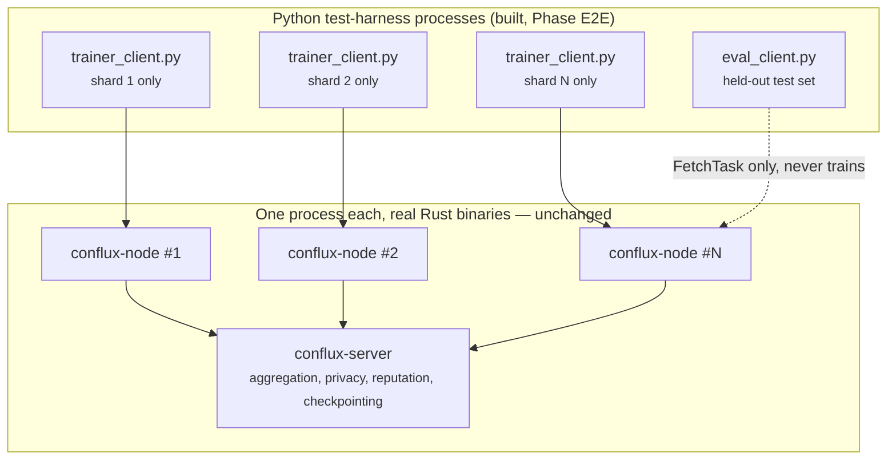

# End-to-End Testing With a Real Model and Dataset

**Status: built and verified, live, on 2026-08-22.** Two working harnesses
exist under `python/conflux_client/examples/`:
[`e2e_numpy_logreg/`](../python/conflux_client/examples/e2e_numpy_logreg/README.md)
(Option A — logistic regression, NumPy, no PyTorch) and
[`e2e_pytorch_mnist/`](../python/conflux_client/examples/e2e_pytorch_mnist/README.md)
(Option B — a real MLP on real MNIST). Both converge to within a couple
points of a centralized baseline trained on the same data without
Conflux, and both confirmed a `robust`-family aggregator (`krum`)
successfully excludes a persistent Byzantine client. Running them
surfaced **two real, previously-unknown issues** — see "Real findings"
below; this is exactly why this doc's original plan insisted on actually
running the thing rather than trusting hand-written code snippets.

This doc is the design rationale and the results; the two `README.md`s
linked above are the copy-paste-and-run instructions. Read this doc for
*why*; read those for *how*.

## Is this possible today?

**Yes — the Rust-side pipeline (`conflux-server` + `conflux-node`) never
needed to change**, beyond a handful of new `main.rs` env vars (below).
Every round already moves a flat, framework-agnostic `Vec<f32>` (spec §7,
ADR 0004): `conflux-proto::encode_weights`/`decode_weights` pack and
unpack a plain little-endian `f32[]`, and nothing on the Rust side
inspects what the numbers mean. Aggregation (`FedAvg`, and the
`robust` family), privacy, reputation scoring, selection, and
checkpointing were all already exercised by real integration tests
against this exact wire format before this harness existed — this doc's
job was proving that held up over many real rounds of real training, not
just one round of synthetic `ClientDelta`s.

**The one missing piece was entirely on the Python side**:
`python/conflux_client/stub_client.py` doesn't train anything — it adds a
fixed `+1.0` offset to every weight (ADR 0005: the real `ClientApp` SDK
is deliberately deferred). The two example harnesses are **test
harnesses**, standing in for the deferred SDK the same way
`stub_client.py` already stands in for it, just with real gradients
instead of a fixed offset.

**This is not ADR 0005's deferred SDK.** A production `ClientApp` SDK
needs a real API surface, error handling, packaging, and design review
(ADR 0005's own scope). These harnesses are single-purpose: prove the
round pipeline correctly converges a real model, for validation and
regression testing. Nothing here should be mistaken for, or grown into,
the SDK without going through that design work.

### `main.rs` changes this required

Closing part of the gap the STATUS record had flagged's
manual verification: `main.rs` gained `overrides_from_env()`, reading
`CONFLUX_AGGREGATOR`/`CONFLUX_SELECTOR`/`CONFLUX_PRIVACY_MECHANISM`/
`CONFLUX_ROBUST_BYZANTINE_FRACTION`/`CONFLUX_QUORUM`/
`CONFLUX_ROUND_TIMEOUT_SECS`/`CONFLUX_CLIP_NORM`/`CONFLUX_NOISE_MULTIPLIER`/
`CONFLUX_MIN_REPUTATION_SCORE` into a `conflux_config::Overrides` — a
demo-motivated expansion, not full config-file parsing (spec §11 Open
Item 2 stays open for the remaining fields). Also gained
`CONFLUX_INITIAL_WEIGHTS_DIM`: the server's placeholder initial
checkpoint is `vec![0.0f32; N]`, and `N` has to match whatever real
model a deployment trains — Conflux has no way to know that on its own
(ADR 0004), so it's now configurable rather than hardcoded to `4`.

## Real findings

Running both harnesses live surfaced three genuine issues neither Phase
11's unit tests nor the application-level tests (which fed
attacks directly to an `Aggregator`, bypassing everything upstream of
it) could have caught. All three are documented here in full because
this is exactly the value real E2E testing is supposed to provide.

### 1. `conflux-reputation`'s cosine filter has its own blind spot, upstream of `robust` aggregation

Round order (spec §8): reputation filtering runs **before** aggregation.
`conflux-reputation`'s `CosineScorer` scores every submitted update
against the batch's raw mean and rejects anything below
`min_reputation_score`. In round 1 — when every client starts from the
same (typically zero) initial checkpoint — a single large-magnitude
attacker can skew that raw mean so far that **every honest update looks
anomalous relative to it**, gets rejected by reputation, and never
reaches the aggregator at all. Whatever `aggregator` was configured then
runs on a batch of one (the attacker), and every later round trains
forward from an already-poisoned checkpoint.

Measured directly (`e2e_numpy_logreg`, 5 clients, 1 persistent attacker,
`--poison-magnitude 1000.0`, default `min_reputation_score = 0.3`):

```
update rejected by reputation filter client_id=client-1 score=-0.50 threshold=0.3
update rejected by reputation filter client_id=client-2 score=-0.43 threshold=0.3
update rejected by reputation filter client_id=client-3 score=-0.41 threshold=0.3
update rejected by reputation filter client_id=client-0 score=-0.49 threshold=0.3
```
— all four honest clients, round 1 only. Every round after that trains
from the poisoned baseline. Final accuracy: **0.3975**, whether
`aggregator` was `fedavg` or `krum` — the choice of aggregator made zero
difference, because the aggregator never saw the honest clients either
way.

Isolating the aggregator's own defense (`--no-reputation`, effectively
disabling the filter) shows Krum working exactly as the tests
already proved in isolation — now confirmed against real, live,
multi-round training:

| Scenario | Held-out accuracy | vs. centralized baseline (0.7375) |
|---|---|---|
| `fedavg`, no attack | 0.735–0.7425 | matches |
| `fedavg`, `--poison` (reputation on, default) | 0.3975 | broken |
| `krum`, `--poison` (reputation on, default) | 0.3975 | broken — reputation's fault, not Krum's |
| `fedavg`, `--poison --no-reputation` | 0.3925 | broken — expected, FedAvg has no defense |
| `krum`, `--poison --no-reputation` | 0.72–0.7375 | **defended** |

Confirmed again on real MNIST with the real MLP
(`e2e_pytorch_mnist`, `krum --poison --no-reputation`): **0.884** vs. a
0.889 centralized baseline.

**This is a real, open gap, not fixed by either harness** — a `robust`
aggregator is not, by itself, a complete defense against a first-round
large-magnitude attacker in the current pipeline. Candidate fixes (not
yet implemented, not yet designed in detail): run reputation scoring
after aggregation instead of before; give `CosineScorer` a robust
reference point (e.g. the coordinate-wise median) instead of the raw
mean; or make reputation filtering explicitly off-by-default for
deployments that rely on `robust` aggregation instead of layering both.
Tracked in the STATUS record's "Next" section.

### 2. Conflux's zero-init placeholder breaks a ReLU network's ability to learn at all

`main.rs`'s initial checkpoint is `vec![0.0f32; N]`. For Option A's
logistic regression (no hidden layer) that's harmless. For Option B's
MLP, it's a textbook symmetry-breaking failure: with every weight and
bias at exactly zero, every hidden unit computes an *identical* zero
output and an *identical* zero gradient through ReLU — none of them can
ever differentiate from one another, so the network is mathematically
incapable of learning from that starting point regardless of how many
steps it trains for. The first real run of `e2e_pytorch_mnist` showed
accuracy pinned at 0.10–0.115 (exactly random-guessing for 10 classes)
and loss pinned at exactly `ln(10) = 2.303` for the entire run — a real
bug, only visible once a model with hidden layers was actually trained
through the pipeline; Option A's own successful runs gave no hint of it.

**Fixed in the harness, not in Conflux** — and that's the architecturally
correct place for the fix: `conflux-server` genuinely cannot know the
right initialization for an arbitrary model (ADR 0004's whole point), so
a real client owns this decision. `e2e_pytorch_mnist/model.py`'s
`is_placeholder_init` detects the all-zero placeholder; every client
(`trainer_client.py`, `eval_client.py`) substitutes its own real,
architecture-aware initialization (`new_model()`, PyTorch's default
Kaiming-uniform init) instead of blindly loading zeros. Every client
still agrees on the same substituted init, since `new_model()` seeds
deterministically (`torch.manual_seed(0)`) — the "everyone starts from
the same shared initial model" FL invariant holds, it's just derived
client-side. After the fix: 0.72 (round 2) → 0.905 (round 15), against a
0.889 centralized baseline.

**Worth knowing if you build a real `ClientApp`** (ADR 0005, still
deferred): any model with hidden layers needs this same substitution.
A future SDK design should probably make it automatic rather than
something every client author has to remember.

### 3. A single empty-data client can NaN-poison reputation for every client, no attacker required

Running `e2e_numpy_logreg` with an aggressive Dirichlet split
(`--dirichlet --dirichlet-alpha 0.1`, 5 clients, 1600 total samples)
produced a shard with **zero samples**:

```
wrote shard_1.npz: 0 samples, class balance nan
```

That client's `train_steps` computed on an empty array, producing `NaN`
weights (`grad_w = X.T @ (pred - y) / len(y)` divides by zero). It
submitted them like any other round. `round.rs`'s reference for that
round — `mean_vector(&decoded)` — then had `NaN` in it, because a mean
that includes even one `NaN` term is `NaN` in every coordinate it
touches. Every subsequent cosine-similarity comparison against that
reference is `NaN` (any arithmetic involving `NaN` propagates it), and
`NaN >= min_score` is `false` under IEEE 754 regardless of `min_score` —
so **all five clients**, the four perfectly healthy ones included, were
rejected:

```
update rejected by reputation filter client_id=client-0 score=NaN threshold=0.3
update rejected by reputation filter client_id=client-1 score=NaN threshold=0.3
update rejected by reputation filter client_id=client-2 score=NaN threshold=0.3
update rejected by reputation filter client_id=client-3 score=NaN threshold=0.3
update rejected by reputation filter client_id=client-4 score=NaN threshold=0.3
```

Held-out accuracy froze at 0.4975 (random-guessing level for binary
classification) for the entire run — every round rejected everyone, so
the model never moved past its initial checkpoint. Re-running with a
less aggressive `alpha = 0.5` avoided the zero-sample shard entirely
(smallest shard: 41 samples) and converged normally (0.7275 vs. a 0.7375
centralized baseline).

**This is a distinct bug from finding 1, not a restatement of it** — no
attacker is required. A single client with degenerate local data (empty
shard, or any input that produces non-finite gradients) can stall the
*entire* round for *every* client, indefinitely, as an accident of data
partitioning. It also means finding 1's proposed fixes don't
automatically cover this case: a coordinate-wise median reference
resists a large-but-finite outlier, but `NaN` poisons a median exactly
as it poisons a mean (any comparison against `NaN` is `false`, so a
`NaN`-valued client would sort undefined-where in a median too, and a
single `NaN` coordinate is enough to make that coordinate's reported
statistic `NaN`). What finding 1's fixes don't address, this finding
needs on top: **non-finite values (`NaN`/`Inf`) in a submitted update
should be rejected outright, logged, and excluded before any reference
computation touches them** — independent of whatever the reference
computation itself ends up being. Not yet fixed in either the harness
or Conflux; a natural addition to the reputation fix's scope (see
the STATUS record's "Next" section and
its phase brief).

## Architecture



Each `trainer_client.py` process only ever sees its own data shard — the
shard is partitioned once, up front, by `partition_data.py`, and each
client process is launched pointed at its own shard file. No shard is
ever transmitted between clients, to `conflux-node`, or to
`conflux-server` — only trained *weights* cross the wire, which is the
actual property federated learning exists to provide.

## Wire format contract

- `TaskResponse.model_weights` / `DeltaChunk.data`: little-endian packed
 `f32`, exactly `conflux_proto::encode_weights`/`decode_weights`
 (`crates/conflux-proto/src/lib.rs`) — both harnesses' own
 `encode_weights`/`decode_weights` (`struct.pack`/`unpack` with
 `"<{n}f"`) are the reference reimplementation, identical to
 `stub_client.py`'s.
- A model's real parameters must be **flattened to one 1-D vector**
 before `encode_weights` and **unflattened back** after `decode_weights`
 — Option A's logistic regression skips this (its weights already are a
 flat vector); Option B's `model.py` has `flatten`/`unflatten` for a
 real `nn.Module`.
- `DeltaChunk.num_samples`: `FedAvg`'s weighting input (McMahan et al.
 2017). Both harnesses report the shard's real size.

## Choosing a model + dataset

Both tiers are built. Start with Option A to validate orchestration
quickly; move to Option B for a result that looks like what a real
deployment would report.

- **Option A** — `sklearn.datasets.make_classification`, plain NumPy
 logistic regression. No download, no PyTorch, deterministic, fast
 enough to run many rounds in seconds. Best for isolating Conflux's own
 effects (privacy noise, robust aggregation, reputation filtering) from
 real-model training noise.
- **Option B** — real MNIST (`torchvision`, ~10MB download, cached after
 first run) + a small real PyTorch MLP (`784 → 64 → 10`, ~51k
 parameters). Higher fidelity; needs the zero-init workaround above.

## Partitioning the dataset across clients

Both harnesses' `partition_data.py` support two splits:

- **IID**: shuffle once, divide into *N* equal shards. Use this first —
 if orchestration is broken, an IID split still shows it, without
 non-IID noise muddying the signal.
- **Non-IID** (`--split dirichlet`, standard FL benchmark practice): draw
 per-class proportions per client from `Dirichlet(alpha)` — small
 `alpha` (e.g. 0.1) gives strongly skewed, realistic-looking client
 data. This is also where `robust` family members and
 `conflux-reputation`'s cosine scorer have something real to react to,
 versus an IID split where every client's update looks similar by
 construction. Both `run_demo.sh` scripts now expose this directly:
 `./run_demo.sh fedavg 5 15 --dirichlet --dirichlet-alpha 0.5`. Run
 live on both harnesses — see finding 3 below for what a too-aggressive
 `alpha` surfaced.

A held-out test set (never partitioned, never seen by any trainer
client) is written separately by both `partition_data.py` scripts, for
`eval_client.py`.

## The trainer and evaluation clients

See `trainer_client.py`/`eval_client.py` in either example directory —
both follow the same structure: register once, then loop
fetch-task/train/submit (trainer) or fetch-task/evaluate (eval-only,
never submits) across rounds, polling until a *new* round appears before
acting so a stale round is never double-processed. `--poison`/
`--poison-magnitude` turn a trainer into a **persistent** Byzantine
client (every round, unlike `stub_client.py`'s single shot) — needed to
actually stress a `robust` aggregator across many rounds rather than
just round 1.

## Launch topology

See either example's `run_demo.sh` for the actual orchestration: builds
the Rust binaries, partitions data, prints a centralized baseline, starts
one `conflux-server`, one `conflux-node` per trainer plus one for the
eval client, waits for registration, then starts the Python processes.

**Quorum**: both scripts set `CONFLUX_QUORUM` explicitly to the client
count and register every `conflux-node` before any Python trainer starts
its round loop — `conflux-node` registers with `conflux-server` once at
its own startup, well before any Python client attaches to it,
which is what makes this reliable in practice (confirmed across many
real runs during verification) despite the round loop starting almost
immediately after the server does.

## Turning DP noise down for a first correctness pass

Both `run_demo.sh` scripts set `CONFLUX_NOISE_MULTIPLIER=0` and a
generous `CONFLUX_CLIP_NORM` — the builtin defaults (Abadi et al. 2016)
are tuned for a different gradient scale and visibly hurt convergence on
these small models otherwise. Re-introduce realistic noise separately to
observe the actual DP trade-off `conflux-privacy`'s own tests already
prove exists in isolation.

## What "working" looks like

Measured directly, not assumed:

- **Option A, no attack**: 0.735–0.7425 held-out accuracy vs. a 0.7375
 centralized baseline — matches.
- **Option B, no attack**: 0.72 (round 2) → 0.905 (round 15) vs. a
 0.889 centralized baseline — matches, and converges visibly over
 rounds.
- **Option A and B, `krum` + persistent attacker, reputation isolated
 out**: 0.72–0.7375 (Option A) and 0.884 (Option B) — both essentially
 match their undefended baselines despite an active attacker every
 round.
- **Option A and B, same attacker, reputation at its default**: both
 collapse to a random-ish accuracy — the real finding above, not a
 harness bug.
- **Dirichlet non-IID, moderate skew (`alpha = 0.5`), no attack**:
 Option A 0.7275 vs. 0.7375 centralized (shard sizes 41–657 out of
 1600, class balance 0.00–1.00 per shard); Option B 0.891 vs. 0.889
 centralized (shard sizes 159–897, real MNIST). Both converge close to
 their centralized baselines despite real per-client heterogeneity —
 FedAvg tolerating moderate non-IID skew as expected.
- **Dirichlet non-IID, aggressive skew (`alpha = 0.1`), no attack**:
 Option A produced a **zero-sample shard** and collapsed to 0.4975 —
 finding 3 above, not a harness bug either. `alpha = 0.5` is the
 practical floor for these dataset sizes/client counts until finding
 3's fix lands.

## Where this lives

Built: `python/conflux_client/examples/e2e_numpy_logreg/` (Option A) and
`python/conflux_client/examples/e2e_pytorch_mnist/` (Option B) — each
with `partition_data.py`, `model.py` (Option B only), `trainer_client.py`,
`eval_client.py`, `centralized_baseline.py`, `run_demo.sh`, and its own
`README.md` with prerequisites, usage, and troubleshooting for someone
running this Rust framework for the first time.

## Per-client fairness metrics, and the SCAFFOLD client (2026-09-02)

Two additions to the MNIST harness, one lesson.

**`eval_client.py --shards`** reports, each round, the global model's
accuracy on every client's own data distribution — min, std, and the
full list — alongside the pooled held-out number. A pooled mean cannot
see who it is failing, and `qfedavg`'s entire claim is about that
per-client distribution; before this flag the claim was unmeasurable.
`run_demo.sh` passes it automatically.

**`trainer_client.py --scaffold`** implements SCAFFOLD's client half:
local steps follow the corrected gradient `g − c_i + c`, and the client
maintains `c_i` across rounds and reports `Δc_i` on the wire.
`run_demo.sh` turns it on automatically when the aggregator is
`scaffold` — the only method whose client half is opt-in.

**The lesson: the first end-to-end run found a real server defect.**
With the client half finally able to send control variates, SCAFFOLD's
held-out loss *climbed monotonically* while accuracy plateaued. A
deterministic quadratic — where SCAFFOLD is provably exact — reproduced
it as a constant `0.1277` bias, to four decimals the value of
`mean(c_i)` after round one. The server's seed round was discarding the
batch's `Δc_i` while every client had already folded the matching
`c_i⁺` into its own state, permanently breaking the `c = mean(c_i)`
invariant the method's unbiasedness rests on. Fixed (the seed round now
folds variates), pinned by a red-first test, and the same MNIST run went
from diverging to the best result in the comparison:

| arm (α = 0.2 non-IID, 5 clients, 12 rounds, 1 seed) | held-out acc | loss | worst client | client std |
|---|---|---|---|---|
| `fedavg` | 0.874 | 0.339 | 0.866 | 0.038 |
| `qfedavg` (q = 1) | 0.842 | 0.443 | 0.823 | 0.034 |
| `scaffold`, seed round discarding Δc | 0.827 | **1.397, rising** | 0.835 | 0.046 |
| `scaffold`, fixed | **0.902** | **0.273, falling** | **0.940** | **0.020** |

Single-seed numbers, and the known run-to-run spread on this harness is
about ±0.06 — `scaffold`'s margins on the worst client (+0.074) and the
falling-vs-rising loss are the robust signals, `qfedavg`'s std
difference is inside noise (its fairness claim remains undemonstrated at
this scale, now measurably so). This is the third defect found by
running a method end to end that every unit test on both sides had
passed over.
