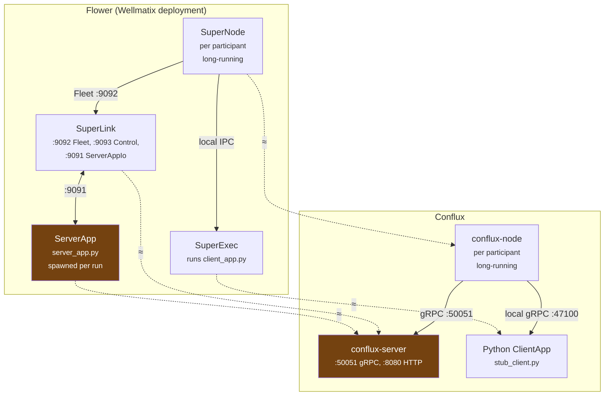

# Conflux vs. Flower: A Real-World Cross-Check

This document grounds Conflux's design against a real, deployed Flower-based
federated learning platform (Wellmatix's) — specifically against a
tutorial-style writeup of that system's SuperLink/SuperNode/SuperExec
architecture and the real, multi-session investigation that got its node
authentication working. It's not a comparison against Flower's generic
documentation; it's a comparison against what actually broke, in
production, and what fixing it required.

The point isn't "which framework is better" — Conflux and Flower solve
overlapping but not identical problems, in different languages, for
different constraints. The point is that a system which has already hit
real production incidents is a genuinely useful check on Conflux's design:
where the two independently arrived at the same shape, that's validation;
where they diverge, that's either a deliberate, defensible choice or a gap
worth tracking honestly.

## Component mapping

| Flower | Conflux | Match |
|---|---|---|
| **SuperLink** | `conflux-server` binary | Partial — see [No server/ServerApp process split](#1-no-serverside-process-isolation) |
| **ServerApp** (`server_app.py`, spawned per run) | *(absorbed into `conflux-server`)* | No equivalent — strategy code runs in-process |
| **SuperNode** | `conflux-node` binary | Close — long-running, connects out, registers, bridges to a local process |
| **SuperExec** (client side, runs `client_app.py`) | Python `ClientApp` (`stub_client.py`), invoked over local loopback gRPC | **Closest match in the whole comparison** — see below |
| **SuperExec** (server side, runs `server_app.py`) | *(nothing)* | No equivalent — see below |
| Fleet API (`:9092`) | gRPC `FlTransport` (`:50051`) | Same role: real client/training traffic |
| Control API (`:9093`) | HTTP admin (`:8080`) | Same role, much thinner surface |
| ServerAppIo API (`:9091`, internal only) | *(nothing)* | No equivalent — nothing internal to talk to |
| `flwr supernode register` + `--database` | `conflux-registry::Registry` + `NodeAllowlist` | Same concept; the cryptographic-identity half was a gap, closed in Phase 8b/8c — see [gap 2](#2-registration-has-no-cryptographic-identity-check--closed-phase-8b8c) |

`conflux-server` is highlighted because it's the target of *two* Flower
components' arrows — that's the visual of "no process boundary" from gap 1
below.

## Where they converge — validated design choices

### The client-side process split is the strongest match in this comparison

Your Flower writeup's own framing — "the long-running processes handle
networking and lifecycle; \[the spawned process\] handles running arbitrary
model code, isolated from that" — is, almost word for word, the reasoning
behind [ADR 0004](adr/0004-client-server-split-local-grpc.md). Conflux
arrived at the same architecture independently: `conflux-node` owns
registration, heartbeat, task fetch, and retry/backoff; the actual
training happens in a separate Python process it hands off to over local
loopback gRPC, reusing the exact same `.proto` schema used for the network
hop. Flower does the analogous thing with SuperNode/SuperExec sharing its
own internal message format. Two systems, same shape, same stated reason.

### The "no persistent database → state wiped on restart" bug class showed up twice in Conflux's own history

Your Problem 3 — the SuperLink's missing `--database` flag meant every
registered SuperNode key lived only in memory, wiped by any restart,
surfacing as a baffling "No SuperNode found with the given public key"
error against a *correctly* registered key — is exactly the bug shape
behind two things Conflux built in Phase 7, discovered independently,
before this document existed:

- **`RedisRegistry`** (Phase 7a) exists specifically because
  `InMemoryRegistry` loses every client registration on restart.
- **`RdpAccountant` persistence** (Phase 7d) exists specifically because
  the privacy accountant's cumulative epsilon was silently resetting to
  zero on every restart — same bug shape, different piece of state
  (privacy budget instead of node identity).

That's a useful cross-validation: "anything representing state across a
restart needs an explicit durability story, or it will misbehave in a way
that's confusing to debug" turned out to be the right instinct on two
unrelated systems, for two unrelated kinds of state.

### ADR 0007 is structural defense against Flower's worst bug

The single worst bug in your writeup — `run_training.py` hardcoding the
federation target as `"local-simulation"`, so every dispatched training
run silently executed inside Flower's in-process simulator instead of
ever reaching a real SuperNode, undetected until a crash trace exposed it
— is exactly the failure mode [ADR 0007](adr/0007-explainable-config-resolution.md)
was written to prevent. If that federation target had been a config value
whose *source* was logged loudly at dispatch time (`federation =
local-simulation, source: hardcoded default`), a human watching startup
logs has a real chance of catching it immediately, rather than the bug
surviving until something crashed. This isn't a feature Conflux happens to
have that would have helped — it's the literal principle the ADR encodes,
with a concrete real-world example of exactly the failure it's for.

## Where they diverge — real gaps this surfaces

### 1. No server-side process isolation

Flower spawns `server_app.py` as its own SuperExec-isolated process;
Conflux's aggregation strategies (`conflux-core`'s `FedAvg`, `Krum`,
`Multi-Krum`, `Trimmed Mean`, `Median` — Phase 11a) run in-process
inside `conflux-server`. This is arguably *not* a gap so much as a
different threat model: Flower needs the isolation because
`server_app.py` is arbitrary user Python; Conflux's aggregators are
vetted, literature-cited Rust implementations compiled into the binary
([ADR 0008](adr/0008-cited-baseline-implementations.md)), not arbitrary
user code, so there's nothing analogous to isolate *today*. Worth
revisiting specifically if a future `libloading`-based dynamic plugin
loading feature (spec §10's "still future" list) ships — a dynamically
loaded aggregator plugin is much closer to Flower's "arbitrary code"
situation than a compiled-in one, and Flower's reasoning would start
applying again at that point.

### 2. Registration has no cryptographic identity check — CLOSED (Phase 8b/8c)

This was the sharpest real gap. Conflux's `RegisterRequest` was just
`client_id` + `auth_token` (a plain string); `conflux-server`'s dispatcher
accepted any register call with no equivalent of `flwr supernode
register`'s explicit pre-registration step.

Closed by `require_node_auth` (`conflux-config`, Phase 8b — research
default `false`, production default `true`, same on/off shape as
`allow_stub_client`) plus a real allow-list: `NodeIdentity`/
`NodeAllowlist`/`InMemoryNodeAllowlist`/`RedisNodeAllowlist` (Phase 8b),
enforced in `dispatcher.rs`'s `register()` *before* `conflux-registry` is
ever touched (Phase 8c) — see
[`phase-8b-node-auth-core.md`](phases/phase-8b-node-auth-core.md) and
[`phase-8c-node-auth-enforcement.md`](phases/phase-8c-node-auth-enforcement.md).
Real end-to-end tests cover a never-allowed client and a wrong shared
token both being rejected, matching `flwr supernode register`'s explicit-
allow-list model.

### 3. mTLS proves CA trust, not node identity — CLOSED (Phase 8c)

Conflux's mTLS (Phase 7e) accepted any client certificate signed by the
configured CA — real mutual authentication, but a meaningfully weaker
guarantee than Flower's node auth, which layers CA trust *with* an
explicit per-key registration check. `flwr supernode unregister`'s
revocability had no equivalent either — pulling one node's access would
have meant reissuing the whole CA.

Closed by the same Phase 8c enforcement as gap 2: `conflux-net::
peer_cert_fingerprint` extracts the SHA-256 of the connection's peer
certificate, and `register()` checks it against the allow-list as a
`NodeIdentity::CertFingerprint` — a cert signed by the trusted CA is
necessary but no longer sufficient. Proven with a real test
(`mtls_client_with_a_ca_trusted_cert_but_no_allowlist_entry_is_rejected`
in `crates/conflux-server/tests/node_auth.rs`) where the TLS handshake
itself succeeds and the RPC is still rejected — the exact case this
comparison originally flagged as missing. Revocation is now real too:
`NodeAllowlist::revoke` removes one client_id without touching the CA or
any other participant, mirroring `flwr supernode unregister`.

### 4. The resolved `auth` config value isn't enforced anywhere — CLOSED (Phase 9a)

Spec §3 ties topology to auth mode (`cross_silo` → mTLS, everything else →
JWT), and `conflux-config` resolved and logged `auth` correctly — fully
ADR 0007 compliant — but nothing read `config.auth.value` and decided
whether to actually bind the server with TLS. The mTLS *mechanism*
existed (7e); nothing checked it at the point a connection landed. This
was structurally the same shape as the vulnerability the Flower writeup
describes for its pre-node-auth Fleet API: a security posture that's
configured and intended, but not actually checked where it matters.

Closed by `conflux-server::auth_enforcement::resolve_server_tls`
(`docs/phases/phase-9a-auth-enforcement.md`): `main.rs` now reads
`config.auth.value` and conditionally binds the gRPC server with real TLS
material (`CONFLUX_TLS_CERT_PATH`/`CONFLUX_TLS_KEY_PATH`/
`CONFLUX_TLS_CLIENT_CA_PATH`), fails fast in production if `auth = mtls`
and no material is configured (mirroring `validate_production_backends`'s
and `require_node_auth`'s shape), and falls back to plaintext with a
logged warning only in research mode. JWT verification itself stays a
separate, still-open deviation — this closes only the "is the resolved
decision actually enforced" gap, not JWT auth's absence.

### 5. The production stub-client guard isn't implemented — CLOSED (Phase 9b)

Spec §7's `allow_stub_client = false` guard — as originally worded,
*"`conflux-server` must refuse to start in production without a real
`ClientApp` connection configured"* — was specified but not built,
deferred since Phase 6 because the stub-vs-real distinction didn't exist
at the network layer. This was conceptually Conflux's direct defense
against Flower's worst bug: silently running against a stub/simulated
client in a context that expects real ones.

**Closing this surfaced a location error in the spec's own wording**:
`conflux-server` never talks to Python at all — only `conflux-node` has
the local loopback listener (ADR 0004) a `ClientApp` connects to, so
`conflux-server` has no way to enforce this. `docs/phases/
phase-9b-stub-client-guard.md` implements the guard in `conflux-node`
instead (`startup_guard::validate_client_app_startup`), gated on an
explicit operator assertion (`CONFLUX_CLIENT_APP_KIND=stub|real`) rather
than a protocol-level detection this codebase has no way to build yet
(ADR 0005 defers the real Python SDK entirely, so there's no handshake
field or cryptographic proof of "real training happened" to check against
— the honest implementable guard today is a logged, explicit assertion,
the same shape `require_node_auth` gave node identity in Phase 8b). A
production `conflux-node` with the default stub kind and no override now
refuses to start before even attempting its upstream connection.

## What this means for the roadmap

Gaps 2 through 5 all lived in the same place: things that existed as
real, tested mechanisms (mTLS, config resolution, the registry trait) but
weren't *enforced* at the point a connection actually lands — the same
root shape as gap 1's absence and every "configured but not checked"
issue in the Flower writeup. **All four are now closed** (Phase 8b/8c and
9a/9b, above) by the same fix applied four times: reading a resolved
config or registration decision and actually acting on it at the
transport boundary, gated behind an explicit on/off toggle so research
experiments aren't forced to pay for it. Only gap 1 (no server-side
process isolation) remains — deliberately unaddressed, since it isn't a
gap under Conflux's current threat model (see that section above); worth
revisiting only if `libloading`-based dynamic plugin loading ships.
