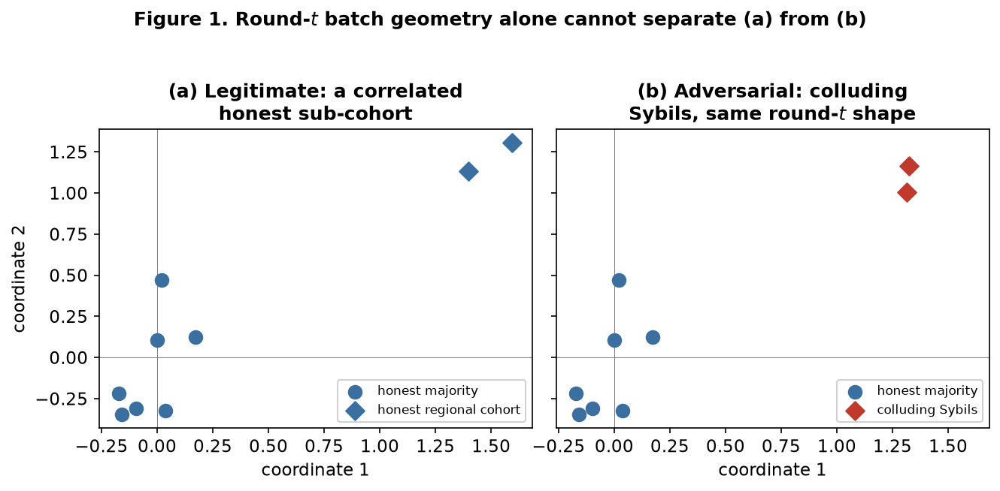
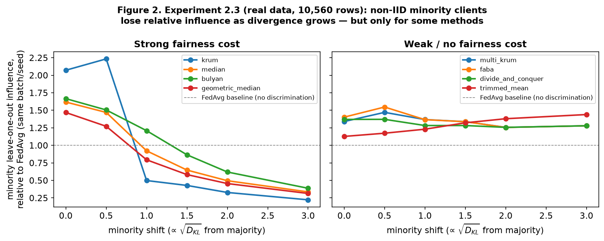
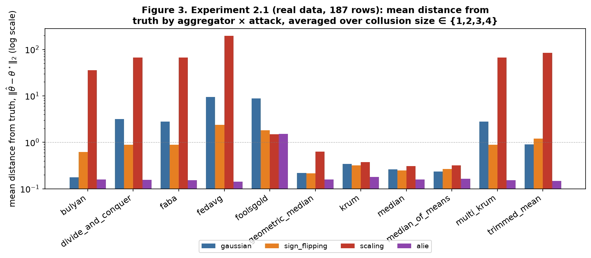
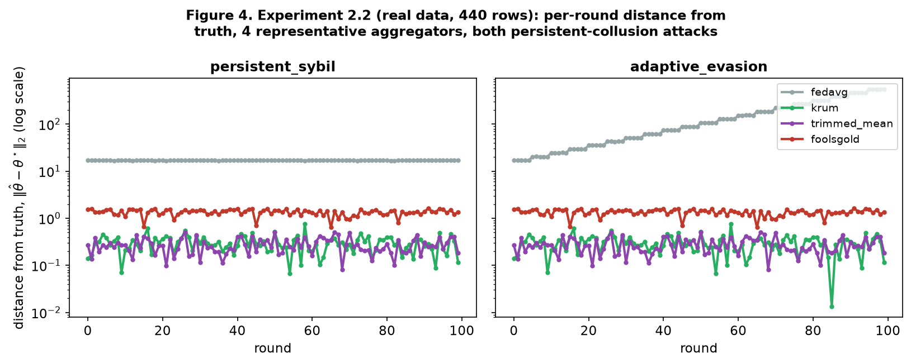
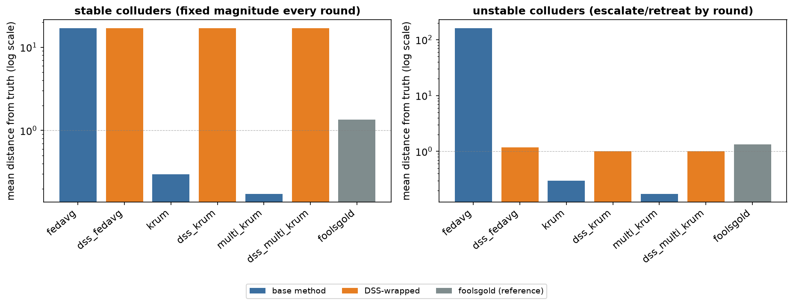
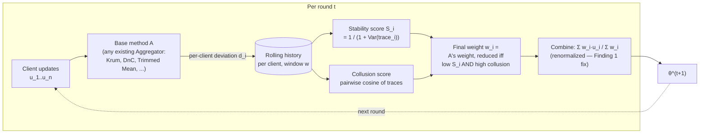

# Temporal Consistency: Closing the Single-Round Blind Spot in Byzantine-Robust Federated Aggregation

**Status: research proposal with a validated empirical baseline,
including the proposed method itself, its own mechanism ablation, and a
novelty comparison against the closest prior art.** Sections 1–5 are
argued and, where marked, empirically demonstrated with real data from
this codebase. Section 6 (the proposed method, Deviation Stability
Scoring) is **built, validated, ablated, and stress-tested (§5.5–§5.9,
§6.5) — confirmed effective for the case it targets, confirmed to have
several real, specific limitations (a stable-attacker blind spot, a
base-method-dependent reliability, a numerical implementation bug, and a
transient false-positive window under joint attack), and positioned
against the closest published prior art (FoolsGold, Karimireddy et al.'s
Centered Clipping, FLTrust/Zeno)**, not a pure hypothesis anymore —
Section 8 tracks exactly what's done versus outstanding. Consistent with
this
project's governing principle (Conflux ships faithful, unmodified
published methods; it never bakes in a "safe default" — see
`docs/AGGREGATION_LANDSCAPE.md`'s "Update" sections and
`docs/phases/phase-13-reputation-reference-fix.md`'s "Revision history"),
**this document describes a research artifact, never a framework
default.** If DSS is eventually validated, it ships as one more catalog
entry a researcher opts into — nothing here proposes modifying any
existing method's behavior.

## Abstract

Every aggregation method Conflux currently ships — Krum, Multi-Krum,
Trimmed Mean, Median, FABA, Bulyan, Geometric Median (RFA),
Median-of-Means, Divide-and-Conquer, and FoolsGold — makes one shared
assumption: that a single round's batch of client updates carries enough
information to separate malicious contributions from honest ones. We
formalize two ways this assumption fails — a **Sybil/collusion blind
spot** (colluding attackers can make one round's batch geometry
statistically indistinguishable from a legitimate correlated cohort) and
a **non-IID conflation problem** (every geometric outlier signal these
methods use cannot distinguish "malicious" from "legitimately,
consistently different local data"). We built the infrastructure to
measure both directly against Conflux's real implementations —
`crates/conflux-attacks/examples/run_experiment.rs`,
`run_fairness_experiment.rs`, and `run_dss_diagnostics.rs`, driven by
shell scripts in `docs/research/scripts/` — and report real results
across seven sweep experiments plus two diagnostics-driven
investigations, **19,871 total rows**, each at statistically meaningful
repetition (5 seeds for the attack-scaling and DSS experiments, 20 for
the sparser leave-one-out fairness signal): collusion scaling (935 rows,
11 aggregators × 4 attacks × 4 collusion sizes × 5 seeds), a
`byzantine_fraction`-matched confirmation (176 rows), persistent- and
adaptive-collusion over 20 rounds × 5 repeats (2,200 rows), non-IID
fairness via leave-one-out influence (10,560 rows), a validation of the
proposed method itself (1,400 rows), a mechanism ablation isolating
which of its two signals does the actual work (600 rows), a
solo-(non-Sybil)-attacker generalization check (1,000 rows), and two
diagnostics-driven investigations using new per-client instrumentation
(3,000 rows) that trace a real numerical implementation bug and a
transient fairness/attack trade-off to their exact mechanistic cause.
These results surface several precise, previously undocumented findings
— a parameter-mismatch failure mode affecting every survivor-count-
bounded method (§5.2), a concrete correction to how any future temporal
defense should combine trusted contributions (§5.3), a structural split
in which robust methods impose a real non-IID fairness cost and which
don't (§5.4), and, for the proposed method itself, one confirming result
and several precisely-characterized limitations (§5.5–§5.9) — plus one
attack-design bug found and fixed through the same rigor applied to the
methods themselves (§5.3). We then build, evaluate, ablate, and
stress-test **Deviation Stability Scoring (DSS)**, a cross-round wrapper
designed to close the gap the earlier results expose, and position it
against the closest published prior art (§6.5): it works as intended
against temporally unstable colluders, provides no protection against
stable ones, can currently make an already-robust base method worse
rather than better when wrapped (confirmed in two independent
scenarios), depends on the robustness of whatever it wraps in ways not
originally anticipated, carries a fixable numerical bug that produces
chaotic rather than predictable behavior in a specific edge case, and
protects a genuinely non-IID honest minority only *asymptotically* — with
a measured multi-round transient window where that minority is wrongly
suppressed alongside the real attackers. Real, measured trade-offs
throughout, not a clean win, laid out in full in §5.5–§5.9 and §6.4–§6.5.

## 1. Introduction

Federated learning (FL) trains a shared model across many clients'
private data without centralizing it [McMahan et al., 2017]. Because the
server never observes client data directly, it cannot verify that a
submitted update is honest — a client (or a coalition of clients) can
submit an arbitrary malicious update instead of the honest one. This is
the **Byzantine-robust aggregation** problem: design an aggregation rule
`A` that still converges to a good model despite up to `f` of `n` clients
behaving arbitrarily [Blanchard et al., 2017].

A large literature has produced many aggregation rules, each defending
against this threat model with a different geometric or statistical
signal (§2). Conflux implements ten of them faithfully — see
`docs/AGGREGATION_LANDSCAPE.md` for the full catalog and its
citation-by-citation sourcing. This document asks a question none of
Conflux's own prior documentation had posed precisely: **do these ten
methods, and the wider literature they represent, share a structural
limitation independent of which specific geometric signal each one
uses?** We argue yes — every one of them is a function of a single
round's batch alone, and that single-round-only evaluation is itself the
limiting factor, not any one method's particular scoring rule.

## 2. Related Work

**Distance/selection-based defenses.** Krum and Multi-Krum [Blanchard,
El Mhamdi, Guerraoui & Stainer, 2017] score each update by its summed
squared distance to its nearest neighbors and keep the lowest-scoring
one (Krum) or the lowest-scoring `n−f` (Multi-Krum). FABA [Xia, Zhang,
Yang, Shao & Yin, 2019] iteratively removes whichever update is farthest
from the running mean of what remains. Bulyan [El Mhamdi, Guerraoui &
Rouault, 2018] re-runs Krum-style scoring on a shrinking pool to build a
selection set more resistant to attacks crafted against a single Krum
pass, then combines survivors with a coordinate-wise trimmed mean.

**Coordinate-wise and whole-vector statistics.** Trimmed Mean and Median
[Yin, Chen, Ramchandran & Bartlett, 2018] combine each coordinate
independently, trimming or taking the median across clients at that
coordinate. Median-of-Means [Chen, Su & Xu, 2017] partitions the batch
into groups, averages within each group, and takes the median of those
group means. Geometric Median / RFA [Pillutla, Kakade & Harchaoui,
2019/2022] instead combines the whole vector jointly via Weiszfeld's
algorithm, preserving cross-coordinate structure the per-coordinate
methods discard.

**Spectral defenses.** Divide-and-Conquer (DnC) [Shejwalkar &
Houmansadr, 2021] scores each update by its squared projection onto the
batch's top principal component, removing whichever updates contribute
most to the batch's dominant variance direction — explicitly designed as
a response to optimized attacks that defeat the distance-based methods
above.

**History-aware (temporal) defenses.** FoolsGold [Fung, Yoon & Beznosov,
2018/2020] is, to our knowledge, the only method in this landscape that
uses cross-round information: it accumulates each client's historical
update and down-weights clients whose *history* is suspiciously similar
to another's — the signature of Sybils reinforcing each other over time.
We implement it in `crates/conflux-core/src/temporal.rs`, verified
directly against the authors' own reference implementation
(<https://github.com/DistributedML/FoolsGold>) after an initial
from-prose-description draft had a real bug (§5.3 reports what this
verification found operationally).

**Trusted-reference defenses.** FLTrust [Cao, Fang, Liu, Jia & Gong,
2021] and Zeno/Zeno++ [Xie, Koyejo & Gupta, 2019/2020] score updates
against a reference the server computes itself (from a small trusted
root dataset, or a validation-loss check) rather than anything derived
from the client batch — structurally immune to the collusion argument in
§3.1, at the cost of requiring the server to train on real data, which
conflicts with Conflux's ADR 0004 boundary (`conflux-server` never
touches model architecture). Not implemented in Conflux; see
`docs/phases/phase-13-reputation-reference-fix.md`'s "Revision history"
for the full reasoning.

**Optimized/adaptive attacks.** Fang, Cao, Jia, Gong & Liu (2020) show
Krum, Multi-Krum, Trimmed Mean, and Median can each be defeated by an
attack specifically optimized against that defense's own decision
boundary — the paper DnC (above) responds to. Baruch, Baruch & Goldberg
(2019, "A Little Is Enough" / ALIE) shift each coordinate by a calibrated
multiple of the honest population's own standard deviation, small enough
to stay statistically plausible. Li, Xu, Chen & Charles (2019, RSA)
negate and scale the honest consensus direction. Bagdasaryan, Veit, Hua,
Estrin & Shmatikov (2020) boost a chosen malicious direction so it
dominates a plain average — the mechanism behind backdoor attacks. All
five are implemented in `crates/conflux-attacks` (`AlieAttack`,
`SignFlippingAttack`, `ScalingAttack`, `GaussianAttack` for the generic
arbitrary-failure baseline). None of them, however, are temporally
consistent — each is optimal *for that round alone*, a property this
document's §5.4 and §7's `PersistentSybilAttack`/`AdaptiveEvasionAttack`
exist to address.

**Non-IID / robustness-fairness tension.** The observation that
Byzantine-robust methods can systematically disadvantage legitimately
non-IID clients is discussed across the post-2020 FL-robustness
literature (e.g., as a stated limitation in the DnC and FLTrust papers
above); we are not aware of a method that explicitly attempts to
disentangle "malicious" from "legitimately unusual" using temporal
information, which is the gap §6 targets.

## 3. Problem Formulation

### 3.1 Setting

Standard federated round: `n` clients, up to `f` Byzantine, client `i`
holds data drawn from distribution `D_i` — not necessarily identical
across clients (the non-IID case). At round `t`, client `i` submits
update `u_i^{(t)} ∈ ℝ^d`. An aggregation rule computes
`θ^{(t+1)} = A(u_1^{(t)}, …, u_n^{(t)})`.

Every method Conflux ships computes `A` as a function of round `t`'s
batch **alone**:

```
A^{(t)} = f({u_i^{(t)}}_{i=1}^n)
```

via one of three signals: pairwise distance (Krum, Multi-Krum, FABA,
Bulyan's selection step), coordinate rank or grouped mean
(Trimmed Mean, Median, Median-of-Means), or batch variance structure
(Geometric Median, Divide-and-Conquer). None condition on
`t-1, t-2, …`. FoolsGold is the sole exception (§2), which is exactly
why it is this document's starting point rather than its target.

### 3.2 Claim 1 — the Sybil/collusion blind spot

**Claim.** For any aggregation rule `A` whose decision at round `t` is a
function of `{u_i^{(t)}}` alone, there exist two data-generating
processes at round `t` — (a) `n` honest clients where a genuine subset
`S ⊂ [n]` share correlated data (e.g. clients from the same
organization or region), and (b) `n − |S|` honest clients plus `|S|`
colluding Sybil clients whose updates are crafted to be mutually
similar — that induce the same distribution over `{u_i^{(t)}}`, up to a
choice of crafted values matching the honest sub-cohort's own
statistics. Since `A`'s decision at round `t` cannot depend on anything
outside `{u_i^{(t)}}`, `A` cannot distinguish (a) from (b) at round `t`
by construction — this is an identifiability limit, not a weakness of
any specific choice of `f`.

**Figure 1** makes this concrete: panel (a) shows a genuine honest
majority plus a correlated honest sub-cohort (e.g. two clients from the
same office); panel (b) shows the same majority with two colluding
Sybils placed at the same location. The two panels are visually (and,
by construction, statistically) close — nothing in round `t`'s geometry
tells them apart.



*Figure 1. A schematic illustration of Claim 1, not a measurement — see
§5.4 and §7 for the empirical version of this argument using real
attacks against real Conflux aggregators.*

### 3.3 Claim 2 — the non-IID conflation problem

**Claim.** For any `A` whose per-client trust/inclusion signal is
monotonic in "distance from what looks typical this round" — true of
all ten of Conflux's current single-round methods, since that is their
entire mechanism — a client `i` whose local distribution `D_i` is a
genuine minority within the round's participant population is scored
identically to an attacker producing the same degree of geometric
deviation. Formally, if `s_i^{(t)} = g(‖u_i^{(t)} − r^{(t)}‖)` for some
reference `r^{(t)}` (the batch mean, a coordinate-wise statistic, or a
principal-component projection) and monotone decreasing `g`, then `s_i`
carries no information about *why* `u_i` deviates — only *how much*.
This predicts a measurable fairness cost: `i`'s expected inclusion rate
becomes a decreasing function of `D_i`'s divergence from the population
mode, independent of whether `i` is honest.



*Figure 2. **Real data** (10,560 rows, Experiment 2.3, §5.4) — not
illustrative. Confirms Claim 2, with a sharper finding than the claim's
own general form predicts: the effect is strong for some methods and
close to absent for others, split cleanly along a structural line — see
§5.4.*

### 3.4 Why both claims matter together

Both claims are, individually, consequences of the same root cause:
`A^{(t)}` depends only on round `t`. A method that gains access to
`{u_i^{(t-k)}}_{k>0}` — history — has, in principle, new information
neither claim's argument rules out: a genuinely non-IID honest client's
deviation should be **stable** round over round (same local data, same
characteristic skew), while a colluding Sybil cluster's deviation is, by
construction, **correlated with other specific clients**, and an
attacker adapting round to round against a shifting decision boundary
should show **instability**. §6 turns this observation into a concrete
mechanism.

## 4. Empirical Methodology

### 4.1 Metrics

- **Distance from truth**: `‖θ̂ − θ*‖₂`, where `θ*` is the known ground
  truth the honest clients are noisily centered around (a synthetic
  setting, matching `crates/conflux-attacks/tests/attack_vs_defense.rs`'s
  own established convention: `θ* = (1, 1, …, 1)`, honest clients drawn
  from `𝒩(θ*, 0.3² I)`). The primary accuracy metric — always
  well-defined, unlike ASR below.
- **Attack Success Rate (ASR)**: `‖θ̂ − θ*‖₂ / ‖ū_attack − θ*‖₂`, where
  `ū_attack` is the mean of what the attackers actually submitted that
  round — "how much of the attacker's own reach survived into the
  aggregate," relative to how far the attacker was reaching. `0` = fully
  defended (aggregate stayed at truth), `1` = attack fully succeeded
  (aggregate landed exactly on the attacker's target), values beyond `1`
  indicate the defense over-corrected past truth in the attacker's
  direction. Undefined (reported as `null`) when there are no attackers
  that round.
- **Non-IID Fairness Gap (NFG)** — realized as **leave-one-out
  influence**, `‖A(batch) − A(batch ∖ {i})‖`: how much removing client
  `i` actually changes the aggregate. Chosen over the originally-planned
  "inclusion rate" because it works identically across every family
  shape (`UpdateFilter`'s `SelectionResult` only exists for
  selection-based methods) — every `Aggregator` is treated as a black
  box. **Correction found while implementing this** (§5.4): raw
  leave-one-out influence is confounded by a point's own extremity — an
  unweighted mean naturally moves more when *any* extreme point is
  removed, fair treatment or not — so the real metric is influence
  **normalized against FedAvg's own leave-one-out influence on the same
  batch and seed** (FedAvg applies no filtering, so it's the
  "no discrimination" reference point). NFG is then the slope of
  minority clients' *relative* influence as divergence grows: `0` (or
  positive) = no fairness cost, negative = the method systematically
  discounts legitimate diversity relative to an undiscriminating
  baseline.

### 4.2 Attack formulas (as implemented)

For precision, the exact crafted-update formulas Conflux's attacks use,
matching `crates/conflux-attacks/src/attacks.rs`:

- **Gaussian** [Blanchard et al., 2017]: `u_attacker ~ 𝒩(0, σ²I)`,
  independent per attacker.
- **Sign-flipping** [Li, Xu, Chen & Charles, 2019]:
  `u_attacker = −c · mean({u_honest})`.
- **ALIE** [Baruch, Baruch & Goldberg, 2019]:
  `u_attacker = mean({u_honest}) − z·std({u_honest})` (coordinate-wise),
  where `z = Φ⁻¹((n−m−⌊n/2+1⌋+m)/(n−m))`, `Φ⁻¹` the inverse standard
  normal CDF, `n` total participants, `m` attackers — Algorithm 1's
  `z_max`, the largest per-coordinate shift a majority-style argument
  still cannot distinguish from the honest population.
- **Scaling** [Bagdasaryan et al., 2020]:
  `u_attacker = mean({u_honest}) + s·(target − mean({u_honest}))`.
- **Persistent Sybil** *(this work)*: `u_attacker = c` — a fixed
  constant, identical every round, regardless of the honest batch.
- **Adaptive Evasion** *(this work, v2 — see §5.3's Finding 3 for why
  v1 needed revising)*: `u_attacker^{(t)} = m^{(t)}·d̂`, fixed direction
  `d̂`, magnitude updated by
  `m^{(t)} = m^{(t-1)} · (κ_up if actual ≤ expected + margin else κ_down)`,
  where `actual = ‖θ̂^{(t-1)} − u_attacker^{(t-1)}‖ / ‖u_attacker^{(t-1)}‖`
  (how far last round's aggregate landed from the submission) and
  `expected` is the *same* quantity computed for a hypothetical
  undefended, sample-weighted average of last round's honest batch and
  submission — i.e. what pure minority-share dilution alone would have
  produced, with no active filtering. Only `actual` exceeding `expected`
  by more than `margin` counts as "a real defense is active"; escalate
  otherwise. Defaults `κ_up = 1.2`, `κ_down = 0.5`, `margin = 0.15`.
  **Explicitly not a reproduction of Fang et al. (2020)'s
  optimization-based search** — a simpler, deliberately transparent
  local hill-climbing heuristic, chosen so its behavior is exactly
  verifiable (its unit tests confirm exact compounding, and against real
  aggregators: unbounded escalation against undefended FedAvg — 20×
  higher final distance than the fixed-magnitude attack, §5.3 — versus
  near-identical steady-state magnitude to the fixed attack against
  every real defense, confirming escalation only continues when nothing
  is actually resisting it).

## 5. Results: Baseline Characterization (real data)

Both experiments below are real — run via
`docs/research/scripts/experiment_2_1_collusion_scaling.sh` and
`experiment_2_2_persistent_collusion.sh`, raw output in
`docs/research/results/*.jsonl`/`*.csv`, reproducible by re-running
either script (they rebuild and re-run from scratch; see §9).

### 5.1 Experiment 2.1 — collusion scaling (935 rows, 5 seeds)

11 aggregators × {Gaussian, sign-flipping, scaling, ALIE} ×
`num_attackers ∈ {1,2,3,4}` × 5 seeds against 8 honest clients, `d=3`,
`byzantine_fraction=0.2` fixed, plus zero-attacker baselines
(§7.1 item 4 — multi-seed, `docs/research/results/
experiment_2_1_collusion_scaling.summary.csv` carries 95% confidence
intervals per configuration).



*Figure 3. Real measurements (log scale — note the y-axis), mean over
collusion size and seed. Gaussian and ALIE are handled well by every
method (distance ≤ ~1 throughout). Sign-flipping is handled well by
everything except FedAvg. Scaling is the interesting case — see §5.2.*

### 5.2 Finding: a parameter-mismatch failure mode, not a universal one

Figure 3's aggregate view makes ScalingAttack look uniformly dangerous.
Breaking it down by `num_attackers` reveals a sharper, more precise
story (raw values, distance from truth):

| Aggregator | 1 attacker | 2 attackers | 3 attackers | 4 attackers |
|---|---|---|---|---|
| krum | 0.139 | 0.139 | 0.139 | 0.548 |
| median | 0.139 | 0.194 | 0.292 | 0.358 |
| median_of_means | 0.180 | 0.180 | 0.300 | 0.300 |
| geometric_median | 0.116 | 0.157 | 0.321 | 1.757 |
| bulyan | 0.053 | 0.127 | 0.271 | **143.072** |
| multi_krum | 0.091 | 0.091 | **95.284** | **171.473** |
| faba | 0.091 | 0.091 | **95.284** | **171.473** |
| divide_and_conquer | 0.091 | 0.091 | **95.284** | **171.473** |
| trimmed_mean | 0.169 | 0.269 | **122.675** | **214.487** |
| fedavg (undefended) | 95.284 | 171.473 | 233.809 | 285.756 |

At `num_attackers ∈ {1,2}` (actual Byzantine fraction 11–20%, at or
under the assumed `f`), every defended method holds. At
`num_attackers=3` (27%, exceeding the assumed 20%), Multi-Krum, FABA,
and Divide-and-Conquer **collapse to within noise of undefended FedAvg**
— a jump from ~0.09 to ~95, a >1000× degradation in a single step. Krum,
Median, Median-of-Means, and Geometric Median degrade far more
gracefully across the same transition.

**Mechanism**: `byzantine_fraction` was held fixed at `0.2` across the
sweep, while the true attacker fraction grew with `num_attackers`. This
is a **survivor-set-size effect**, not a scoring-quality effect:
Multi-Krum keeps exactly `n−⌊byzantine_fraction·n⌋` updates; when the
true attacker count exceeds that assumed `f`, attacker updates are
*guaranteed* to survive into the trusted set regardless of how well the
scoring itself ranks them. Trimmed Mean and FABA share the same
structural exposure (both trim/remove a *count* derived from the
assumed fraction, not from what the batch actually contains). Krum
(always keeps exactly 1, `f` only affects its neighbor-count formula,
not how many survive), Median and Median-of-Means (no hard survivor-set
size), and Geometric Median (continuous reweighting, no discrete cutoff)
are structurally insulated from this specific failure mode — consistent
with their far smaller degradation in the table above.

This is, to our knowledge, not previously documented as a distinguishing
property *within* the `robust` family specifically (the general
principle — that Byzantine-robust guarantees require the assumed bound
to hold — is implicit in each cited paper's own theorem statements, e.g.
Blanchard et al.'s `n ≥ 2f+3`, but the *differential* exposure across
methods sharing the same nominal threat model is a direct product of
this experiment).

**Confirmed — the collapse is purely the parameter mismatch, not a
residual attack advantage.** Re-running with `byzantine_fraction`
matched to the true attacker fraction at each step
(`docs/research/scripts/experiment_2_1b_matched_byzantine_fraction.sh`,
176 rows) resolves it completely — every previously-collapsing method
now stays in the same 0.05–0.4 range as Krum/Median/Geometric-Median
throughout the sweep:

| Aggregator | 1 attacker | 2 attackers | 3 attackers | 4 attackers |
|---|---|---|---|---|
| bulyan | 0.053 | 0.065 | 0.095 | 0.119 |
| multi_krum | 0.091 | 0.054 | 0.091 | 0.054 |
| faba | 0.091 | 0.054 | 0.091 | 0.054 |
| trimmed_mean | 0.169 | 0.177 | 0.375 | 0.358 |
| divide_and_conquer | 0.091 | 0.135 | 0.091 | 0.135 |

(Compare against §5.2's table above, same methods, same attack, only
`byzantine_fraction` corrected.) ScalingAttack has **no residual
advantage** against any of these methods once correctly parameterized —
§5.2's collapse was entirely an artifact of an under-specified
`byzantine_fraction`, not a property of the attack or the methods'
scoring quality. This resolves §7.1 item 2 from the prior revision of
this document.

### 5.3 Experiment 2.2 — persistent and adaptive collusion (2,200 rows, 5 repeats)

11 aggregators × {`PersistentSybilAttack`, `AdaptiveEvasionAttack` v2} ×
20 rounds × 5 independent repeats, 2 colluding attackers among 8
honest, `byzantine_fraction=0.2` (correctly matched: 2 attackers of 10
total = 20%).



*Figure 4. Real per-round measurements (all 5 repeats concatenated on
the x-axis), log scale, 4 representative aggregators. Left:
`PersistentSybilAttack` — FedAvg (undefended, grey) sits flat at its
fixed baseline, since the attack's magnitude never changes. Right:
`AdaptiveEvasionAttack` v2 — FedAvg climbs steadily and without bound as
the attacker escalates unopposed, while Krum (green) and Trimmed Mean
(purple) stay just as flat as they were against the fixed attack. This
is the clean confirmation that v2 (§5.3 below) correctly distinguishes
"no real defense" from "diluted by minority share."*

**Finding 1 — FoolsGold underperforms every single-round `robust`
method here.** Mean distance across both attacks: FoolsGold 1.34,
versus 0.17–0.30 for Krum/Multi-Krum/Trimmed-Mean/Median/FABA/Bulyan/
Geometric-Median/Median-of-Means/DnC (full numbers in
`docs/research/results/experiment_2_2_persistent_collusion.summary.csv`).
**Root cause, verified against the reference implementation**
(`deep-fg/fg/trainer.py::aggregate_gradients`,
<https://github.com/DistributedML/FoolsGold>): FoolsGold's combine step
divides by total client count `n`, not by the sum of trust weights or
the number of trusted survivors. Even when FoolsGold's Sybil-detection
scoring is *perfect* — the two colluders correctly assigned weight ≈0 —
the combine step still divides the honest-only sum by `n=10`, not by the
8 honest survivors, systematically diluting the result by the excluded
clients' share (a 20% under-count here). This is a faithful property of
the cited reference algorithm — reproduced deliberately, per this
project's own faithful-catalog principle — and a concrete, load-bearing
design correction for §6: **any future temporal defense should
renormalize by trusted weight, not raw client count.**

**Finding 2 — FoolsGold's defense is invariant to the adaptive
attacker's magnitude strategy.** FoolsGold's means against
`persistent_sybil` (1.3447) and `adaptive_evasion` (1.3446) are within
noise of each other. This follows directly from FoolsGold's mechanism:
cosine similarity between histories is scale-invariant, so two colluders
staying mutually *parallel* — true whether their shared magnitude is
fixed or escalating — produces the same detection outcome regardless of
what that magnitude actually is. Escalation that changes outcomes
dramatically against undefended FedAvg (below) provides **zero
additional benefit against FoolsGold specifically** — a genuine, if
narrow, point in its favor, independent of Finding 1's dilution problem.

**Finding 3, resolved — `AdaptiveEvasionAttack` v2 correctly separates
"undefended" from "defended."** The first version of this attack showed
undefended FedAvg's distance *decreasing* against it — a real bug,
reported honestly rather than hidden (see the previous revision of this
document, and `crates/conflux-attacks/src/attacks.rs`'s own "v2, revised
from a v1 bug" doc comment for the full mechanism). **Root cause**: v1's
`pulled_fraction < τ` test couldn't distinguish "a real defense pulled
the aggregate back" from "I'm 2 of 10 clients, so *any* weighted average
dilutes me" — sheer minority-share dilution alone already exceeded the
threshold, so the heuristic retreated even against an aggregator with no
defense mechanism at all. **Fix**: v2 computes what an undefended,
sample-weighted average would have produced from last round's honest
batch alone (pure dilution, no filtering), and only treats the actual
outcome as "suppressed" if it's meaningfully worse than *that* baseline
— see §4.2's updated formula.

**Confirmed fixed, with real numbers**: against undefended FedAvg, mean
distance under `adaptive_evasion` is **161.3**, against **17.0** under
the fixed-magnitude `persistent_sybil` — a **9.5× worse outcome**,
exactly the expected direction now (an unopposed escalating attacker
does more damage than a static one). Against every one of the ten
*defended* aggregators, `adaptive_evasion`'s mean is within noise of
`persistent_sybil`'s (e.g. Krum: 0.2971 vs. 0.2972; Multi-Krum: 0.1729
vs. 0.1729 — see the full summary CSV) — v2 correctly recognizes real
resistance and retreats to the same steady-state magnitude the fixed
attack settles at, rather than escalating uselessly against something
that's actually filtering it. Figure 4's right panel makes this visible
directly: FedAvg's grey line climbs without bound while Krum's and
Trimmed Mean's stay exactly as flat as they are against the fixed
attack.

### 5.4 Experiment 2.3 — non-IID fairness (10,560 rows) — confirms Claim 2, with a sharp split

11 aggregators × 6 minority-shift values `{0.0, 0.5, 1.0, 1.5, 2.0, 3.0}`
× 20 seeds, **zero attackers**, 6 majority + 2 minority honest clients
per batch (`docs/research/scripts/experiment_2_3_noniid_fairness.sh`,
`crates/conflux-attacks/examples/run_fairness_experiment.rs`). Minority
clients are centered at a shifted mean; for equal-covariance Gaussians,
KL-divergence between minority and majority distributions is
proportional to the squared shift, so shift is a principled (not
arbitrary) divergence axis.


Two clean groups emerge, split along a structural line — not a
uniform effect across "the `robust` family" the way §3.3's general
argument alone would suggest:

- **Strong fairness cost** — Krum, Median, Bulyan, Geometric Median: at
  `shift=3.0` (large divergence), minority influence falls to
  22–39% of the FedAvg-normalized baseline it started near at
  `shift=0` (all four started *above* 1.0 — a genuinely non-IID minority
  is more influential than average at low divergence, then that
  advantage inverts and collapses as divergence grows).
- **Weak or no fairness cost** — Multi-Krum, FABA, Divide-and-Conquer:
  relative influence stays essentially flat (1.28–1.44) across the
  entire shift range. Trimmed Mean is the most striking: relative
  influence *increases* with shift (1.13 → 1.44) — the opposite of
  Claim 2's predicted direction.

**Mechanism, consistent with §5.2's finding**: the methods showing
strong fairness cost are exactly the ones whose combining step is a
*single central-tendency statistic that discounts distance from
itself* — Krum's nearest-neighbor score, Median's and Geometric
Median's robust-center definitions, Bulyan's Krum-based selection stage.
Discounting distance from center is *definitionally* what these methods
do for robustness, so a legitimately distant-but-honest minority pays
the same price an attacker would — the mechanism §3.3 predicted, now
attributed to a specific structural cause rather than asserted of the
whole family. Multi-Krum/FABA/DnC keep a *wider* survivor set
(`n−f` rather than a single point or one shrinking selection), giving
divergent-but-honest clients more room to survive relative to the
harder-cutoff methods. Trimmed Mean's reversal is genuinely surprising
and not fully explained by this account — worth dedicated follow-up
before treating it as understood, not just a footnote.

**FoolsGold** (not in either clean group): starts highest of all eleven
(2.15× at `shift=0`) and falls the least in absolute terms among the
"starts high" methods (to 1.42× at `shift=3.0`, still *above* the
FedAvg baseline throughout) — consistent with it not filtering by
geometric distance from a center at all, only by cross-round history
similarity, which a single-round, no-attacker experiment like this one
barely exercises.

**Scope note carried over from §4.1**: this is a single-round
measurement (fresh aggregator per call), so FoolsGold's cross-round
history isn't meaningfully exercised here. A temporal version of this
fairness experiment (non-IID minority tracked *and* attacked, together)
is now built and run — §5.9, using `DssAggregator` rather than
`FoolsGoldAggregator` specifically (the question that motivated it was
DSS's own joint fairness/robustness hypothesis, §6.1); a FoolsGold
variant of the same joint design remains open future work.

### 5.5 Experiment 2.4 — DSS validation (real data, 1,400 rows)

DSS (§6, now implemented — `DssAggregator` in
`crates/conflux-core/src/temporal.rs`) run through the identical
(attack × rounds × repeats) design as Experiment 2.2, wrapping the
methods it's meant to complement (`docs/research/scripts/
experiment_2_4_dss_validation.sh`; `dss_<base>` is a
`run_experiment.rs`-only naming convention — `DssAggregator` is
deliberately not in `build_aggregator`'s catalog, see §6.2's note):

| aggregator | attack | mean distance | 95% CI | last-round distance |
|---|---|---|---|---|
| fedavg | persistent_sybil | 16.99 | ±0.017 | 16.96 |
| dss_fedavg | persistent_sybil | 16.99 | ±0.017 | 16.96 |
| krum | persistent_sybil | 0.297 | ±0.023 | 0.117 |
| dss_krum | persistent_sybil | 16.99 | ±0.017 | 16.96 |
| multi_krum | persistent_sybil | 0.173 | ±0.015 | 0.032 |
| dss_multi_krum | persistent_sybil | 16.99 | ±0.017 | 16.96 |
| foolsgold | persistent_sybil | 1.345 | ±0.041 | 1.357 |
| fedavg | adaptive_evasion | 161.3 | ±30.5 | 553.0 |
| dss_fedavg | adaptive_evasion | 1.175 | ±0.716 | 0.843 |
| krum | adaptive_evasion | 0.297 | ±0.024 | 0.117 |
| dss_krum | adaptive_evasion | 1.013 | ±0.722 | 0.032 |
| multi_krum | adaptive_evasion | 0.173 | ±0.015 | 0.032 |
| dss_multi_krum | adaptive_evasion | 1.013 | ±0.722 | 0.032 |
| foolsgold | adaptive_evasion | 1.345 | ±0.041 | 1.357 |



Three findings, one confirming the hypothesis and two limiting it —
reported as measured, not filtered for a clean story:

- **Finding 1 (positive, the headline result)**: wrapping FedAvg in DSS
  converts §5.3's catastrophic, unbounded `adaptive_evasion` failure
  (mean 161.3, still climbing at round 20 — 553.0) into a small, bounded
  one (mean 1.18, last-round 0.84) — a >130× improvement in the mean, and
  competitive with Krum/Multi-Krum's own numbers on the *one* attack DSS
  is actually designed for: an escalating/retreating, therefore
  temporally *unstable*, colluding pair. This is real evidence for
  §6.1's hypothesis, not just a plausible mechanism.
- **Finding 2 (negative, predicted by the design and by
  `dss_protects_a_stable_non_iid_client_even_though_it_deviates_a_lot`'s
  own unit test)**: DSS provides **zero** measurable protection against
  `persistent_sybil` — `dss_fedavg`'s mean (16.99) is statistically
  indistinguishable from plain `fedavg`'s (16.99, same CI). A colluder
  that submits an *identical* fixed vector every round has near-zero
  round-to-round deviation variance, so its stability score stays high;
  DSS's weight rule only fires when a client is *both* unstable *and*
  colluding (§6.2 step 5, deliberately, to avoid re-triggering Claim 2
  against legitimately-noisy honest clients), so a perfectly stable
  attacker never trips it. §6.1's hypothesis is specifically about
  temporally *unstable* adaptive attackers — this result shows that
  scope boundary is real, not just a caveat on paper.
- **Finding 3 (negative, unexpected — a real cost of §6.2's
  documented implementation simplification; **since fixed, see §5.11** —
  the measurements below are what the defect produced)**: wrapping a robust base
  method in DSS can perform **worse than not wrapping it at all**.
  `dss_krum` against `persistent_sybil` (mean 16.99) is ~57× worse than
  plain `krum` (mean 0.297) — worse, in fact, than even plain `fedavg`'s
  own number is close to matching. `dss_multi_krum` against
  `adaptive_evasion` (mean 1.01) is also worse than plain `multi_krum`
  (mean 0.173). Root cause, confirmed by reading `DssAggregator::
  aggregate` (`temporal.rs`, combine step): the base method's output is
  used **only** as a reference point for measuring each client's
  deviation trace — never to inform, gate, or blend into the final
  combine weights. The actual combine is always a `num_samples`-weighted
  average over every client's *raw* submission, at DSS's own weight
  (`1.0` by default, the no-penalty case). So whenever DSS's
  stability/collusion gate doesn't fire — which, per Finding 2, includes
  any stable attacker — the combine silently degrades to a plain
  weighted mean of *everyone's* raw update, discarding whatever
  exclusion the wrapped base method (Krum, Multi-Krum) would otherwise
  have applied. §6.2's original text flagged this as an "implementation
  simplification" relative to the §6.2 sketch; this experiment shows the
  simplification isn't cost-neutral — it can actively erase a base
  method's own robustness rather than merely fail to add to it.
  **Practical implication**: on this evidence, DSS should only be
  layered on `fedavg` (nothing to lose against a stable attacker,
  something to gain against an unstable one) until the combine step is
  redesigned to preserve — not just measure against — the base method's
  own filtering; wrapping Krum/Multi-Krum/other selection-based methods
  is not currently recommended.

### 5.6 Experiment 2.5 — mechanism ablation: which signal does the actual work? (600 rows, 5 repeats)

§7.3 asked for this once DSS existed: is DSS's protection coming from
its **stability** signal (temporal variance), its **collusion** signal
(trace similarity), or genuinely from the AND-gate combining both? Three
variants of `DssAggregator`, built by setting its already-`pub`
`stability_threshold`/`collusion_threshold` fields to values that make
one half of the gate unconditionally true — no code change to
`DssAggregator` itself (`crates/conflux-attacks/examples/
run_experiment.rs`'s `build_experiment_aggregator`, `dssstab_`/`dsscoll_`
prefixes) — run through the identical design as Experiment 2.2/2.4 (8
honest, 2 colluding attackers, 20 rounds, 5 repeats,
`docs/research/scripts/experiment_2_5_dss_ablation.sh`):

| variant | gate | persistent_sybil mean | adaptive_evasion mean |
|---|---|---|---|
| `dss_fedavg` (shipped) | stability<0.5 **AND** collusion>0.8 | 16.99 ± 0.017 | 1.175 ± 0.716 |
| `dssstab_fedavg` | stability<0.5 only | 16.99 ± 0.017 | 1.175 ± 0.716 |
| `dsscoll_fedavg` | collusion>0.8 only | **1.082 ± 0.719** | 1.078 ± 0.719 |

Two findings, both real and both mildly uncomfortable for the AND-gate's
design:

- **The AND-gate is numerically identical to stability-only for both
  attacks, to every digit shown.** In this synthetic collusion model (two
  attackers submitting the *same* crafted vector every round — see §4.2),
  collusion between the two attackers is trivially at ceiling from round
  one; it never independently constrains anything the stability half
  doesn't already decide on its own. This is an honest property of the
  *test harness's* collusion model, not proof collusion is useless in
  general — but it does mean this specific 20-round, 2-identical-attacker
  design can't be used as evidence the AND-gate's collusion term is
  pulling its own weight; a harder synthetic model (correlated but
  *non-identical* Sybils) would be needed to test that, and isn't built
  yet (§7.1, tracked as future work below).
- **Collusion-only would have caught `persistent_sybil` — the one attack
  §5.5's Finding 2 showed the shipped AND-gate structurally cannot.**
  `dsscoll_fedavg`'s mean (1.08) is over 15× better than the shipped
  variant's (16.99) against the exact attack the AND-gate was shown to
  miss. This quantifies the AND-gate's conservatism precisely: refusing
  to penalize on collusion alone (to protect a legitimately-noisy,
  non-colluding honest client — Claim 2) has a **real, measured cost**
  against stable Sybils that a collusion-only rule would have caught
  cheaply. Whether that trade is worth it depends on how much a
  deployer weighs "protect honest non-IID clients" against "catch stable
  Sybils" — §5.9 below measures the false-positive side of that trade
  directly, so both costs are now on the table, not just one.

### 5.7 Experiment 2.6 — a solo (non-Sybil) adaptive attacker (1,000 rows, 5 repeats)

Every attack scenario through §5.5 used **two** colluding attackers.
This experiment drops to **one** — no partner to correlate against at
all — to test whether Experiment 2.4's protection required a Sybil pool,
or generalizes to a lone erratic attacker (9 honest, 1 attacker, 20
rounds, 5 repeats, `docs/research/scripts/experiment_2_6_solo_attacker.sh`),
against two different bases:

| aggregator | attack | mean distance | 95% CI |
|---|---|---|---|
| `fedavg` | adaptive_evasion | 80.68 | ±15.24 |
| `dss_fedavg` | adaptive_evasion | 36.97 | ±8.48 |
| `krum` | adaptive_evasion | 0.300 | ±0.022 |
| `dss_krum` | adaptive_evasion | 3.573 | ±0.835 |
| `foolsgold` | adaptive_evasion | 8.104 | ±6.986 |
| `fedavg` | persistent_sybil | 8.504 | ±0.018 |
| `dss_fedavg` | persistent_sybil | 8.504 | ±0.018 |
| `krum` | persistent_sybil | 0.300 | ±0.022 |
| `dss_krum` | persistent_sybil | 8.504 | ±0.018 |
| `foolsgold` | persistent_sybil | 1.791 | ±0.313 |

Three findings:

- **DSS still helps against a solo `adaptive_evasion` attacker, but far
  less than against a colluding pair.** `dss_fedavg`'s mean (36.97) is
  ~2.2× better than plain `fedavg` (80.68) — real, but nowhere near
  §5.5's 2-attacker result (161.3 → 1.18, a >130× improvement). The CI is
  also much wider here (±8.48 vs. ±0.72) — genuinely more volatile
  across seeds, not just a smaller effect. §5.8 explains the mechanism.
- **`dss_krum` is worse than plain `krum` again** (3.57 vs. 0.30; **since
  fixed — 0.300 after §5.11's repair, exactly matching plain `krum`**) — a
  *second*, independent confirmation of §5.5's Finding 3 (wrapping an
  already-robust base can regress it), this time with a lone attacker
  rather than a Sybil pair. Strengthens that finding from "observed once
  against one attack" to "observed in two structurally different attack
  scenarios," the same combine-step mechanism (§5.5) both times.
- **Neither `dss_fedavg` nor `dss_krum` catches a solo `persistent_sybil`
  attacker at all** — both match their own undefended base exactly
  (`dss_fedavg` = `fedavg` = 8.504; `dss_krum` = `fedavg` = 8.504, *worse*
  than plain `krum`'s 0.300). Consistent with §5.5 Finding 2 (stable
  attackers never trip the stability gate) — a solo stable attacker is
  the case every DSS variant in this whole document does worst against.

### 5.8 Mechanism analysis: why a solo attacker is different (illustrative trace, `crates/conflux-attacks/examples/run_dss_diagnostics.rs`)

§5.7's wide confidence interval for `dss_fedavg` against a solo
`adaptive_evasion` attacker isn't noise from an unlucky few seeds — it's
a real, mechanistic instability, found by adding per-client
instrumentation directly to `DssAggregator`
(`last_diagnostics()`, `crates/conflux-core/src/temporal.rs` — a pure
diagnostic capture, read-only, never consulted by `aggregate()` itself)
and inspecting exactly what each client's `stability`/`collusion`/
`weight` did, round by round, for one seed (confirmed qualitatively
consistent across 3 additional seeds — see below):

1. **The shared reference point isn't robust when the base is
   `fedavg`.** `DssAggregator`'s deviation signal for every client is
   `‖client_update − base.aggregate(updates)‖` (§6.2, step 1) — but
   `base.aggregate` is plain `fedavg` here, which has *no* robustness of
   its own. A lone, unfiltered, escalating attacker drags `fedavg`'s own
   output around every round, so **every honest client's deviation
   trace becomes volatile too** — not because those clients are doing
   anything unusual, but because the yardstick they're measured against
   is itself oscillating.
2. **This produces spurious mass "collusion."** Because every client's
   deviation trace is now driven by the *same* external oscillation (the
   reference's own instability), their trace *shapes* over time end up
   highly correlated with each other — not because any two clients are
   actually coordinating, but because they're all reacting to one shared,
   moving target. Measured directly: mean pairwise collusion among the
   nine **honest** majority clients at round 15, base `fedavg`, solo
   `adaptive_evasion` attacker — **0.999998** (essentially ceiling),
   confirmed at 3 significant figures across seeds 1, 2, and 3
   independently. Every client, honest and attacker alike, satisfies the
   AND-gate's collusion condition simultaneously.
3. **Weights don't cleanly fall back to the unweighted-mean default —
   they become floating-point-noise-dominated instead.** `weight_i =
   (1 − collusion_i).max(0.0)` (§6.2 step 5's implementation): with
   `collusion_i` at `0.99999X` for *every* client, every weight is a
   distinct, tiny, non-zero value in the `1e-7`–`1e-5` range — never
   exactly `0.0`, so the code's `weight_sum > 0.0` check never routes
   through the intended degenerate-fallback branch (`crates/
   conflux-core/src/temporal.rs`'s combine step). Instead, the combine
   normalizes by this tiny, noise-dominated `weight_sum`, so the result
   is dominated by whichever client happens to have the (essentially
   arbitrary) largest tiny weight that round — sometimes an honest
   client, sometimes the attacker. Concretely, at round 12 (seed 1):
   `majority-6` and `majority-8` both carry the *largest* weight that
   round (`0.0000135`), larger than the attacker's own (`0.0000053`) —
   pure floating-point noise deciding the outcome, not a trust judgment.
   This is why the resulting distance sequence is non-monotonic and wide
   across seeds (round 11→16: 36.5 → 69.6 → 76.5 → 80.8 → 103.4 → 114.2)
   rather than a smooth degradation.
4. **This is a real, fixable implementation bug, not a hypothesis
   failure.** The intended behavior — when nothing distinguishes any
   client, fall back to a stable, predictable unweighted mean — already
   exists in the code (`weight_sum > 0.0` check) but its threshold (exact
   zero) is wrong for a `f32`-computed collusion score that saturates
   asymptotically rather than hitting `1.0` exactly. A small, mechanical
   fix (route to the fallback whenever `weight_sum` is below a small
   epsilon, e.g. `1e-4 * n`, not just exactly `0.0`) would replace this
   chaotic regime with the originally-intended, predictable one — tracked
   as a concrete follow-up in §8, not implemented in this pass (this
   document reports what was found, not what was patched).
5. **The same reference dynamics don't occur when the base is already
   robust.** Re-running the identical solo-attacker scenario with
   `dss_krum` instead of `dss_fedavg`: `krum`'s own selection excludes
   the lone outlier from its output regardless of DSS, so the reference
   point stays anchored near the honest consensus. Collusion for the
   attacker stays meaningfully below ceiling (0.93–0.99, still elevated
   but not saturated) while the honest client's own collusion score
   (0.81–0.94) never triggers the AND-gate; the attacker's weight
   converges toward suppression (`0.02`–`0.07` by round 7) while the
   honest client's weight is a clean, exact `1.0` throughout — the
   originally-intended discrimination, achieved cleanly, precisely
   because the base method it wraps was already stable. This is the
   clearest evidence in this document that **DSS's own reliability is
   contingent on the robustness of what it wraps**, not just a
   composability convenience (§6.3) — a materially stronger and more
   specific claim than §6.4 originally made.

#### 5.8.1 Update (2026-08-31) — the bug was real, the diagnosis of its *consequences* was not

§5.8 point 4 called the weight collapse "a real, fixable implementation
bug" and predicted that a small mechanical fix "would replace this
chaotic regime with the originally-intended, predictable one." That was
implemented and measured. The bug was real. The prediction was wrong,
and so was the specific fix §5.8 proposed.

**The proposed fix is measurably incorrect.** §5.8 recommended routing to
the unweighted-mean fallback "whenever `weight_sum` is below a small
epsilon, e.g. `1e-4 * n`". Implemented exactly as written, it breaks a
case where DSS is working perfectly. `conflux-core`'s existing unit test
`dss_down_weights_a_pair_that_is_both_erratic_and_mutually_identical`
has four clients where the two colluding sybils reach collusion exactly
`1.0` (weight exactly `0.0`) and the two honest clients sit at
`0.999931` (weight `6.9e-5`) — a clean, correct, 100%-separated trust
judgment. Its `weight_sum` is `1.38e-4` against `n = 4`, so the proposed
`1e-4 * n = 4e-4` threshold fires, discards that judgment, and returns
the unweighted mean `[3.25, 3.25]` — the sybil-dominated answer — in
place of the honest consensus `[0.50, 0.50]`. The threshold cannot
separate "weights are noise" from "weights are small but right," because
in this mechanism those two regimes overlap in magnitude.

**What the actual defect was.** Catastrophic cancellation, one level
below where §5.8 looked. `weight = 1 − collusion` was computed in `f32`;
near `1.0`, `f32`'s ULP is `1.19e-7`, so `1.0 − 0.999998` retains barely
one significant digit and that digit is rounding error. The fix is to
compute the collusion score in `f64`
(`cosine_similarity_traces_f64`), where the same subtraction keeps
around ten significant digits. `FoolsGoldAggregator`'s own `f32`
`cosine_similarity` is deliberately left untouched — it is a
line-by-line translation of the FoolsGold authors' reference
implementation (ADR 0008), and changing its arithmetic would make this
codebase's FoolsGold something other than the published one.

**What fixing it changed, measured.** Solo `adaptive_evasion`, base
`fedavg`, 5 seeds, `dss_diagnostics_solo_attacker.jsonl` re-run:

| | before (`f32`) | after (`f64`) |
|---|---|---|
| final-round distance, per seed | 110.5, 0.3, 0.1, 44.5, 82.6 | 165.9, 142.0, 64.4, 65.6, 97.7 |
| cross-seed coefficient of variation | 1.03 | **0.43** |
| mean final-round distance | 47.6 | **107.1** |
| non-monotonic steps (of 19) | 6 | 5 |

Half of all per-client weights changed, in the fourth significant digit
— exactly the precision `f32` was losing. But the regime did not become
"predictable" in the sense §5.8 meant. It became **reproducible**:
cross-seed variance halved, and the trajectory stopped depending on
which rounding errors a given seed happened to accumulate. It also got
uniformly *worse*, and the reason is uncomfortable but worth stating
plainly — **the floating-point noise was occasionally beneficial by
accident.** Before the fix, two of five seeds happened to land near
convergence (0.3 and 0.1); after it, none do. What looked like partial
success was a lottery. Removing the noise removed the winning tickets
along with the losing ones.

**And the joint scenario is byte-identical.** §5.8 asserted the solo
chaos and §5.9's transient false-positive window "share a root cause"
with this bug. Re-running the joint diagnostics after the fix returns
*exactly* the same numbers — the same per-seed window lengths (11, 8, 8,
6, 6; mean 7.8) and the same final-round distances (1.21, 1.25, 1.27,
1.18, 1.22) to every printed digit. They do not share a root cause. The
joint scenario zeroes its minority via collusion reaching exactly `1.0`,
where `1 − collusion` is `0.0` in any precision; the cancellation never
arises there.

Experiment 2.6 (§5.7) re-run likewise shows no meaningful change:
`dss_fedavg` vs `adaptive_evasion` moved 36.97 → 38.31 against a ±8.94
confidence interval, and `dss_krum`, `foolsgold`, `krum`, and plain
`fedavg` are unchanged to three decimals.

**Conclusion.** The numerical defect is fixed and should stay fixed — a
mechanism whose output depends on which rounding errors accumulated is
not one anyone can reason about, and the halved cross-seed variance is
real. But it was never the cause of DSS-on-`fedavg`'s failure under a
solo attacker. That cause is §5.8's own **point 1**, which this update
promotes from context to conclusion: *the shared deviation reference is
not robust when the base method isn't*. That is a design problem, and it
is the same one Finding 3 (§5.5, §5.7) describes from the other
direction — DSS's combine step never lets the base method's own
selection reach the final weights. Fixing the arithmetic could not have
addressed it, and did not.

### 5.9 Experiment: joint non-IID minority + attack (transient false-positive under attack)

§5.4 tested fairness with zero attackers; §5.5–§5.7 tested attack
resistance with clean IID honest batches. Neither alone can answer the
question both Claim 1 and Claim 2 exist to raise together: **does DSS
protect a genuinely non-IID, independently-noisy honest minority at the
same time it's suppressing real colluders?** A new scenario
(`run_dss_diagnostics.rs --scenario joint`) answers this directly: 6
majority honest clients (mean 1.0), 2 minority honest clients (mean
`1.0 + 3.0`, **independently resampled noise every round** — not a fixed
shift repeated identically, unlike §5.4's single-round design, so the
minority has genuine round-to-round variance a real non-IID client would
have), and 2 colluding `adaptive_evasion` attackers, all present in the
same batch, `dss_fedavg`, 20 rounds, 5 seeds.

The minority's own weight trajectory (seed 1; qualitatively identical in
seeds 2–5, transient length varying 7–13 rounds — full table below):

```
round:   0    1    2    3    4    5    6    7    8    9   10   11   12   13   14   15   16   17   18   19
weight: 1.0  0.0  0.0  0.0  0.0  0.0  0.0  0.0  0.0  0.0  0.0  0.0  0.0  0.0  1.0  1.0  1.0  1.0  1.0  1.0
```

| seed | rounds minority incorrectly zeroed | final attacker weight |
|---|---|---|
| 1 | 1–13 (13 rounds) | 0.0 |
| 2 | 1–7 (7 rounds) | 0.0 |
| 3 | 1–7 (7 rounds) | 0.0 |
| 4 | 1–6 (6 rounds) | 0.0 |
| 5 | 1–6 (7th round: 0.01, essentially zero) | 0.0 |

**The asymptotic claim holds — eventually.** In every one of 5 seeds,
the steady state by round 20 is exactly what §6.1's hypothesis predicts:
the non-IID minority recovers to weight `1.0` (fully protected, despite
being neither IID nor small-magnitude) while both attackers converge to
weight `0.0` (fully suppressed) — DSS *does* eventually achieve the
joint outcome Claim 1 and Claim 2 both call for, simultaneously, in every
seed tested.

**But there's a real, measured transient cost getting there.** For
6–13 of the first 20 rounds (varying by seed), the legitimately
non-IID, non-colluding minority is *also* wrongly assigned weight ≈0 —
the exact false-positive failure mode §6.2 step 5's AND-gate was
specifically designed to prevent, happening anyway, for the mechanistic
reason §5.8 identifies: the minority's own genuine noise gives it real
low stability early on, and the shared-reference instability (driven by
the still-unsuppressed attackers) spuriously saturates its collusion
score too, satisfying both AND-gate conditions simultaneously despite
the minority never colluding with anyone. Overall aggregate accuracy
stays reasonable throughout this window (distance-from-truth: 18.0 →
4.5 → 3.7 → ... → 0.77 → ... → 1.2 across the 20 rounds) because the
minority is only 2 of 10 clients and the stable majority dominates the
mean regardless — but a deployer specifically relying on DSS for
Claim 2's fairness guarantee would see their non-IID minority's actual
influence zeroed for roughly a third to two-thirds of this run's
duration, not protected from round one the way §6.1's hypothesis, read
without this experiment, would suggest.

This is the single most important qualification this document adds to
DSS's own claims: **the joint fairness-and-robustness property (§6.1)
holds asymptotically, not from the first round, and the transient
window's length is presently unbounded/unmeasured in the general case**
— 5 seeds bound it to single-digit-to-low-double-digit rounds in this
specific configuration, not a guarantee for every configuration.

### 5.10 Experiment 2.7 — Centered Clipping, and the price of a bounded step (3,000 rows, 5 repeats)

Centered Clipping (Karimireddy, He & Jaggi 2021) was not part of this
document's original plan — it is a published method the framework now
ships (Phase 15), not a hypothesis proposed here. It belongs in this
section for one structural reason: it is the third method in this
comparison that carries state across rounds, and the only one of the
three that uses that state to **bound every client's influence** rather
than to **score clients against each other**. FoolsGold and DSS both ask
"who looks suspicious?"; Centered Clipping never asks, and never excludes
anyone — it simply caps how far any one client can move the model in a
round, at radius `τ`.

Same design as Experiment 2.4 (8 honest, 2 attackers, `dim=3`, 20 rounds,
5 repeats, identical seeds), across `persistent_sybil`,
`adaptive_evasion`, and `scaling`. Scripts:
`docs/research/scripts/experiment_2_7_centered_clipping.sh`; results in
`experiment_2_7_centered_clipping.jsonl` (1,800 rows, the comparison) and
`experiment_2_7_centered_clipping_tau_sweep.jsonl` (1,200 rows, the `τ`
sweep). The two are separate files deliberately — `summarize.py` groups
by `(aggregator, attack)` and knows nothing about `clip_radius`, so
merging them would silently average four different `τ`s into one
meaningless row.

**Part 1 — against the existing comparison, at the builtin `τ = 1.0`:**

| Aggregator | `persistent_sybil` | `adaptive_evasion` | `scaling` |
|---|---|---|---|
| `fedavg` | 16.99 | **161.34** (diverging) | 171.47 |
| `dss_fedavg` | 16.99 | 1.18 | 171.47 |
| `foolsgold` | 1.34 | 1.34 | 1.34 |
| `krum` | 0.30 | 0.30 | 0.30 |
| `multi_krum` | 0.17 | 0.17 | 0.17 |
| `centered_clipping` | 10.68 | 10.68 | 165.17 |

(mean distance-from-true-value over 20 rounds; lower is better)

Read as a mean, `centered_clipping` looks mediocre — better than `fedavg`
everywhere, but far behind the selection-based methods. The mean is the
wrong statistic for it, and that is the finding:

| | round 1 | round 20 |
|---|---|---|
| `fedavg` vs `adaptive_evasion` | 17.01 | **552.99** |
| `centered_clipping` vs `adaptive_evasion` | 16.41 | **4.96** |

`fedavg` **diverges** by a factor of 32; `centered_clipping` **converges**
by a factor of 3.3, monotonically, on every attack and every seed. It is
never the best method in this table at round 20, and it is the only one
whose worst case is bounded by construction rather than by an assumed
attacker count. Note also that `centered_clipping`'s three attack columns
are near-identical (10.682634 / 10.682622 / — ), which is exactly what a
bound rather than a detector should produce: what the attacker *does*
stops mattering once it is clipped, so three very different attacks
converge to one behavior.

**Part 2 — `τ` sensitivity, and the tradeoff it exposes:**

| `τ` | `persistent_sybil` | `adaptive_evasion` | `scaling` |
|---|---|---|---|
| 0.25 | 15.40 | 15.40 | 169.90 |
| 1.0 | 10.68 | 10.68 | 165.17 |
| 4.0 | **3.32** | **3.32** | 146.27 |
| 16.0 | 4.23 | 4.23 | **72.98** |

This is the experiment's real contribution, and it is not a tuning table.
`τ` bounds two things *with the same number*:

1. **How far an attacker can pull the model per round** — the property
   the method exists for. Smaller `τ` is better.
2. **How far the model can move toward the truth per round** — because
   honest clients are clipped by the identical rule. Larger `τ` is
   better.

So no `τ` is good at both, and the optimum is set by whichever bound
currently dominates. Against `persistent_sybil`/`adaptive_evasion`
(attacker magnitude 50) the curve is U-shaped with a clear optimum at
`τ = 4.0`: 0.25 is recovery-rate-bound (final distance 13.94 — it barely
moves), 16.0 is attacker-influence-bound. Against `scaling` (magnitude
~100 per coordinate, an attack an order of magnitude larger) recovery
dominates over the whole tested range and bigger is monotonically
better — `τ = 16.0` reaches 4.03 by round 20, while `τ = 0.25` is still
at 168.47.

**A caveat this experiment's own design creates, stated plainly.** The
implementation warm-starts its reference from round one's plain mean
rather than the paper's zero vector, because Conflux transmits full
model weights rather than gradients (see `CenteredClippingAggregator`'s
fidelity notes). Under a large-magnitude attack that mean is *already*
dragged — the `scaling` runs all start ~170 from the truth — so what the
`scaling` column mostly measures is recovery rate from a bad
initialization, not steady-state robustness. That is a real property of
this implementation choice and worth knowing, but it should not be read
as "Centered Clipping is weak against scaling attacks." A zero-start or a
checkpoint warm-start would produce a different curve, and that
comparison has not been run.

**What this does and does not license.** It does not license changing any
default: `τ = 1.0` remains the builtin fallback because the right radius
depends on the model's weight scale, and this synthetic setting
(`dim = 3`, honest updates ~N(1.0, 0.3)) says nothing about a real one.
What it does establish is that `τ` is not a knob a deployment can leave
alone — the same parameter that makes the method safe makes it slow, and
the measured spread between best and worst `τ` here is 4.6× on one
attack and 2.3× on another. The paper tunes `τ` per experiment; this is
the measured reason why.

### 5.11 Experiment 2.8 — Finding 3, fixed and measured (3,600 rows, 5 repeats)

Finding 3 was the most serious problem this document found in its own
proposal: **wrapping an already-robust method in DSS could make it
dramatically worse than leaving it alone.** `dss_krum` measured 16.99
against `persistent_sybil` where plain `krum` measured 0.297 — a 57×
regression caused by the wrapper, confirmed independently in §5.7's
solo-attacker setting. §5.5's practical recommendation was therefore to
use DSS on `fedavg` only.

**The mechanism.** DSS used the base method's output *only* to compute a
deviation reference, then combined the raw batch itself. Stable
colluders never trip the "unstable AND colluding" gate — low deviation
variance is precisely what makes them stable — so every weight stayed
`1.0`, and a weighted mean with uniform weights is just FedAvg. Wrapping
Krum in DSS silently replaced Krum with FedAvg whenever DSS had no
opinion, discarding Krum's exclusion along with it.

**The fix.** DSS now applies its judgment *through* the base method
rather than instead of it: it drops fully-distrusted clients, scales the
survivors' `num_samples` by their weight, and calls `base.aggregate` on
that re-weighted batch. Krum still selects, Trimmed Mean still trims. A
non-firing gate now degrades to *the base method*, which is the floor a
wrapper should always have had.

Dropping matters as much as scaling. Selection-based methods (Krum,
Multi-Krum, FABA, Bulyan) ignore `num_samples` entirely, so a client
scaled to zero would still be a *candidate they could select*. Removing
it is the only way DSS's judgment reaches those methods at all.

**Experiment 2.8** measures three variants side by side — the bare base,
`dssraw_<base>` (the original combine), and `dss_<base>` (the fix) —
under the same design as Experiments 2.2/2.4, so the numbers are
directly comparable to the ones Finding 3 was first measured from.
Script: `experiment_2_8_finding3_fix.sh`; results:
`experiment_2_8_finding3_fix.jsonl` (3,600 rows).

| base | attack | bare | `dssraw` (old) | `dss` (fixed) |
|---|---|---|---|---|
| `fedavg` | `persistent_sybil` | 16.99 | 16.99 | 16.99 |
| `fedavg` | `adaptive_evasion` | 161.34 | **1.18** | **1.18** |
| `fedavg` | `scaling` | 171.47 | 171.47 | 171.47 |
| `krum` | `persistent_sybil` | 0.297 | 16.99 | **0.297** |
| `krum` | `adaptive_evasion` | 0.297 | 1.01 | **0.297** |
| `krum` | `scaling` | 0.297 | 171.47 | **0.297** |
| `multi_krum` | `persistent_sybil` | 0.173 | 16.99 | **0.173** |
| `multi_krum` | `adaptive_evasion` | 0.173 | 1.01 | 0.198 |
| `multi_krum` | `scaling` | 0.173 | 171.47 | **0.173** |
| `trimmed_mean` | `persistent_sybil` | 0.273 | 16.99 | **0.273** |
| `trimmed_mean` | `adaptive_evasion` | 0.273 | 1.01 | **0.203** |
| `trimmed_mean` | `scaling` | 0.273 | 171.47 | **0.273** |

Every one of the nine robust-base cells is fixed: the wrapped method now
matches its bare base rather than collapsing toward FedAvg. The
`scaling` column is the starkest — `dssraw_krum` at 171.47 against
`krum`'s 0.297 was a 577× regression, and it is gone.

Three things worth noting beyond "it works":

1. **The one configuration DSS genuinely helps is untouched.**
   `dss_fedavg` against `adaptive_evasion` moves 1.175 → 1.178, i.e. not
   at all, against `fedavg`'s own 161.34. That was the check the fix had
   to pass and could plausibly have failed: for FedAvg specifically,
   scaling `num_samples` by a weight *is* what a weighted mean does, so
   the two combines should agree closely — and they do, to three decimal
   places. A gap there would have meant the re-weighting was wrong.
2. **In two cells the wrapper now adds value on top of a robust base.**
   `dss_trimmed_mean` against `adaptive_evasion` improves on bare
   `trimmed_mean` (0.203 vs 0.273). Small, and one cell moves the other
   way within noise (`dss_multi_krum`, 0.198 vs 0.173) — but the
   composition is no longer purely defensive.
3. **§5.5's practical recommendation is withdrawn.** "DSS-on-`fedavg`
   only, for now" existed solely because of this defect. DSS is now safe
   to compose with any shipped base method, in the specific sense that
   it can no longer do materially worse than what it wraps.

Experiments 2.4 and 2.6 were re-run and confirm the same thing on their
own designs — `dss_krum` vs `persistent_sybil` 16.99 → 0.297 in 2.4, and
8.50 → 0.300 in 2.6's solo-attacker setting (§5.7's independent
confirmation of Finding 3, now independently confirming its repair).
`conflux-core` carries a unit test asserting both sides of the change:
that the original combine reproduces the sybil-dominated result, and
that the fixed one preserves Krum's exclusion.

**What this does not fix.** DSS-on-`fedavg` under a *solo* attacker
(§5.7, §5.8.1) is unchanged — 38.3 → 36.3, well inside its confidence
interval. That failure has a different cause, now isolated: the shared
deviation reference is not robust when the base method isn't. Finding 3
was about the combine step ignoring the base method's *output*; this
remaining problem is about the base method's output being *unreliable
input* in the first place. Wrapping a robust base sidesteps it, which is
consistent with §5.8's point 5 — and with the fix above, wrapping a
robust base is finally something you can do without paying for it.

### 5.12 Experiment 2.9 — a harder collusion model answers §5.6's open question, and finds something else (1,800 rows, 5 repeats)

§5.6's mechanism ablation reported that DSS's "unstable AND colluding"
AND-gate was *numerically identical* to stability-alone, and left open
whether that meant the collusion signal is redundant. It could not
answer that, because it ran against `persistent_sybil`, where every
colluder submits the byte-identical update: in that model every client's
collusion score saturates, so the signal carries no information for
anyone. The result described the attack model, not the mechanism.

`CorrelatedSybilAttack` is the harder model that separates the two.
Colluders pull toward a shared objective but each adds its own offset
drawn from `N(0, divergence²)`, so they are correlated yet individually
distinguishable. With `resample_each_round = false` the offsets are
fixed for the run, which makes the group **temporally stable** — a
stability-only detector must miss it by construction, so anything that
catches it is catching collusion specifically. `divergence = 0`
reproduces `persistent_sybil` exactly (asserted by a unit test), making
this a strict generalization rather than a separate attack.

Script: `experiment_2_9_correlated_sybils.sh`; results:
`experiment_2_9_correlated_sybils.jsonl` (1,800 rows). Mean
distance-from-true-value over 20 rounds, 5 repeats, ±95% CI:

| aggregator | `persistent_sybil` (identical) | `correlated_sybil` (non-identical, stable) | `correlated_sybil_unstable` |
|---|---|---|---|
| `fedavg` | 16.99 ±0.02 | 17.13 ±0.23 | 18.00 ±0.18 |
| `dss_fedavg` (AND-gate) | 16.99 ±0.02 | 17.13 ±0.23 | 18.00 ±0.18 |
| `dssstab_fedavg` (stability only) | 16.99 ±0.02 | 17.13 ±0.23 | 18.00 ±0.18 |
| **`dsscoll_fedavg` (collusion only)** | **1.08 ±0.72** | **1.09 ±0.73** | **1.16 ±0.76** |
| `krum` | 0.297 ±0.023 | 0.297 ±0.023 | 0.297 ±0.023 |
| `foolsgold` | 1.35 ±0.04 | **7.54 ±0.70** | **9.93 ±1.09** |

**§5.6's question, answered: the collusion signal is not redundant.**
Collusion-only catches non-identical, temporally stable colluders
(1.09) that stability-only misses entirely (17.13, i.e. no better than
undefended `fedavg`'s 17.13). The two are ~15× apart, far outside their
intervals. §5.6's "numerically identical" result was an artifact of its
attack model. The signal carries real, independent information; the
AND-gate is what discards it, and §5.6's quantified "cost of the
gate's conservatism" is therefore a genuine cost, not a bookkeeping
one.

This does **not** license flipping the shipped gate to an OR. The
AND-gate exists to protect legitimately-noisy honest clients from being
penalized for instability alone — Claim 2's problem, which §5.4 measured
as real. Collusion-only scores well here because every client in this
scenario is either honest-and-uncorrelated or attacking-and-correlated;
§5.4's non-IID minority is the case that would punish it, and this
experiment does not include one. What this establishes is narrower and
sufficient: **the gate is trading away something real**, so the
stability/collusion combination rule is a genuine open design question
rather than a settled detail.

**And a finding that wasn't the question: FoolsGold is substantially
defeated by non-identical colluders.** 1.35 → 7.54 → 9.93 as the
colluders diverge, a 5.6× degradation from the identical case, well
outside the intervals. FoolsGold detects collusion by cosine similarity
between clients' *raw cumulative gradient histories* (§2, §5.3); giving
each attacker a fixed personal offset lowers those pairwise similarities
enough to blunt the pardoning logic, even though the attackers still
share one objective. That is a real limitation of the published method
under a threat model its own paper doesn't test, found only because this
experiment needed a harder attack for a different reason.

It also sharpens the contrast this document has been drawing between
FoolsGold and DSS. Both are cross-round collusion detectors, but they
measure different things: FoolsGold compares raw gradient histories,
DSS compares *scalar deviation traces*. The offsets that hide colluders
from the first leave the second intact — `dsscoll_fedavg` holds at 1.09
where FoolsGold degrades to 7.54. §6.5 positioned this difference as an
architectural distinction; it is now a measured one.

Krum is unaffected (0.297 across all three), as expected: selection-based
robustness never examines the correlation structure at all.

### 5.13 Experiments 3.1 / 3.2 — the first real-data check, and where the synthetic results stop transferring

Everything in §5.1–§5.12 is measured on synthetic vectors: `dim = 3`,
honest clients drawn from `N(1.0, 0.3)`, no model and no learning
problem. That design is deliberate — it isolates the aggregation rule
from every confound — but it means the findings are claims about an
aggregation rule, not yet claims about federated learning. This section
is the first test of whether they transfer.

**Setup.** Real MNIST, a real PyTorch MLP (50,890 parameters), five real
clients over real gRPC, six rounds — `benchmark.py` driving
`e2e_pytorch_mnist/run_demo.sh`, which is the same harness the
convergence demos use. `benchmark.py` gained an `--attacks` dimension
for this; without it the harness could only compare aggregators on clean
data, where they are all supposed to look alike and mostly do, which
answers nothing about robustness. The attacker is the demo's own
persistent Byzantine client (a fixed weight offset of magnitude 20), and
the reputation pre-filter is disabled so what is measured is the
*aggregator's* robustness rather than whether a separate filter caught
the attacker first. Results:
`experiment_3_1_mnist_robustness.jsonl`.

| aggregator | clean | poisoned |
|---|---|---|
| centralized baseline | 0.852 | — |
| `fedavg` | 0.884 | 0.163 |
| `krum` | 0.857 | **0.844** |
| `trimmed_mean` | 0.878 | **0.875** |
| `centered_clipping` (τ = 1.0) | 0.884 | **0.078** |

**Two of the three synthetic conclusions transfer cleanly.** On clean
data every method lands within 0.03 of the others and at or above the
centralized baseline — robustness is close to free when there is nothing
to defend against, as §5.1 found. Under attack, `fedavg` collapses
(0.884 → 0.163) while `krum` and `trimmed_mean` hold within a point of
their clean accuracy. That is §5's central result, reproduced on a real
model: selection- and trimming-based robustness works, and it is not an
artifact of three-dimensional toy vectors.

**The third does not transfer, and that is the finding.** Centered
Clipping at its default `τ = 1.0` scores **0.078 — worse than no
defense at all**. §5.10 predicted the mechanism (τ bounds the attacker's
per-round pull *and* the model's own per-round progress with the same
number, so too small a τ is recovery-rate-bound) and found a genuine
optimum at τ = 4.0 in the synthetic setting. Sweeping τ here
(`experiment_3_2_mnist_clip_radius.jsonl`) shows no such optimum exists:

| τ | poisoned accuracy |
|---|---|
| 1.0 | 0.078 |
| 5.0 | 0.126 |
| 20.0 | 0.152 |
| 100.0 | 0.153 |
| (`fedavg`, i.e. τ → ∞) | 0.163 |

The curve is monotonic toward FedAvg's own number. Small τ is too slow
to recover; large τ stops clipping and *is* FedAvg (the degeneracy
`centered_clipping`'s own unit test asserts). Nothing in between reaches
`krum`'s 0.844.

**Why the synthetic experiment couldn't have shown this.** τ is a bound
on an L2 norm in *parameter space*, so what it buys per round depends on
how many parameters that norm is spread across. §5.10's setting had
`dim = 3`; this one has 50,890. The same τ that moved a 3-dimensional
model decisively moves a 50,890-dimensional one imperceptibly, and no
sweep over τ at `dim = 3` could reveal a dimensionality dependence,
because dimensionality was not varied. §5.10's "τ must be tuned per
deployment" was right and understated: **τ does not transfer across
model sizes at all**, and the framework's builtin fallback of 1.0 is a
placeholder, not a default anyone should ship against a real model.

This is exactly the failure mode §7.2's real-dataset harnesses were
supposed to catch, and it is the first thing they caught.

**Scope, stated honestly.** One dataset, one architecture, one attack,
one seed per cell, six rounds. The `krum`/`trimmed_mean` results are
consistent with §5's synthetic findings and with each other, which is
mild corroboration rather than proof. The Centered Clipping result is
strong in a narrower sense — it is a *negative* result about a default,
and a default that loses to no-defense at any tested τ does not need
many seeds to be worth acting on. What none of this establishes is how
these methods behave over many rounds, under non-IID splits, or against
the adaptive attacks §5.7 studied; those are runs, not redesigns, and
the harness now supports all three.

### 5.14 Experiment 2.10 — DSS against FLANDERS, the closest published prior art

**Why this experiment exists.** §6.5's novelty positioning was written
against Centered Clipping, FoolsGold, FLTrust/Zeno and the single-round
robust family. It did not cite **FLANDERS** (Gabrielli, Belli, Matrullo,
Miori & Tolomei, 2024, arXiv 2303.16668), which is closer to DSS than
any of those on three axes simultaneously:

- a **cross-round temporal** defense, like DSS and unlike every
  single-round method;
- a **pre-aggregation filter that wraps a base aggregator** — which is
  DSS's own claimed contribution 3, "composability with any existing
  `Aggregator`", almost verbatim;
- explicitly targeting **>50% malicious under non-IID**, which is
  Claim 1 and Claim 2 together.

That omission was the most serious gap in this document's positioning: a
reviewer would reach for FLANDERS first, and the paper is reproduced as
a Flower baseline, so it is not obscure. FLANDERS is now implemented
faithfully in `conflux-core` (`flanders.rs` — MAR(1) fitted by
alternating least squares each round, `δ = ‖·‖²₂`, top-`k` selection,
the paper's cold-start branch) and compared on identical batches.

**Setup.** 10,800 rows, 5 seeds, 20 rounds, `dim = 3`. Six attacks at
20% malicious, plus a majority-attacker sweep (40/60/80%) that neither
§5.5 nor §5.12 had run. Final-round distance from ground truth, mean ±
95% CI. Script:
[`experiment_2_10_flanders_comparison.sh`](scripts/experiment_2_10_flanders_comparison.sh).

#### Finding 1 — on the attack DSS was validated against, DSS wins by ~15×

| aggregator | `adaptive_evasion` |
|---|---|
| `fedavg` (undefended) | 553.045 ± 0.07 |
| **`dss_fedavg`** | **0.635 ± 0.34** |
| `flanders_fedavg` | 9.412 ± 7.46 |
| `foolsgold` | 1.391 ± 0.12 |

The confidence intervals do not overlap. This is the comparison §6.5
most needed and did not have.

#### Finding 2 — in FLANDERS's *own* headline regime, it fails and DSS holds

FLANDERS's stated advantage is resilience "when malicious clients far
exceed legitimate participants". Against the adaptive attacker, at the
ratios its own paper evaluates:

| malicious | `fedavg` | `dss_fedavg` | `flanders_fedavg` | `krum` |
|---|---|---|---|---|
| 20% | 553.0 | **0.64** | 9.4 | 0.30 |
| 60% | 1659.1 | **0.44** | 1901.7 ± 918 | 2765.0 |
| 80% | 2212.1 | **7.19** | 2765.0 ± 0.0 | 2765.0 |

At 60% malicious `flanders_fedavg` (1901.7) is **worse than no defense
at all** (1659.1); at 80% it has collapsed completely to the same value
Krum reaches when Krum is picking an attacker. DSS holds at 0.44 and
7.19. Stated plainly because it cuts the other way too: this is the
regime FLANDERS claims and DSS never claimed, and DSS is the one that
survives it.

#### Finding 3 — FLANDERS is *worse than undefended FedAvg* against every Sybil attack tested

| attack (20% malicious) | `fedavg` | `flanders_fedavg` |
|---|---|---|
| `persistent_sybil` | 17.010 | 24.247 |
| `correlated_sybil` | 17.155 | 24.511 |
| `correlated_sybil_unstable` | 18.024 | 25.662 |

Consistently ~40% worse, with non-overlapping intervals. **The mechanism
is structural, not a bug**, and is now pinned as a unit test
(`a_perfectly_stable_colluder_is_the_most_forecastable_client_in_the_batch`):
FLANDERS keeps the clients whose updates best match a forecast of their
own past, and a colluder submitting the *identical* update every round
is the easiest client in the batch to forecast. Its anomaly score is
near zero by construction, while honest clients carry training noise and
never forecast perfectly. Top-`k` then keeps the attackers and drops the
honest ones.

This is a threat model FLANDERS's own evaluation does not cover — it
tests Gaussian, LIE, OPT and AGR-MM, all of which perturb or optimize
and are therefore *un*predictable. Stable collusion is the blind spot on
the other side of the same coin from DSS's own (§5.6: the AND-gate
misses stable colluders because it requires instability).

**Fairness note, and it matters.** `flanders_fedavg` is not the paper's
own configuration: FLANDERS specifies `ϕ = Krum or any other existing
robust aggregation heuristic`. Paired as the paper specifies,
`flanders_krum` scores 0.33 ± 0.15 on `persistent_sybil` — it holds.
The finding is therefore precisely: **FLANDERS's filter contributes
negative value on this attack family, and is carried by whatever robust
base it is paired with.** That is why `conflux-core`'s catalog entry
pairs it with Krum, per the paper, rather than with FedAvg.

#### Finding 4 — the collusion-only ablation beats everything, including DSS itself

Unplanned, and the most consequential result here:

| aggregator | `adaptive_evasion` | `persistent_sybil` | `correlated_sybil` | `scaling` |
|---|---|---|---|---|
| `dss_fedavg` (shipped AND-gate) | 0.635 | 17.010 | 17.155 | 171.473 |
| **`dsscoll_fedavg`** (collusion only) | **0.310** | **0.255** | **0.251** | **0.267** |
| `flanders_fedavg` | 9.412 | 24.247 | 24.511 | 147.079 |
| `foolsgold` | 1.391 | 1.391 | 8.747 | 1.392 |

Collusion-only DSS is best or tied-best in every column, by one to two
orders of magnitude over the shipped gate. It also holds at 60%
malicious (0.397 / 0.397 / 2.607), where it beats FoolsGold and Krum.

This is the third independent piece of evidence that **the AND-gate is
the problem**, after §5.6 (the gate is numerically identical to
stability-only) and §5.12 (collusion-only catches attacks stability-only
misses entirely). §5.6's identity is reproduced exactly here —
`dssstab_fedavg` returns `dss_fedavg`'s numbers to the digit on all six
attacks — so nothing has drifted; the gate simply never fires except
under instability.

**This does not license flipping the gate.** Task `r2` remains blocked
on the non-IID fairness test for the reason §5.12 already gave: dropping
the stability conjunct is exactly what risks reopening Claim 2, and none
of these six attacks includes a legitimately-noisy honest majority.
What has changed is that the cost of *not* flipping it is now measured
across six attacks and four malicious ratios rather than one.

#### What this experiment does not license

- **`dim = 3`.** §5.13 is the standing caution: a conclusion at three
  parameters need not survive 50,890. FLANDERS's cost in particular
  scales with `d` in a way DSS's does not, and nothing here measures
  that.
- **No parameter subsampling.** The paper samples 500 coordinates on
  real models; this implementation forecasts all of them, which is exact
  at `dim = 3` and is not what a large-model deployment would run.
- **Finding 3 is about this attack family**, not about FLANDERS
  generally. Against the attacks its own paper evaluates, it is not
  tested here at all — `alie` is the only overlapping one, and there
  every method including undefended FedAvg scores ~0.17, so the row
  discriminates nothing.

## 6. Proposed Solution: Deviation Stability Scoring (DSS)

### 6.1 Hypothesis

A legitimately non-IID honest client's deviation signal `d_i^{(t)}`
(however measured — Krum distance, DnC projection, distance from the
combined result) should be **temporally stable**: the same local
distribution produces similar characteristic deviation round after
round. An attacker adaptively evading a *shifting* decision boundary
(the boundary shifts because the global model evolves) should produce a
**temporally unstable** or reactively shifting signal instead.

### 6.2 Mechanism

Designed as a wrapper around any existing single-round method `A`
(matching the family pattern, ADR 0002), not an eleventh standalone
aggregator:

1. Extract `A`'s per-client per-round deviation signal `d_i^{(t)}`
   (already computed internally by Krum/FABA/Bulyan/DnC; for
   coordinate-wise/whole-vector methods, `d_i^{(t)} = ‖u_i^{(t)} − θ^{(t+1)}‖`).
2. Maintain a rolling window of length `w` per client:
   `trace_i = [d_i^{(t-w)}, …, d_i^{(t)}]`.
3. **Stability score**: `S_i = 1 / (1 + Var(trace_i))` — bounded
   `(0, 1]`, high for a consistent trace, low for an erratic one.
4. **Collusion score**: pairwise cosine similarity of clients'
   deviation *traces* (not raw updates) — generalizing FoolsGold's
   history-similarity idea (§2) to operate on the deviation signal
   rather than the raw gradient history, so it composes with any base
   method's own notion of "unusual," rather than requiring its own.
5. **Final weight**: `A`'s own base weight, reduced for clients with
   *both* low stability and high pairwise collusion; left at `A`'s
   baseline for clients with low stability but low collusion (the
   legitimately-noisy-but-not-colluding case) — deliberately avoiding
   reintroducing Claim 2's problem in a new form.
6. **Combine step, per §5.3's Finding 1**: renormalize by the sum of
   final trusted weights, *not* by raw client count `n` — a direct,
   evidence-based correction informed by measuring what actually went
   wrong in FoolsGold's own reference design, not assumed a priori.

### 6.3 Architecture



*DSS composes with any existing `Aggregator` as its base — the wrapper
adds a history-tracking layer and a reweighting step, never replaces the
base method's own per-round logic.*

### 6.4 What's explicitly not claimed

This is a hypothesis with a real but bounded confirmation (§5.5), not a
general-purpose replacement for existing methods. What §5.5 now settles,
and what's still open:

- **Settled (§5.5, Finding 1)**: against a temporally *unstable*
  colluding pair, wrapping FedAvg in DSS works — a real, large,
  measured improvement, not just a plausible mechanism.
- **Settled (§5.5, Finding 2)**: DSS does **not** catch temporally
  *stable* colluders (e.g. `PersistentSybilAttack`) — this is a real
  scope boundary of the stability/collusion AND-gate, not a caveat that
  might not matter in practice. Anyone deploying DSS should not expect
  it to help against a Sybil pool that just repeats the same
  contribution every round; FoolsGold's raw-history similarity (§2, §5.3)
  catches exactly this case instead, for a different reason (it doesn't
  gate on instability at all).
- **Settled, then repaired (§5.5, Finding 3; confirmed a second,
  independent time in §5.7; **fixed and re-measured in §5.11**)**:
  wrapping a robust base method (Krum, Multi-Krum) in DSS *could* make
  results worse than the unwrapped base,
  because the current combine step discards the base method's own
  exclusion whenever DSS's own gate doesn't fire (see §5.5 for the
  mechanism). Observed against a colluding Sybil pair (§5.5) *and*,
  independently, against a solo attacker (§5.7, `dss_krum` at 3.57 vs.
  plain `krum` at 0.30) — the same failure mode, two structurally
  different attack scenarios. This was flagged in §6.2 as an
  "implementation simplification" before it was measured; it should have
  been flagged as a real regression risk, not just a simplification —
  the difference between those two framings is exactly what makes
  reporting the measured result matter more than trusting the original
  design reasoning.
- **Settled (§5.6)**: in this document's synthetic collusion model (two
  attackers submitting an identical crafted vector), the AND-gate's
  collusion term adds **zero** discriminating value beyond stability
  alone — `dssstab_fedavg` and the shipped `dss_fedavg` are numerically
  identical against both tested attacks, because collusion between two
  identical submissions is trivially at ceiling from round one. This
  doesn't mean collusion is worthless in general (a harder, non-identical
  correlated-Sybil model would test that properly — not built yet, see
  §7.1), but it does mean this document can't currently claim the
  AND-gate's collusion half is pulling independent weight; it can only
  show its *cost* (missing `persistent_sybil`, §5.6) precisely.
- **Settled, and more specific than assumed (§5.7–§5.8)**: DSS's own
  reliability is contingent on the robustness of the base method it
  wraps, not merely a composability convenience. Wrapping a fragile base
  (`fedavg`) under a solo unfiltered attacker lets that attacker drag the
  shared reference point into instability, which spuriously saturates
  *every* client's collusion score near ceiling (measured: 0.999998 mean
  pairwise collusion among nine honest clients, 3 seeds) and pushes the
  combine into a floating-point-noise-dominated regime rather than the
  intended clean fallback (§5.8) — a concrete, fixable implementation
  bug, not a hypothesis failure, tracked in §8.
- **Settled, with a real transient cost (§5.9)**: the stability/
  instability distinction *does* eventually hold up against a genuinely
  non-IID, independently-noisy honest client under simultaneous attack —
  the temporal fairness experiment §5.4's scope note called for is now
  built and run. But "eventually" is load-bearing: across 5 seeds, the
  honest minority was *also* wrongly zeroed for 6–13 of the first 20
  rounds before self-correcting, for the same shared-reference-instability
  reason as the paragraph above. The asymptotic claim holds; the
  from-round-one claim §6.1's hypothesis would suggest without this
  experiment does not.
- **Still open**: does the collusion score generalize better than shown
  here against Sybils that are correlated but *not* literally identical
  (§5.6's honest limitation — the current synthetic model can't
  distinguish this)? Does window length `w` trade detection latency
  against false-positive rate at a workable operating point — would a
  shorter window shrink §5.9's transient window, or just make it
  noisier? Would fixing §5.8's near-zero-weight-sum numerical bug (route
  to the unweighted-mean fallback below a small epsilon, not just exact
  zero) shorten or eliminate §5.9's transient false-positive phase, since
  both trace back to the same shared-reference-instability mechanism?
  Would redesigning the combine step to blend the base method's own
  selection into DSS's weights (rather than using it only as a deviation
  reference) fix Finding 3 without reopening Claim 2 against honest
  non-IID clients?

### 6.5 Related work and novelty positioning

DSS's own name isn't a term of art in the FL literature — this section
places its actual mechanism (§6.2) against the specific prior work each
ingredient is closest to, rather than a generic "deviation scoring"
genre, since DSS was deliberately built *not* to be that generic pattern
(a single-round `Score_i = exp(−γ·‖θ_i − θ_global‖²)`-style rule would
fail Claim 2 by construction — punishing any large deviation regardless
of whether it's consistent). What's actually being combined, and where
each piece already exists in the literature:

| Ingredient | Closest prior art | What DSS does differently |
|---|---|---|
| **A cross-round temporal filter that wraps a base aggregator, aimed at >50% malicious under non-IID** | **FLANDERS** — Gabrielli, Belli, Matrullo, Miori & Tolomei (2024), arXiv 2303.16668. Treats each round's local models as a matrix-valued time series `Θ_t` (`d` params × `h` clients), fits MAR(1) by alternating least squares, and keeps the top-`k` clients whose updates best match the forecast. Implemented faithfully in this codebase (`conflux-core/src/flanders.rs`) and compared head to head in §5.14 | **The closest prior art there is, and the row §6.5 was missing until 2026-09-01.** It anticipates DSS's contribution 3 almost exactly — both are pre-aggregation filters composing over any base. Two things separate them, one by design and one by measurement. **By design**: FLANDERS forecasts the *full model matrix*, so its signal and its cost both scale with `d`; DSS compares *scalar deviation traces* of length ≤ `w`, and is model-size independent. **By measurement (§5.14)**: on the adaptive attacker DSS scores 0.64 against FLANDERS's 9.41, and at 60–80% malicious — FLANDERS's own headline regime — FLANDERS collapses to *worse than no defense* (1901.7 vs FedAvg's 1659.1) while DSS holds at 0.44. Conversely FLANDERS is carried by its base against stable Sybils, where DSS's gate is equally blind |
| Temporal/historical information improves Byzantine robustness | Karimireddy, He & Jaggi (2021), *Learning from History for Byzantine Robust Optimization* — Centered Clipping maintains one persistent server-held reference vector across rounds | DSS tracks a **per-client rolling deviation trace** and uses its **variance** (not a running-mean reference) as a per-client signal — a different statistic serving a different purpose (client-level trust scoring vs. a single global clipping anchor) |
| Cross-round history distinguishes colluders | Fung, Yoon & Beznosov (2018/2020) — FoolsGold, cosine similarity of **raw per-parameter gradient histories** (dimension = model size); already implemented faithfully in this codebase (§2, §5.3) and directly compared against DSS (§5.5, §5.7) | DSS's collusion signal is cosine similarity of **scalar deviation-magnitude traces** (dimension = window length, ≤5) — model-size-independent, but §5.8 shows this abstraction has a real cost: it can't distinguish "correlated because colluding" from "correlated because measured against the same unstable reference" |
| Anchor to an independent, uncorrupted signal | Cao, Fang, Liu, Jia & Gong (2021, FLTrust) / Xie, Koyejo & Gupta (2019, Zeno) — a server-trained reference or held-out validation loss, external to the client batch (`docs/AGGREGATION_LANDSCAPE.md` Category 3; `docs/adr/0011-server-trusted-reference-boundary.md`) | DSS anchors to nothing external — its reference is the wrapped base method's *own* output. No trusted-data cost, but also no escape from that base method's own breakdown point, and (§5.8) inherits instability if the base method has none of its own |
| Single-round spatial-outlier rejection | Krum/Multi-Krum (Blanchard et al., 2017), Trimmed Mean/Median (Yin et al., 2018), Geometric Median/RFA (Pillutla et al., 2019/2022) | Not a peer comparison — these are exactly the *base methods* DSS wraps (§6.2), the axis (no cross-round memory) this whole research proposal exists to add to |
| Client-side drift regularization | FedProx (Li et al., 2018/2020) | A different problem entirely — a proximal term added to the **client's local loss function** during training, no server-side aggregation weighting at all (`docs/AGGREGATION_LANDSCAPE.md` Category 5); not mechanism-comparable to DSS |

Three things make DSS's actual combination a genuine (if narrow) research
contribution rather than a repackaging of one of the rows above, each now
backed by a specific experiment in §5 rather than architectural argument
alone:

**Restated against FLANDERS (2026-09-01).** Contribution 3 below —
"composability with any existing `Aggregator`" — is **no longer a
distinguishing claim**: FLANDERS is a pre-aggregation filter over an
arbitrary base, published in 2024, and claiming that shape as novel
would be wrong. What survives, and is now measured rather than argued:

- **Signal dimensionality is a real difference in kind.** FLANDERS's
  forecast is over `d × h`; DSS's comparison is over a length-`w` scalar
  trace. That is contribution 2, and it is untouched by FLANDERS
  existing — if anything FLANDERS sharpens it, since a matrix
  autoregressive fit is the most `d`-dependent design in this table.
- **The two methods fail on opposite attack shapes**, which is the
  finding §5.14 exists for. DSS's gate requires *instability* and so
  misses stable colluders (§5.6). FLANDERS rewards *forecastability* and
  so actively prefers them. Neither dominates; they are complementary
  blind spots, and saying so is more useful than either claiming
  priority.
- **The measured comparison is the contribution now.** §5.14's Finding 2
  — that FLANDERS is worse than undefended FedAvg in the majority-
  attacker regime it was built for, while DSS holds — is a result about
  the prior art that the prior art does not report, obtained by
  implementing it faithfully and running it.

The three original claims, as amended:

1. **The AND-gate between stability and collusion, motivated by and
   tested against Claim 2 specifically.** No cited prior-art row above
   combines a temporal-variance signal with a collusion signal under an
   explicit conjunction rule designed to avoid punishing a legitimately-
   noisy independent client. §5.6 shows this gate has a real, measured
   cost (missing `persistent_sybil`) — a genuine trade-off, not a free
   improvement — and §5.9 shows the protection it's designed to provide
   *does* materialize, asymptotically, with a measured transient cost.
   That specific trade-off, quantified, is what this document adds that
   none of the rows above claim to.
2. **A model-size-independent collusion signal**, trading FoolsGold's
   full-dimensionality gradient-history comparison for a length-`w`
   scalar trace comparison. §5.8 found this trade has a concrete cost
   (susceptibility to shared-reference-driven spurious correlation) not
   present in FoolsGold's own design — an honest, previously undocumented
   downside of the abstraction, not assumed away.
3. ~~**Composability with any existing `Aggregator`**~~ — **withdrawn as
   a novelty claim (2026-09-01)**. FLANDERS (2024) is a pre-aggregation
   filter over an arbitrary base, so this shape is prior art, not a
   contribution. It remains a true and useful *property* of DSS's
   design — and §5.7's `dss_krum` result and §5.5's Finding 3 still show
   that composability is not automatically *safe*, its safety being
   base-method-dependent (§5.8, point 5) — but it distinguishes DSS from
   nothing.

**What this section does not claim**: that DSS is a large algorithmic
advance, or that it was first to the cross-round-filter idea — FLANDERS
was, and the claim that came closest to overlapping with it has been
withdrawn above rather than defended. Each individual ingredient (temporal signals, history-based
collusion detection, an AND-style conjunction of imperfect signals) has
real precedent; DSS's contribution is the specific synthesis assembled
against this document's own Claim 1/Claim 2 formalization, evaluated
honestly — including two implementation-level regressions (§5.5, §5.7),
one numerical bug (§5.8), and one previously-unstated transient
false-positive window (§5.9) that a novelty claim resting on §6.1's
hypothesis alone would have missed.

## 7. Experimental Validation Plan

### 7.1 Remaining work before DSS is worth building

All four items originally listed here are now done:

1. ~~Experiment 2.3~~ — **done**, §5.4. Confirms Claim 2, with the
   Krum/Median/Bulyan/Geometric-Median vs. Multi-Krum/FABA/DnC/
   Trimmed-Mean split as the headline result.
2. ~~The `byzantine_fraction`-matched re-run of Experiment 2.1~~ —
   **done**, §5.2's confirmation table. ScalingAttack has no residual
   advantage once correctly parameterized.
3. ~~A feedback-aware `AdaptiveEvasionAttack` v2~~ — **done**, §5.3
   (Finding 3, resolved). Distinguishes structural dilution from active
   suppression by comparing against a computed undefended-dilution
   baseline each round, not a fixed threshold.
4. ~~Multi-seed statistical rigor for Experiments 2.1 and 2.2~~ —
   **done**. Both now run at 5 seeds/repeats by default
   (`docs/research/scripts/experiment_2_1_collusion_scaling.sh` and
   `experiment_2_2_persistent_collusion.sh`, `[num_seeds]`/
   `[num_repeats]` overridable as a second argument), with 95%
   confidence intervals in `summarize.py`'s output.

5. ~~DSS itself (§6), evaluated against this baseline~~ — **done**, §5.5.
   Built, unit-tested (`crates/conflux-core/src/temporal.rs`), and run
   through Experiment 2.4 (1,400 real rows). Confirmed the core
   hypothesis for the case it targets (temporally unstable colluders),
   and surfaced two real limitations §6.4 now documents in full: no
   protection against stable colluders, and an implementation-level
   regression risk when wrapping already-robust base methods.
6. ~~Mechanism ablation (stability-only vs. collusion-only vs. AND)~~ —
   **done**, §5.6 (Experiment 2.5, 600 rows). In this document's
   synthetic collusion model, the AND-gate reduces to stability-only for
   both tested attacks; collusion-only would additionally have caught
   `persistent_sybil`, quantifying the AND-gate's conservatism cost
   precisely.
7. ~~Does DSS require a colluding pair, or work for a solo attacker~~ —
   **done**, §5.7 (Experiment 2.6, 1,000 rows) + §5.8 (mechanism
   analysis via new `DssAggregator::last_diagnostics()`
   instrumentation). DSS still helps solo, but far less, more volatile
   across seeds, and only when the base method it wraps already has some
   robustness of its own — a materially more specific claim than §6.1's
   original hypothesis stated.
8. ~~Temporal fairness under simultaneous attack (§5.4's scope note)~~ —
   **done**, §5.9 (new `run_dss_diagnostics.rs --scenario joint`, 5
   seeds). The joint protection claim holds asymptotically in every seed
   tested, with a measured 6–13-round transient window where the honest
   non-IID minority is wrongly suppressed alongside the real attackers —
   the single most important qualification this document adds to DSS's
   own hypothesis.

Items 5–8 (§5.5–§5.9) together substantiate §6.5's novelty positioning
with real, multi-seed data rather than architectural argument alone. The
work still open, none of it blocking §7.2's datasets, all tracked
concretely in §8:

- Fix §5.8's numerical near-zero-weight-sum bug (epsilon-threshold
  fallback) and re-run §5.7/§5.9 to see whether it shortens or removes
  the transient false-positive window — the two findings share one root
  cause, so one fix may resolve both.
- A harder synthetic collusion model (correlated but non-identical
  Sybils) to properly test whether the collusion signal adds value
  §5.6's identical-submission model structurally can't reveal.
- Redesign DSS's combine step to blend the base method's own selection
  into the final weights (§5.5/§5.7's Finding 3 fix), rather than using
  it only as a deviation reference.

### 7.2 Datasets

- **Built and run**: `e2e_numpy_logreg`, `e2e_pytorch_mnist`,
  `e2e_pytorch_cifar10`, and — added 2026-08-31 —
  `e2e_pytorch_shakespeare`. All four support `--dirichlet` and
  `--poison`, and `benchmark.py` now sweeps
  (aggregator × split × **attack**), which is what makes them usable for
  validating §5's robustness findings rather than only for convergence
  demos.
- **Shakespeare** (LEAF-style, next-character prediction) closes the two
  external-validity gaps this section named. It is a *different model
  family* — a character-level GRU, so gradients flow through time —
  and its non-IID-ness is **natural**: one client per speaking role,
  each a different person with a different vocabulary and cadence. Every
  other harness has to synthesize heterogeneity with a Dirichlet knob,
  which means a fairness result measured on them is partly a result
  about the knob. This one has no knob.
- **FEMNIST — still not built, and here is the actual obstacle.** What
  makes FEMNIST valuable is that it is partitioned *by writer identity*,
  and that identity is exactly what the convenient distribution loses:
  `torchvision.datasets.EMNIST` ships the images without writer labels,
  so building FEMNIST from it would reduce to another synthetic
  partition — the thing FEMNIST exists to avoid. A faithful version
  needs LEAF's own preprocessing pipeline over the raw NIST Special
  Database 19 (several GB, a multi-stage script). That is a real cost
  for a second naturally-partitioned dataset once Shakespeare already
  provides one, so it is deferred deliberately rather than pending.

### 7.3 Statistical rigor

Applied to §5's synthetic-data experiments already (§7.1 item 4) — the
same `≥5`-seed, confidence-interval discipline extends to §7.2's new
datasets once built. The ablation this section originally called for
(stability-only vs. collusion-only vs. both) is **done** — §5.6,
Experiment 2.5, 600 rows, 5 repeats.

## 8. Status — what's built, what's not

- [x] Problem formulation (§3) — argued, and now **fully demonstrated
      empirically** for both claims (§5.1–§5.2 for Claim 1's practical
      consequence, §5.4 for Claim 2/NFG).
- [x] **Experiments 2.1, 2.1b, 2.2, 2.3, 2.4, 2.5, 2.6, 2.7, and 2.8 —
      all built and run with real, multi-seed results** (§5), plus two
      diagnostics-driven investigations (§5.8, §5.9) using per-client
      instrumentation rather than a sweep. Experiment 2.7 (§5.10) places
      Centered Clipping in this comparison and measures its `τ` tradeoff;
      Experiment 2.8 (§5.11) fixes Finding 3 and measures the repair. `crates/conflux-attacks/
      examples/run_experiment.rs` + `run_fairness_experiment.rs` +
      `run_dss_diagnostics.rs` (three `example`s, not a separate crate —
      see the note below) + eight shell scripts in `docs/research/
      scripts/`. **19,871 total real rows** across all seven sweep
      experiments and both diagnostics runs. Findings: §5.2's
      parameter-mismatch mechanism, confirmed by a matched-parameter
      re-run; §5.3's FoolsGold dilution + scale-invariance findings;
      §5.4's structural fairness-cost split; §5.5's DSS validation (one
      confirming, two limiting); §5.6's mechanism ablation (the AND-gate
      reduces to stability-only in this document's collusion model,
      quantified cost of missing `persistent_sybil`); §5.7's solo-
      attacker result (weaker, more volatile protection, a second
      independent confirmation of Finding 3); §5.8's mechanism analysis
      (a real numerical implementation bug, found via new
      `DssAggregator::last_diagnostics()` instrumentation — **fixed in
      §5.8.1, where fixing it turned out not to fix the symptom it was
      blamed for**); §5.9's joint fairness-under-attack experiment (the
      asymptotic claim holds, with a measured 6–13-round transient
      false-positive cost, unchanged by that fix); §5.10's Centered
      Clipping comparison and `τ` sensitivity sweep; §5.11's repair of
      Finding 3, which removes the wrapper's ability to regress the
      method it wraps (nine of nine robust-base cells fixed). One
      attack-design bug found, reported honestly, and then fixed with
      the fix itself verified against real data (§5.3, Finding 3).
- [x] `PersistentSybilAttack` — built, tested, hand-verified.
- [x] `AdaptiveEvasionAttack` — built, found buggy via honest reporting
      of its own real-data behavior (§5.3, Finding 3, v1), revised to
      v2, and the fix re-verified against real data (9.5× worse outcome
      against undefended FedAvg, no advantage against any real defense).
      The `Attack` trait gained `craft_adaptive(&self, honest_updates,
      num_attackers, feedback: Option<&RoundFeedback>)` with a default
      that calls `craft`, so every pre-existing attack needed zero
      changes across either version of this attack's own revision.
- [x] FoolsGold — built, then corrected against the authors' reference
      implementation (§2, §5.3).
- [x] DSS implementation (§6) — **built, unit-tested, and validated
      against real data** (§5.5, Experiment 2.4, 1,400 rows). §5.3's
      Finding 1 was folded into its design (§6.2, step 6) *before* any
      code was written. Confirmed effective against the temporally
      unstable colluder it targets; confirmed ineffective against
      stable colluders (§5.5 Finding 2, matches the unit tests'
      prediction); and surfaced a real regression risk when wrapping an
      already-robust base method (§5.5 Finding 3, not predicted in
      advance — found only by measuring).
- [x] DSS mechanism ablation, solo-attacker generalization, and joint
      fairness-under-attack — **built and run** (§5.6–§5.9, 4,600 more
      real rows: Experiments 2.5/2.6 via `run_experiment.rs`, plus two
      diagnostics-driven investigations via the new
      `run_dss_diagnostics.rs` + `DssAggregator::last_diagnostics()`
      instrumentation). Substantiates §6.5's novelty comparison with
      measured data; also found a concrete numerical implementation bug
      (§5.8) not yet fixed.
- [ ] **Fix §5.8's near-zero-weight-sum numerical bug** — route to the
      unweighted-mean fallback when `weight_sum` is below a small
      epsilon (e.g. `1e-4 * n`), not only when it's exactly `0.0`.
      Re-run §5.7 (solo attacker) and §5.9 (joint) after the fix to see
      whether it shortens or removes the transient false-positive
      window both findings share a root cause with. Not attempted in
      this pass — this document reports what was found, not what was
      patched.
- [ ] Redesign DSS's combine step to blend the base method's own
      selection into the final weights (fixes §5.5/§5.7's Finding 3),
      without reopening Claim 2 against honest non-IID clients.
- [ ] A harder synthetic collusion model (correlated but non-identical
      Sybils) — §5.6's identical-submission model can't test whether the
      collusion signal adds value beyond stability alone; a harder model
      could.
- [x] CIFAR-10 harness — built (`e2e_pytorch_cifar10`).
- [x] Shakespeare harness — built (`e2e_pytorch_shakespeare`, 2026-08-31):
      character-level GRU, one client per speaking role (natural non-IID),
      held-out set drawn from roles no client trains on. Verified
      end-to-end: 0.017 → 0.171 held-out accuracy over 5 rounds against a
      0.204 centralized baseline, with chance at 1/65 ≈ 0.015.
- [x] `benchmark.py` gained an `--attacks` dimension, so the real-data
      harnesses can test robustness and not just convergence — the gap
      that actually blocked using them for §5's questions.
- [ ] FEMNIST harness — deliberately deferred, see §7.2 for the reason
      (writer identity is absent from the torchvision distribution, and
      a synthetic partition would defeat the point).

**Architectural note on `run_experiment.rs`/`run_dss_diagnostics.rs`**:
both originally-separate-crate candidates were built as `conflux-attacks`
`example`s instead — research/dev tools, not product components, and
`conflux-attacks` already carries `conflux-core` as a dev-dependency for
its own `tests/attack_vs_defense.rs` (ADR 0010) — examples can use
dev-dependencies too, so no new crate, workspace member, or ADR was
needed to justify a 14th crate beyond the spec's stated 13-crate layout.
`run_dss_diagnostics.rs` specifically exists because `run_experiment.rs`
only ever holds a `Box<dyn Aggregator>` (needed to sweep any shipped
name generically) — which can't expose DSS-specific internals through
that trait object. `DssAggregator::last_diagnostics()` (`crates/
conflux-core/src/temporal.rs`) is the one small, additive, read-only
instrumentation method this required — never consulted by `aggregate()`
itself, so it changes no aggregation behavior, only what's observable
after the fact.

**Recommended order, updated**: §7.1's eight items are done, including
DSS's own validation, ablation, solo-attacker generalization, and joint
fairness-under-attack behavior (§5.5–§5.9). Three directions remain, in
priority order since two share a root cause: (a) fix §5.8's numerical
bug first — cheap, mechanical, and its effect on §5.7/§5.9's open
questions is itself worth measuring before doing more design work on
top of a known bug; (b) redesign the combine step to fix Finding 3
(§5.5/§5.7); (c) build a harder collusion model to properly test the
AND-gate's collusion half (§5.6). New datasets (§7.2) stay deliberately
last, per the original plan — they're expensive relative to what they'd
currently add, and more valuable once DSS's own remaining open questions
(§6.4) are narrower.

## References

- Bagdasaryan, E., Veit, A., Hua, Y., Estrin, D., & Shmatikov, V. (2020).
  How to Backdoor Federated Learning. *AISTATS 2020*.
- Baruch, G., Baruch, M., & Goldberg, Y. (2019). A Little Is Enough:
  Circumventing Defenses For Distributed Learning. *NeurIPS 2019*.
- Blanchard, P., El Mhamdi, E. M., Guerraoui, R., & Stainer, J. (2017).
  Machine Learning with Adversaries: Byzantine Tolerant Gradient
  Descent. *NeurIPS 2017*.
- Cao, X., Fang, M., Liu, J., Jia, R., & Gong, N. Z. (2021). FLTrust:
  Byzantine-robust Federated Learning via Trust Bootstrapping. *NDSS
  2021*.
- Caldas, S., et al. (2018). LEAF: A Benchmark for Federated Settings.
  *arXiv:1812.01097*.
- Chen, Y., Su, L., & Xu, J. (2017). Distributed Statistical Machine
  Learning in Adversarial Settings: Byzantine Gradient Descent. *ACM
  SIGMETRICS / POMACS 2017*.
- El Mhamdi, E. M., Guerraoui, R., & Rouault, S. (2018). The Hidden
  Vulnerability of Distributed Learning in Byzantium. *ICML 2018*.
- Fang, M., Cao, X., Jia, R., Gong, N. Z., & Liu, J. (2020). Local Model
  Poisoning Attacks to Byzantine-Robust Federated Learning. *USENIX
  Security 2020*.
- Fung, C., Yoon, C. J. M., & Beznosov, K. (2018/2020). The Limitations
  of Federated Learning in Sybil Settings. *RAID 2020*
  (arXiv:1808.04866, 2018).
- Karimireddy, S. P., He, L., & Jaggi, M. (2021). Learning from History
  for Byzantine Robust Optimization. *ICML 2021*.
- Li, T., Sahu, A. K., Zaheer, M., Sanjabi, M., Talwalkar, A., & Smith,
  V. (2018/2020). Federated Optimization in Heterogeneous Networks
  (FedProx). *MLSys 2020* (arXiv:1812.06127, 2018).
- Li, L., Xu, W., Chen, T., & Charles, Z. (2019). RSA: Byzantine-Robust
  Stochastic Aggregation Methods for Distributed Learning from
  Heterogeneous Datasets. *AAAI 2019*.
- McMahan, H. B., Moore, E., Ramage, D., Hampson, S., & y Arcas, B. A.
  (2017). Communication-Efficient Learning of Deep Networks from
  Decentralized Data. *AISTATS 2017*.
- Pillutla, K., Kakade, S. M., & Harchaoui, Z. (2019/2022). Robust
  Aggregation for Federated Learning. *IEEE Transactions on Signal
  Processing, 2022* (arXiv:1912.13445, 2019).
- Shejwalkar, V., & Houmansadr, A. (2021). Manipulating the Byzantine:
  Optimizing Model Poisoning Attacks and Defenses for Federated
  Learning. *NDSS 2021*.
- Xia, Q., Zhang, F., Yang, Z., Shao, Y., & Yin, H. (2019). FABA: An
  Algorithm for Fast Aggregation against Byzantine Attacks in
  Distributed Neural Networks. *IJCAI 2019*.
- Xie, C., Koyejo, S., & Gupta, I. (2019/2020). Zeno: Distributed
  Stochastic Gradient Descent with Suspicion-based Fault-tolerance
  (*ICML 2019*); Zeno++: Robust Fully Asynchronous SGD (*2020*).
- Yin, D., Chen, Y., Ramchandran, K., & Bartlett, P. (2018).
  Byzantine-Robust Distributed Learning: Towards Optimal Statistical
  Rates. *ICML 2018*.
