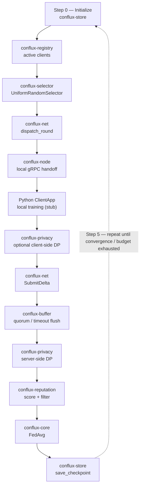
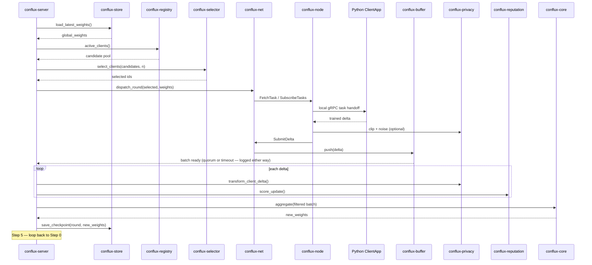

# Conflux — Federated Learning Framework: Implementation Spec & Plan (v1, consolidated)

**Status:** Consolidated draft for review
**Supersedes:** `agg-or-spec-plan-v2` through `v8` — this document merges all decisions from that iteration into one coherent spec under the project's final name, **Conflux**.
**Naming rationale:** many independent, heterogeneous contributions (client updates) converging into one stronger result (the global model) — the metaphor the whole aggregation-family design (§5) is built around. Verify `conflux` availability on crates.io before the first `cargo new` (not yet exhaustively checked).

---

## 1. Purpose & Scope

Conflux is a configurable, extensible, Rust-native federated learning framework. Python (PyTorch) stays entirely client-side for model training; Rust owns networking, orchestration, aggregation, privacy, and reputation. The framework supports four deployment topologies from one codebase — **cross-silo** (institutions), **cross-device** (phones/IoT), **crowdsourcing** (public/anonymous participants), and **edge** — selected by configuration, not by forking code.

**Explicit non-goals:** multi-tenancy (one process = one experiment; running multiple experiments means running multiple processes — an application-layer concern), and a finished Python SDK / model-distribution mechanism (deferred, §7).

---

## 2. Workspace Structure

```
conflux/
├── Cargo.toml
└── crates/
    ├── conflux-proto/        # Shared protobuf schema — network AND local IPC
    ├── conflux-config/       # Layered config, topology/mode profiles, strategy registry
    ├── conflux-registry/     # Client lifecycle (register/heartbeat/evict)
    ├── conflux-store/        # Model checkpoint + experiment metadata persistence
    ├── conflux-selector/     # Client sampling strategies
    ├── conflux-net/          # Transport — dual-mode (push/pull)
    ├── conflux-buffer/       # Async staging, quorum + timeout flush
    ├── conflux-privacy/      # Local DP (clip + noise) + epsilon accounting
    ├── conflux-reputation/   # Contribution scoring, Byzantine detection
    ├── conflux-core/         # SIMD aggregation algorithms (family-based)
    ├── conflux-server/       # Server binary
    └── conflux-node/         # Client binary (Rust-side networking/orchestration)

python/
└── conflux_client/           # Python ClientApp SDK — deferred design, see §7
```

Dependency graph is unchanged from earlier drafts and remains acyclic: `conflux-proto` and `conflux-config` sit beneath everything; `conflux-net`/`conflux-buffer`/`conflux-core` depend on `conflux-proto`; `conflux-server` integrates all seven library crates; `conflux-node` depends only on `conflux-proto` and `conflux-net`.

This section describes v1's original twelve-crate design as planned. A
thirteenth crate, `conflux-attacks` (test/dev-only, never a
`conflux-server` dependency — ADR 0010), was added in Phase 12, after
this spec was written — see `docs/ARCHITECTURE.md`'s workspace-layout
diagram for the current, maintained picture, and `conflux-core`/
`conflux-selector`/`conflux-privacy`'s added dependency on
`conflux-config` (Phase 10b/11b, for strategy-registry registration),
also not reflected in the graph above.

---

## 3. Connection Modes & Topology Profiles

One `.proto` schema serves both directions, so the same binaries serve every topology:

```protobuf
service FlTransport {
  rpc FetchTask (FetchTaskRequest) returns (TaskResponse);       // pull mode
  rpc SubscribeTasks (SubscribeRequest) returns (stream TaskResponse); // push mode
  rpc SubmitDelta (stream DeltaChunk) returns (SubmitAck);        // both modes
  rpc Register (RegisterRequest) returns (RegisterResponse);
  rpc Heartbeat (HeartbeatRequest) returns (HeartbeatResponse);
}
```

`TaskResponse`/`DeltaChunk` are reused verbatim over the **local loopback gRPC channel** between `conflux-node` and the Python `ClientApp` — one schema for both hops.

| Topology | Connection mode | Auth | Selector default | Fit |
|---|---|---|---|---|
| `cross_silo` | push | mTLS | all_available | Hospitals, banks — few, trusted, always-reachable |
| `cross_device` | pull | JWT | uniform_random | Phones, laptops — many, intermittent |
| `crowdsource` | pull | JWT | uniform_random (stricter reputation threshold) | Public/anonymous participants |
| `edge` | pull | JWT | uniform_random (resource-aware, future) | IoT/edge compute |

Topology-owned parameters: `connection_mode`, `auth`, `round_timeout_secs`, `min_reputation_score`, `client_registry_ttl` (full defaults in §8's reference table).

---

## 4. Configuration: Two-Axis Model + Explainable Resolution

### 4.1 The two axes

```
framework built-in fallback
    → topology profile   (cross_silo | cross_device | crowdsource | edge)
    → mode profile        (research | production)
    → explicit experiment-level override      [highest precedence]
```
- **Topology** answers "what kind of participants and network?" — network/domain shape.
- **Mode** answers "am I iterating on research, or running a live deployment?" — safety/reproducibility posture.

The two axes are disjoint in which parameters they own, so layering never conflicts; an explicit override always wins.

```toml
[profiles.research]
seed_mode = "fixed"
seed_value = 42
budget_exhausted_action = "continue_without_guarantee"
accounting_scope = "global"
allow_stub_client = true
config_log_format = "text"

[profiles.production]
seed_mode = "os_random"
budget_exhausted_action = "halt"
accounting_scope = "global"   # per_client deferred, see §6
allow_stub_client = false
config_log_format = "json"
```

`allow_stub_client = false` in production means `conflux-server` refuses to start without a real `ClientApp` connection configured — no accidentally running a live deployment against the pipeline-testing stub.

### 4.2 Explainable resolution (mandatory, not optional verbosity)

Every resolved parameter logs its source at startup — `conflux-server` does not reach "ready" without emitting this in full:

```rust
pub enum ConfigSource {
    Cli,
    EnvVar(String),
    ExperimentFile(String),
    ModeProfile(String),
    TopologyProfile(String),
    BuiltinFallback,
}
```

**Format is configurable** (`config_log_format: json | text`), defaulting per mode profile — **JSON by default in production** (machine-parseable for log aggregation and audit trails), **text by default in research** (readable at a glance during iteration), and overridable either way regardless of mode:

```json
{"param":"round_timeout_secs","value":300,"source":"topology_profile","profile":"cross_device"}
{"param":"clip_norm","value":1.0,"source":"builtin_fallback"}
```
```
[config] round_timeout_secs = 300  (source: topology profile "cross_device")
[config] clip_norm          = 1.0  (source: built-in fallback)
```

This "say so, out loud" principle extends beyond config startup to runtime decisions elsewhere in the pipeline: `conflux-buffer` logs whether a round closed on quorum or timeout; `conflux-reputation` logs every rejected update with its score and threshold; `conflux-privacy`'s accountant logs cumulative epsilon after every round, not just at exhaustion.

### 4.3 Extension for special cases

```toml
[profiles.research_high_privacy]
inherits = "research"
target_epsilon = 2.0
noise_multiplier = 2.5
budget_exhausted_action = "halt"
```
`inherits` pulls every field from the base profile; only overrides are listed. Applies identically to topology and mode profiles — a special case is new config, never a code change.

---

## 5. Extensibility: The Family Pattern

The core mechanism letting Conflux aim to cover published aggregation methods without each one reimplementing shared machinery: a **family** is common accumulation/selection logic plus a small trait capturing what a method varies.

**Aggregation — `averaging` family** (ships `FedAvg` as the one member):
```rust
pub trait Aggregator: Send + Sync {
    fn aggregate(&self, updates: &[ClientDelta]) -> Result<Vec<f32>, AggregatorError>;
}
pub trait AveragingWeighting: Send + Sync {
    fn weight_for(&self, update: &ClientDelta, batch: &[ClientDelta]) -> f32;
}
pub struct WeightedAverageAggregator<W: AveragingWeighting> { weighting: W }
// impl Aggregator for WeightedAverageAggregator<W> — shared accumulation, written once.

pub struct SampleCountWeighting; // McMahan et al., 2017 — FedAvg's weighting rule
pub type FedAvg = WeightedAverageAggregator<SampleCountWeighting>;
```
A future `FedAvgM` or inverse-loss weighting variant is a ~10-line `AveragingWeighting` impl.

**Aggregation — `robust` family** (Byzantine-resilient; shipped Phase 11a — Krum, Multi-Krum, Trimmed Mean, Median). Two composable shapes, not one: selection-based members pick a subset of whole updates, coordinate-wise members combine one weight-vector index at a time across every client — the latter don't fit "selected whole updates" at all, so a single trait would misrepresent them:
```rust
pub trait UpdateFilter: Send + Sync {
    fn filter(&self, updates: &[ClientDelta]) -> Result<SelectionResult, AggregatorError>;
}
pub struct FilteredAggregator<F: UpdateFilter, C: Aggregator> { filter: F, combiner: C }
// impl Aggregator for FilteredAggregator<F, C> — filter, then hand survivors to any
// existing Aggregator (including FedAvg) to combine. Krum/Multi-Krum implement UpdateFilter.

pub trait CoordinateWiseRobustStatistic: Send + Sync {
    fn combine(&self, values_at_one_coordinate: &mut [f32]) -> f32;
}
pub struct CoordinateWiseAggregator<S: CoordinateWiseRobustStatistic> { statistic: S }
// impl Aggregator for CoordinateWiseAggregator<S> — Trimmed Mean/Median implement
// CoordinateWiseRobustStatistic.
```
References: Blanchard, El Mhamdi, Guerraoui & Stainer (2017), *Machine Learning with Adversaries: Byzantine Tolerant Gradient Descent*, NeurIPS — Krum/Multi-Krum; Yin, Chen, Ramchandran & Bartlett (2018), *Byzantine-Robust Distributed Learning: Towards Optimal Statistical Rates*, ICML — Trimmed Mean/Median. New parameter: `robust_byzantine_fraction` (§9). See `docs/phases/phase-11a-robust-aggregation.md` for the full redesign rationale and `docs/EXTENDING.md` for how to add a member to either shape.

**Privacy — `dp` family** (ships `GaussianClippingPrivacy` as the one member):
```rust
pub struct GaussianClippingPrivacy { pub clip_norm: f32, pub noise_multiplier: f32 }
```
References: Abadi et al. (2016), *Deep Learning with Differential Privacy*, ACM CCS — https://arxiv.org/abs/1607.00133; Geyer, Klein & Nabi (2017), *Differentially Private Federated Learning: A Client Level Perspective* — https://arxiv.org/abs/1712.07557.
Defaults: `clip_norm = 1.0`, `noise_multiplier = 1.0` (both widely used DP-SGD starting points; model-dependent, so not mode-driven — see §8).

**Selection** — one implementation, cited:
```rust
pub struct UniformRandomSelector;
```
Reference: McMahan, Moore, Ramage, Hampson & y Arcas (2017), *Communication-Efficient Learning of Deep Networks from Decentralized Data*, AISTATS — https://arxiv.org/abs/1602.05629 (the client-sampling strategy from the original FedAvg algorithm). Seeding is configurable (§8: `seed_mode`), defaulting `fixed(42)` in research, `os_random` in production — the latter matters specifically for crowdsourcing, where a predictable seed could let an adversary anticipate client selection.

All families register into `conflux-config`'s compile-time strategy registry (`inventory::submit!`), so config selects an implementation by name (`aggregator = "fedavg"`) without any change to `conflux-server`.

---

## 6. Privacy Accounting

```rust
pub trait PrivacyAccountant: Send + Sync {
    fn record_round(&mut self, noise_multiplier: f32, sample_rate: f32);
    fn current_epsilon(&self, delta: f64) -> f64;
    fn budget_exhausted(&self, target_epsilon: f64, delta: f64) -> bool;
}
pub struct RdpAccountant { rounds: Vec<(f32, f32)> }
```
References: Mironov (2017), *Rényi Differential Privacy*, IEEE CSF — https://arxiv.org/abs/1702.07476; Wang, Balle & Kasiviswanathan (2019), *Subsampled Rényi Differential Privacy and Analytical Moments Accountant*, AISTATS — https://arxiv.org/abs/1808.00087.

Defaults: `target_epsilon = 8.0`, `delta = 1e-5` (Abadi et al., 2016). `conflux-server` checks `budget_exhausted()` before dispatching each round; behavior on exhaustion is configurable via `budget_exhausted_action` (`halt` in production, `continue_without_guarantee` — logged loudly each round — in research, useful for studying the tradeoff itself).

**Decision — accounting scope:** `AccountingScope::Global` ships in the initial build (one epsilon for the whole experiment); `PerClient` (bounding each individual's exposure across rounds) is deferred to Phase 8, chosen deliberately for a faster first working prototype — `PerClient` would require per-client round history in `conflux-registry`/`ExperimentStore` before every selection decision, which isn't needed to prove the core pipeline. Selecting `PerClient` before it's implemented fails fast at startup rather than silently behaving like `Global` (consistent with §4.2's explainability principle).

---

## 7. Client Side: `conflux-node` + Python

```
conflux-server  <--(network: push or pull, per topology)-->  conflux-node (Rust)
                                                                   |
                                                       local loopback gRPC
                                                       (same .proto, no TLS — localhost only)
                                                                   |
                                                            Python ClientApp
                                                            (PyTorch training)
```

`conflux-node` owns registration/heartbeat, auth token refresh, task fetch/receive per configured connection mode, retry/backoff, optional client-side privacy transform before submission, and runs the local gRPC server the Python side connects to.

**Deferred, not yet designed:** how a model architecture is introduced to a `ClientApp`, and how client code is distributed to participants in a crowdsourced/edge deployment (pip package? container? something the web application layer handles?) — real product decisions, out of scope for this spec until resolved. What's decided: the local gRPC handoff mechanism, and that a **stub Python client** (fixed dummy weights, no PyTorch dependency) stands in for end-to-end pipeline testing until the real SDK exists, permitted only in research mode (`allow_stub_client`).

---

## 8. The Five Steps of FL, Mapped to Crates

| Step | Crate(s) |
|---|---|
| 0. Initialize global model | `conflux-store` |
| 1. Send model to selected clients | `conflux-registry` → `conflux-selector` → `conflux-net` |
| 2. Train locally | `conflux-node` → Python `ClientApp` (stub) → `conflux-privacy` (optional client-side) |
| 3. Return updates | `conflux-net` → `conflux-buffer` |
| 4. Aggregate | `conflux-privacy` (server-side) → `conflux-reputation` → `conflux-core` → `conflux-store` |
| 5. Repeat | `conflux-server` round loop, until convergence or `budget_exhausted()` |





Step 2 is the only step with zero Rust-side algorithmic logic — the enforced boundary keeping PyTorch/GPU training out of the Rust codebase.

---

## 9. Unified Configuration Reference

| Parameter | Axis | Research default | Production default |
|---|---|---|---|
| `connection_mode`, `auth`, `round_timeout_secs`, `min_reputation_score`, `client_registry_ttl` | Topology | — (topology-set, per §3 table) | — (topology-set) |
| `quorum` | Neither (experiment-defined) | no universal default | no universal default |
| `selector` | Neither (fixed) | `uniform_random` | `uniform_random` |
| `seed_mode` / `seed_value` | Mode | `fixed` / `42` | `os_random` / n/a |
| `aggregator` | Neither (fixed) | `fedavg` | `fedavg` |
| `robust_byzantine_fraction` | Neither (fixed) | `0.2` | `0.2` |
| `privacy_mechanism` | Neither (fixed) | `gaussian_clipping` | `gaussian_clipping` |
| `clip_norm` / `noise_multiplier` | Neither (fixed) | `1.0` / `1.0` | `1.0` / `1.0` |
| `target_epsilon` / `delta` | Neither (fixed) | `8.0` / `1e-5` | `8.0` / `1e-5` |
| `budget_exhausted_action` | Mode | `continue_without_guarantee` | `halt` |
| `accounting_scope` | Mode | `global` | `global` (per_client deferred, §6) |
| `allow_stub_client` | Mode | `true` | `false` |
| `require_node_auth` | Mode | `false` | `true` |
| `config_log_format` | Mode | `text` | `json` |

`aggregator`'s default (`fedavg`) is unchanged, but the field now also
accepts `krum`/`multi_krum`/`trimmed_mean`/`median` (Phase 11a) —
`robust_byzantine_fraction` only matters when one of those is selected.

Any field is overridable at the experiment level regardless of axis (§4.1's precedence order).

---

## 10. Phased Implementation Plan

**Phase 0** — Workspace scaffold, `conflux-proto` schema + codegen.
**Phase 1** — `conflux-config` (topology/mode profiles, provenance logging, strategy registry), `conflux-registry` (`InMemoryRegistry`).
**Phase 2** — Leaf crates: `conflux-store` (in-memory + file), `conflux-selector` (`UniformRandomSelector`), `conflux-privacy` (`GaussianClippingPrivacy` + in-memory `RdpAccountant`, `Global` scope only), `conflux-reputation` (`CosineScorer`).
**Phase 3** — `conflux-net` dual-mode transport (`PushTransport`/`PullTransport`), `Register`/`Heartbeat`.
**Phase 4** — `conflux-buffer` (quorum + timeout, explainable flush logging), `conflux-core` (`averaging` family with `FedAvg`; `robust` family trait + distance machinery, no member yet).
**Phase 5** — `conflux-server` integration: full round pipeline reading strategy names from config, single-experiment `AppState`, `/health`/`/round/status`/`/clients/register` routes.
**Phase 6** — `conflux-node` + stub Python client; end-to-end pipeline test in `pull` mode. Real SDK/model-distribution design still pending (§7).
**Phase 7** — Production hardening: `RedisRegistry`, `ExperimentStore` (Postgres — required for `RdpAccountant` persistence across restarts), `S3Store`, observability, mTLS for push mode, load testing.
**Phase 8** — Hybrid backend selection (`AnyRegistry`/`AnyStore`, `AppState::connect`, production fail-fast); node authentication core (`NodeIdentity`/`NodeAllowlist`, `require_node_auth`) and enforcement (mTLS peer-cert fingerprint, HTTP admin allow-list surface).
**Phase 9** — Enforcing the resolved `auth` config value (real TLS binding, production fail-fast); production stub-client guard (`conflux-node`, not `conflux-server` — ADR/spec correction, see `docs/phases/phase-9b-stub-client-guard.md`).
**Phase 10** — Closed the `RoundBuffer` lost-update race; wired `conflux-config`'s `inventory` strategy registry into real `aggregator`/`selector` construction (ADR 0002's registry mechanism, deferred since Phase 1, actually connected).
**Phase 11** — `robust` family members (Krum, Multi-Krum, Trimmed Mean, Median — see §5 above) via a redesigned two-shape aggregation architecture; `privacy_mechanism` registry wiring (the third of three §5 families); poison mode for the stub Python client.
**Phase 12** — `conflux-attacks`: cited implementations of known FL attacks (Gaussian noise, sign-flipping, ALIE, scaling/boosting) and application-level attack/defense tests against every shipped `Aggregator` — test/dev-only, never a `conflux-server` dependency (ADR 0010).

**Still future** — `PerClient` accounting, resource-aware/utility-based selectors, resolved Python SDK, `libloading`-based dynamic plugin loading, hierarchical topology, config-file parsing (§11 Open Item 2), JWT auth verification. See `docs/STATUS.md`'s "Next" section for the current, maintained version of this list — phase numbers above are historical record as of when each shipped; `docs/STATUS.md` is the live source of truth.

---

## 11. Open Items Going Into Phase 0

1. **`conflux` crates.io / namespace availability** — verify before scaffolding (§1).
2. **Config file format & merge details beyond precedence order** (§4.1 covers ordering; exact TOML schema for `inherits` merge semantics on nested tables isn't fully specified).
3. **Python SDK and model-distribution design** (§7) — needed before Phase 6 can move beyond the stub client.
