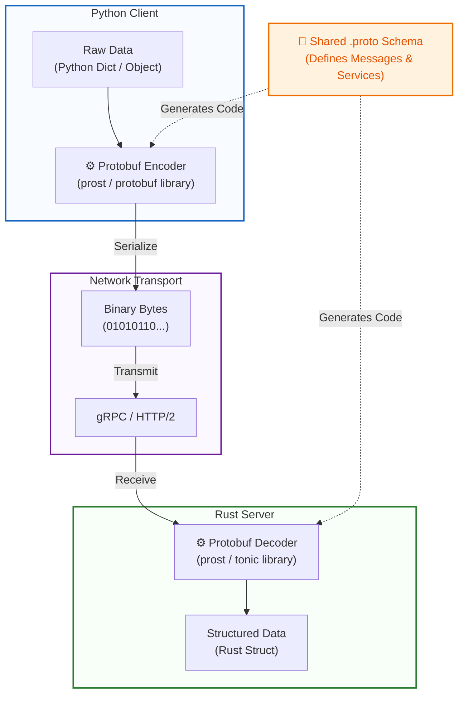

In the context of **Tonic** and **Rust programming**, **"proto"** refers to **Protocol Buffers** (often abbreviated as Protobuf, or `.proto` files). 

Protocol Buffers are a language-agnostic, platform-neutral mechanism created by Google for serializing structured data. In the Rust/gRPC ecosystem, `.proto` files act as the **Interface Definition Language (IDL)**. They define the data structures (messages) and the RPC services (methods) that your application will use.

When using **Tonic** (a native Rust implementation of gRPC), you do not write the serialization logic or the network transport layer by hand. Instead, you write a `.proto` file, and the Rust toolchain automatically generates strongly-typed, idiomatic Rust code from it.

Here is a complete breakdown of how "proto" works within the Tonic and Rust ecosystem, along with a working reference example.

---

### 1. The Rust Protobuf Toolchain
To understand "proto" in Rust, you need to understand the three crates that work together:
1. **`prost`**: A Protocol Buffers implementation for Rust. It takes `.proto` files and generates Rust structs and enums for your messages.
2. **`tonic`**: The gRPC framework. It provides the async networking, HTTP/2 transport, and gRPC routing.
3. **`tonic-build`**: A build-time tool that connects `prost` and `tonic`. It reads your `.proto` files and generates the Rust traits (for servers) and client structs that you will implement in your Rust code.

---

### 2. Step-by-Step Reference Example

Here is how you go from a "proto" file to a working Rust gRPC server and client.

#### Step A: The `.proto` File
Create a file named `proto/helloworld.proto`. This defines the "contract" of your service.

```protobuf
syntax = "proto3";
package helloworld;

// The service definition (The RPC methods)
service Greeter {
  rpc SayHello (HelloRequest) returns (HelloReply);
}

// The message definitions (The data structures)
message HelloRequest {
  string name = 1;
}

message HelloReply {
  string message = 1;
}
```

#### Step B: The `Cargo.toml`
You need to declare the dependencies for your application and the build script.

```toml
[package]
name = "tonic-proto-example"
version = "0.1.0"
edition = "2021"

[dependencies]
tonic = "0.12"
prost = "0.13"
tokio = { version = "1.0", features = ["full"] }

[build-dependencies]
tonic-build = "0.12"
```

#### Step C: The Build Script (`build.rs`)
Cargo automatically runs `build.rs` before compiling your main code. This is where `tonic-build` reads the `.proto` file and generates the Rust code.

```rust
// build.rs
fn main() -> Result<(), Box<dyn std::error::Error>> {
    // Compile the proto file. 
    // This generates Rust code in the OUT_DIR.
    tonic_build::compile_protos("proto/helloworld.proto")?;
    Ok(())
}
```

#### Step D: The Rust Server Implementation
Now you write your actual Rust code. You use the `tonic::include_proto!` macro to import the generated Rust code, and then you implement the generated `Greeter` trait.

```rust
// src/main.rs (Server)
use tonic::{transport::Server, Request, Response, Status};

// Include the generated code. The string must match the `package` name in the .proto file.
pub mod hello_world {
    tonic::include_proto!("helloworld");
}

use hello_world::greeter_server::{Greeter, GreeterServer};
use hello_world::{HelloReply, HelloRequest};

// Define your server struct
#[derive(Default)]
pub struct MyGreeter {}

// Implement the generated trait for your struct
#[tonic::async_trait]
impl Greeter for MyGreeter {
    async fn say_hello(
        &self,
        request: Request<HelloRequest>, // Accept request of type HelloRequest
    ) -> Result<Response<HelloReply>, Status> { // Return an instance of type HelloReply
        println!("Got a request from {:?}", request);

        let reply = hello_world::HelloReply {
            message: format!("Hello {}!", request.into_inner().name),
        };
        
        Ok(Response::new(reply)) // Send back our formatted greeting
    }
}

#[tokio::main]
async fn main() -> Result<(), Box<dyn std::error::Error>> {
    let addr = "[::1]:50051".parse()?;
    let greeter = MyGreeter::default();

    println!("GreeterServer listening on {}", addr);

    Server::builder()
        .add_service(GreeterServer::new(greeter))
        .serve(addr)
        .await?;

    Ok(())
}
```

#### Step E: The Rust Client Implementation
Similarly, the `.proto` file generates a client struct that you can use to call the server.

```rust
// src/client.rs (or inside main.rs)
pub mod hello_world {
    tonic::include_proto!("helloworld");
}

use hello_world::greeter_client::GreeterClient;
use hello_world::HelloRequest;

#[tokio::main]
async fn main() -> Result<(), Box<dyn std::error::Error>> {
    let mut client = GreeterClient::connect("http://[::1]:50051").await?;

    let request = tonic::Request::new(HelloRequest {
        name: "Rustacean".into(),
    });

    let response = client.say_hello(request).await?;

    println!("RESPONSE={:?}", response.into_inner());
    Ok(())
}
```

---

### 3. Why this Architecture is Powerful in Rust
* **Compile-Time Safety:** Because `prost` and `tonic-build` generate Rust code at compile time, any mismatch between your client and server `.proto` definitions will result in a Rust compilation error, not a runtime crash.
* **Zero-Cost Abstractions:** The generated Rust structs map directly to the Protobuf binary format. Tonic uses `hyper` and `tokio` under the hood, meaning the gRPC transport is highly asynchronous and non-blocking.
* **Separation of Concerns:** Your `.proto` file acts as the single source of truth for your API. You can use it to generate clients in Python, Go, or TypeScript, while your Rust server strictly adheres to the same contract.

### Official References
If you want to dive deeper into the source code and documentation, here are the official repositories:
1. **Tonic (gRPC Framework):** [github.com/hyperium/tonic](https://github.com/hyperium/tonic)
2. **Prost (Protobuf Compiler):** [github.com/tokio-rs/prost](https://github.com/tokio-rs/prost)
3. **Tonic Hello World Example:** [github.com/hyperium/tonic/tree/master/examples/helloworld-tutorial](https://github.com/hyperium/tonic/tree/master/examples/helloworld-tutorial)


Here is a highly detailed prompt you can copy and paste into an AI image generator (like DALL-E 3 or Midjourney). 

Because AI image generators can sometimes struggle with spelling exact text perfectly, I have also provided a **Mermaid.js** code block below it. You can paste the Mermaid code into any markdown editor or tool like [mermaid.live](https://mermaid.live) to instantly generate a perfect, text-accurate academic diagram.

### Option 1: Prompt for AI Image Generators (DALL-E 3 / Midjourney)

> **Prompt:** A flat, 2D academic technical diagram on a pure white background illustrating a data flow from left to right. On the far left, a blue box labeled "Python Client" containing a small data object. An arrow points right to a gray processing block labeled "Protobuf Encoder". An arrow points right showing a block of binary code "010101". This binary block moves across a central area labeled "Network / gRPC". On the right, the binary block enters a gray processing block labeled "Protobuf Decoder". An arrow points right to a green box labeled "Rust Server" containing a structured data object. At the top center, a document icon labeled "Shared .proto Schema" has dotted arrows pointing down to both the Python Encoder and Rust Decoder. Clean vector style, sans-serif typography, high contrast, no 3D effects, professional educational infographic.

***

### Option 2: Mermaid.js Diagram (Recommended for Perfect Text)
If you want guaranteed perfect text and a clean academic look, copy the code below and paste it into [mermaid.live](https://mermaid.live). It will instantly render a professional flowchart.



***

### Option 3: Layout Guide (For Draw.io, Excalidraw, or PowerPoint)
If you are drawing this manually in an academic tool, use this left-to-right layout:

1. **Top Center:** Draw a document icon labeled **`message.proto`**. Draw dotted lines pointing down to both the Client and Server sides to show they share the same schema.
2. **Left Side (Python):** 
   * Draw a box labeled **Python Client**.
   * Inside, draw a small JSON/Dictionary icon.
   * Draw an arrow pointing right into a cylinder/gear labeled **Proto Encoder (Serialize)**.
3. **Middle (The Wire):**
   * Draw an arrow coming out of the Encoder turning into a block of binary (`10110...`).
   * Draw a long arrow across the middle labeled **gRPC / HTTP/2 Network**.
4. **Right Side (Rust):**
   * The binary enters a cylinder/gear labeled **Proto Decoder (Deserialize)**.
   * Draw an arrow pointing right into a box labeled **Rust Server**.
   * Inside the Rust server, draw a Struct/Class icon to show the data is now strongly typed.


Here is a comprehensive, rewritten article that merges the foundational concepts of Protocol Buffers in Rust (Tonic/Prost) with the real-world, production-grade use case from the **Conflux FL** (Federated Learning) article. 

This unified guide explains how `.proto` files act as the universal contract bridging a **Python data-generating client** and a **Rust-based aggregation server**, while highlighting advanced architectural and performance optimizations.

---

# Protocol Buffers in Action: Bridging Python and Rust in Distributed Systems

In modern distributed systems, **Protocol Buffers ("proto")** serve as the single source of truth. They are a language-agnostic Interface Definition Language (IDL) created by Google. Instead of writing custom, error-prone serialization logic, developers define their data structures and RPC services in a `.proto` file. Toolchains then generate strongly-typed, idiomatic code for any language.

When combining a **Python client** (e.g., for machine learning data generation) with a **Rust server** (for high-performance, async processing), Protocol Buffers, powered by the Rust `tonic` and `prost` ecosystem, provide compile-time safety, zero-cost abstractions, and seamless interoperability.

The open-source **Conflux FL** (Federated Learning) project provides a perfect, production-grade case study of this architecture in action.

---

## 1. The Real-World Use Case: Federated Learning
In Federated Learning, multiple clients train machine learning models locally and send only the model weight updates (deltas) to a central server for aggregation. 

In the Conflux architecture:
* **The Python Client**: Runs the ML training loop (e.g., PyTorch/TensorFlow), generates raw model weights (`Vec<f32>`), and needs to send them over the network.
* **The Rust Server**: Acts as a high-performance, asynchronous aggregation engine using `tokio` and `tonic` to receive, decode, and process these updates from hundreds of concurrent clients.

The `.proto` file is the **universal contract** that guarantees the Python client and Rust server perfectly understand each other's data, despite being written in entirely different languages.

---

## 2. The "Dual-Hop" Architecture
A brilliant design pattern highlighted in the Conflux architecture is the **Dual-Hop** communication model. The *exact same* `.proto` schema governs two distinct communication boundaries:

1. **Hop 1 (Local Loopback)**: The Python training process communicates with a local Rust "node" agent on the same machine.
2. **Hop 2 (Network)**: The local Rust node forwards the data to the central Rust aggregation server over gRPC/HTTP2.

**Why is this powerful?** By using the same `.proto` file for both hops, the system guarantees end-to-end type safety. If a field is added to the `ClientDelta` message, the code generation fails at compile time for *both* the Python binding and the Rust server until both are updated. There is no "drift" between the local and network protocols.

---

## 3. Under the Hood: The Rust Toolchain & Workspace Design
To make this work in Rust, the ecosystem relies on three key components:
* **`prost`**: The core Protocol Buffers implementation for Rust.
* **`tonic`**: The native Rust gRPC framework providing async HTTP/2 transport.
* **`tonic-build`** (or `prost-build`): The build-time code generator.

### The Zero-Dependency Crate Pattern
In a Rust Cargo workspace, the crate containing the `.proto` file (e.g., `conflux-proto`) is intentionally placed at the **very bottom of the dependency graph**. It has *zero internal dependencies*. 

If the core aggregation logic (`conflux-core`) depended on the proto crate, and the proto crate depended on `conflux-core` to understand its own data, you would create a circular dependency. By keeping the proto crate completely isolated, it enforces a strict rule: *"Everything can read the wire format, but the wire format doesn't care what reads it."*

### Compile-Time Code Generation (`build.rs`)
You never hand-write the Rust structs for `RegisterRequest` or `ClientDelta`. Instead, a `build.rs` script runs before compilation:

```rust
// build.rs
fn main() -> Result<(), Box<dyn std::error::Error>> {
    // Reads the .proto file and generates Rust code into OUT_DIR
    tonic_build::compile_protos("proto/conflux.proto")?;
    Ok(())
}
```
When you change a field in the `.proto` file, Cargo rebuilds the generated code. Any Rust code that references the old field name will immediately throw a **compile-time error**, preventing runtime serialization bugs.

---

## 4. Advanced Optimization: Hybrid Encoding
While Protocol Buffers are excellent for defining RPC methods and metadata, serializing massive arrays of floating-point numbers (like ML model weights) using standard Protobuf `repeated float` fields can introduce unnecessary overhead.

Conflux solves this with a **Hybrid Encoding Strategy**:
1. Use `.proto` to define the message envelope and metadata (e.g., `client_id`, `timestamp`, `task_id`).
2. Use a custom, zero-dependency, zero-cost codec to convert the raw `Vec<f32>` weights directly into a `Vec<u8>` byte array for the payload.

```rust
// Inside the Rust proto crate: A highly optimized, dependency-free codec
pub fn encode_weights(weights: &[f32]) -> Vec<u8> {
    // Convert each 32-bit float to 4 little-endian bytes
    weights.iter().flat_map(|w| w.to_le_bytes()).collect()
}

pub fn decode_weights(bytes: &[u8]) -> Result<Vec<f32>, DecodeError> {
    if bytes.len() % 4 != 0 {
        return Err(DecodeError::MalformedLength(bytes.len()));
    }
    // Reconstruct floats from 4-byte chunks
    Ok(bytes
        .chunks_exact(4)
        .map(|c| f32::from_le_bytes(c.try_into().unwrap()))
        .collect())
}
```
This approach gives you the best of both worlds: the strict schema validation and RPC routing of gRPC/Protobuf, combined with the raw, C-like performance of direct memory byte manipulation for heavy payloads.

---

## 5. Unified Architecture Diagram

Below is a visual representation of this merged architecture. You can view this in any Markdown viewer that supports Mermaid, or paste it into [mermaid.live](https://mermaid.live).

```mermaid
flowchart TD
    %% Styles
    classDef python fill:#e3f2fd,stroke:#1565c0,stroke-width:2px,color:#0d47a1;
    classDef rust fill:#e8f5e9,stroke:#2e7d32,stroke-width:2px,color:#1b5e20;
    classDef proto fill:#fff3e0,stroke:#ef6c00,stroke-width:2px,color:#e65100;
    classDef network fill:#f3e5f5,stroke:#6a1b9a,stroke-width:2px,stroke-dasharray: 5 5;

    %% Shared Schema
    Schema["📄 Shared .proto Schema\n(FlTransport, ClientDelta, RPCs)"]:::proto

    %% Python Client Side
    subgraph Client_Side [Python Client (ML Training)]
        direction TB
        PyWeights["Raw Weights\n(np.ndarray / List[float])"]
        PyEncoder["⚙️ Protobuf Encoder\n(google.protobuf + Custom Byte Codec)"]
        PyWeights --> PyEncoder
    end

    %% Rust Server Side
    subgraph Server_Side [Rust Server (Aggregation)]
        direction TB
        RsDecoder["⚙️ Protobuf Decoder\n(prost / tonic-build generated)"]
        RsCustomDecode["⚙️ Custom Weight Decoder\n(f32::from_le_bytes)"]
        RsStruct["Structured Data\n(ClientDelta Rust Struct)"]
        
        RsDecoder --> RsCustomDecode
        RsCustomDecode --> RsStruct
    end

    %% Network
    subgraph Transport [Network / Local Loopback]
        Bytes["Binary Payload\n(Bytes: Metadata + Raw f32 Array)"]
        Grpc["gRPC / HTTP2 Transport\n(Tonic)"]
    end

    %% Connections
    Schema -. "Generates Python Bindings" .-> PyEncoder
    Schema -. "Generates Rust Code via build.rs" .-> RsDecoder
    
    PyEncoder -- "1. Serialize Metadata & Weights to Bytes" --> Bytes
    Bytes -- "2. Transmit" --> Grpc
    Grpc -- "3. Receive Byte Stream" --> RsDecoder

    %% Apply Styles
    style Client_Side fill:#f8fbff,stroke:#1565c0,stroke-width:2px
    style Server_Side fill:#f8fff8,stroke:#2e7d32,stroke-width:2px
    style Transport fill:#fcf8ff,stroke:#6a1b9a,stroke-width:2px
```

---

## Summary: Why This Architecture Wins
1. **Single Source of Truth**: The `.proto` file eliminates guesswork. Python and Rust agree on the data contract before the code even compiles.
2. **Strategic Dependency Management**: Keeping the proto crate at the bottom of the Rust workspace prevents circular dependencies and keeps the codebase modular.
3. **Compile-Time Safety**: `build.rs` ensures that if the data contract changes, the Rust compiler will catch the mismatch immediately, preventing silent runtime failures.
4. **Performance at Scale**: By combining gRPC's robust routing with a custom, little-endian byte codec for heavy numeric arrays, the system achieves near-bare-metal performance without sacrificing the developer experience of high-level RPC frameworks.


# Crate Deep Dive: `conflux-proto` — The Bedrock of Conflux FL

Welcome to the first installment of our **Crate Deep Dives** series. If you are reading this, you are either looking to understand how Conflux FL works under the hood, or you are ready to contribute to the codebase. Either way, you are in the right place.

Every great distributed system needs a single source of truth. In Conflux FL, that truth lives in **`conflux-proto`**. 

This crate is the foundation everything else depends on, directly or indirectly—and crucially, *it depends on nothing itself*. That is not an accident; it is the first and most important design principle of our architecture. 

In this deep dive, we will explore what this crate owns, the Rust concepts that make it robust, and a step-by-step guide on how you can extend it as a contributor.

---

## 1. What This Crate Owns

At its core, `conflux-proto` owns two things:
1. **The `.proto` Schema**: The Interface Definition Language (IDL) that defines our gRPC service (`FlTransport`) and all message types (e.g., `RegisterRequest`, `ClientDelta`).
2. **The Weight Codec**: The highly optimized logic that turns a machine learning model’s weights (a `Vec<f32>`) into raw bytes on the wire, and back again.

Currently, this schema defines four core RPCs:
* `Register`: A client announces its presence and capabilities.
* `Heartbeat`: Keeps the connection alive and reports node health.
* `FetchTask` / `SubscribeTasks`: Supports both pull and push modes for task distribution.
* `SubmitDelta`: The critical path where trained model updates are sent to the server.

### The "Dual-Hop" Architecture
The most interesting design decision in `conflux-proto` isn’t the RPCs themselves—it’s that this **single schema serves two different communication hops**:
1. **Hop 1 (Local Loopback)**: The communication between a local Rust node agent and the Python training process running on the *same machine*.
2. **Hop 2 (Network)**: The communication between that local Rust node and the central Rust aggregation server over the network.

Why do this? By using the exact same `.proto` file for both hops, we guarantee end-to-end type safety. The Python training process (using generated Protobuf bindings) and the Rust server (using `tonic`/`prost`) speak the exact same language. If a field changes, the contract breaks everywhere simultaneously, preventing silent, hard-to-debug serialization mismatches.

---

## 2. Rust Concept: The Zero-Dependency Workspace Anchor

Conflux FL is organized as a single Cargo workspace containing multiple crates. `conflux-proto` sits at the very bottom of this dependency graph.

```toml
# crates/conflux-proto/Cargo.toml
[package]
name = "conflux-proto"
version = "0.1.0"
edition = "2021"

# Notice the absence of internal workspace dependencies!
[dependencies]
prost = "0.13"
tonic = "0.12"

[build-dependencies]
tonic-build = "0.12"
```

**Why is this critical?** 
Everything in Conflux FL needs to understand the wire format. If `conflux-proto` depended on, say, `conflux-core` (our aggregation logic), we would instantly create a circular dependency the moment `conflux-core` needed to decode a `ClientDelta`—which it does constantly. 

By keeping the schema dependency-free, we enforce a strict architectural rule: *"Everything can read the wire format, but the wire format doesn’t care what reads it."*

---

## 3. Rust Concept: Compile-Time Code Generation (`build.rs`)

As a contributor, you will **never** hand-write the Rust structs for `ClientDelta` or `RegisterRequest`. Instead, they are generated at compile time from the `.proto` file by a `build.rs` script using `tonic-build`.

```rust
// crates/conflux-proto/build.rs
fn main() -> Result<(), Box<dyn std::error::Error>> {
    // Configure tonic-build to generate code from our schema
    tonic_build::configure()
        .build_server(true)
        .build_client(true)
        .compile_protos(&["proto/conflux.proto"], &["proto/"])?;
    Ok(())
}
```

Cargo runs `build.rs` *before* compiling the rest of the crate. By the time your code writes `use conflux_proto::ClientDelta`, that type already exists in the `OUT_DIR`, generated fresh from the schema. 

**The Contributor Benefit:** If you add a new field to `ClientDelta` in the `.proto` file, every single crate in the workspace that uses it will throw a compile-time error at the exact line of code that is now outdated. This is the magic of generated types: it replaces runtime serialization bugs with immediate, actionable compiler errors.

---

## 4. Rust Concept: High-Performance Hybrid Encoding

A machine learning model’s weights are fundamentally just a massive array of 32-bit floating-point numbers (`Vec<f32>`). However, gRPC moves *bytes*, not typed float vectors. 

While we could use Protobuf’s `repeated float` field, doing so for millions of weights introduces unnecessary serialization overhead and memory allocation. Instead, `conflux-proto` uses a **Hybrid Encoding Strategy**:
1. Protobuf handles the *envelope* (metadata, client IDs, task IDs).
2. A custom, zero-dependency codec handles the *payload* (the raw weights).

```rust
// crates/conflux-proto/src/codec.rs

/// Encodes a slice of f32 weights into a little-endian byte vector.
pub fn encode_weights(weights: &[f32]) -> Vec<u8> {
    weights.iter().flat_map(|w| w.to_le_bytes()).collect()
}

/// Decodes a byte slice back into a Vec<f32>.
pub fn decode_weights(bytes: &[u8]) -> Result<Vec<f32>, DecodeError> {
    if bytes.len() % 4 != 0 {
        return Err(DecodeError::MalformedLength(bytes.len()));
    }
    
    Ok(bytes
        .chunks_exact(4)
        .map(|c| f32::from_le_bytes(c.try_into().unwrap()))
        .collect())
}
```

We use `to_le_bytes()` and `from_le_bytes()`, which are built into Rust’s standard library. This is a zero-cost abstraction: little-endian, fixed 4 bytes per `f32`, chosen once and used everywhere. No external serialization library is needed for something this simple, ensuring maximum throughput when submitting massive model deltas.

---

## 5. Contributor Tutorial: How to Extend `conflux-proto`

Ready to add a new feature? Let’s say you want to add a new RPC called `GetMetrics` to allow the server to query client hardware stats. Here is the exact workflow:

### Step 1: Update the `.proto` File
Open `proto/conflux.proto` and add your message and RPC definition.
```protobuf
service FlTransport {
  // ... existing RPCs ...
  rpc GetMetrics (MetricsRequest) returns (MetricsResponse);
}

message MetricsRequest {
  string client_id = 1;
}

message MetricsResponse {
  float cpu_usage = 1;
  float memory_usage_mb = 2;
}
```

### Step 2: Build the Workspace
Run `cargo build` in the root of the workspace. Cargo will automatically detect changes in the `.proto` file, run `build.rs`, and generate the new Rust traits and structs.

### Step 3: Implement the Server Trait
Navigate to the crate that implements the server (e.g., `conflux-net`). You will see that the generated `FlTransport` trait now requires you to implement `get_metrics`.
```rust
#[tonic::async_trait]
impl FlTransport for MyConfluxServer {
    // ... other methods ...

    async fn get_metrics(
        &self,
        request: Request<MetricsRequest>,
    ) -> Result<Response<MetricsResponse>, Status> {
        let req = request.into_inner();
        println!("Fetching metrics for client: {}", req.client_id);
        
        // Your logic here...
        let reply = MetricsResponse {
            cpu_usage: 45.5,
            memory_usage_mb: 1024.0,
        };
        
        Ok(Response::new(reply))
    }
}
```

### Step 4: Update the Python Client
Don’t forget the other side of the dual-hop! Regenerate the Python gRPC stubs (usually via `python -m grpc_tools.protoc`) so the Python training loop can call this new RPC.

---

## 6. Where It Connects

If you look at the Conflux FL layer diagram, every crate above `conflux-proto`—`conflux-net`, `conflux-buffer`, `conflux-core`, and both binary entry points—imports `ClientDelta` or the weight codec directly. 

Nothing in `conflux-proto` imports anything back. This unidirectional dependency flow is what keeps the codebase clean, testable, and easy to reason about.

---

## What’s Next?

Now that you understand how Conflux FL defines and transmits its data, you are ready to see what the server *does* with that data. 

In the next deep dive, we will explore **`conflux-core`**, where we use advanced Rust generics to turn a single accumulation loop into eleven different, highly optimized aggregation methods. 

*Have questions or want to discuss a new proto feature? Join us in the [Conflux FL GitHub Discussions](#) or open an issue!*


# The Ultimate Guide to Protocol Buffers and gRPC in Rust with Tonic

Welcome to the most comprehensive, standalone tutorial for mastering Protocol Buffers (Protobuf) and gRPC in Rust using the **Tonic** framework. 

Whether you are building microservices, real-time data pipelines, or high-performance APIs, this guide will take you from a blank slate to implementing advanced streaming, authentication, and debugging patterns.

---

## 📋 Prerequisites

Before writing any code, ensure you have the following installed:
1. **Rust Toolchain**: `rustc` and `cargo` (via [rustup.rs](https://rustup.rs/)).
2. **Protocol Buffers Compiler (`protoc`)**: Tonic relies on this to parse `.proto` files. 
   - *macOS*: `brew install protobuf`
   - *Ubuntu/Debian*: `sudo apt install protobuf-compiler`
   - *Windows*: Download from the [protobuf releases page](https://github.com/protocolbuffers/protobuf/releases) and add to your `PATH`.

---

## Part 1: The Foundations (Unary RPC)

Let’s build a realistic **User Profile Service**. A client sends a user ID, and the server returns the user's profile.

### Step 1: Project Setup
Create a new Cargo project and add the necessary dependencies.

```bash
cargo new tonic-tutorial
cd tonic-tutorial
```

Update your `Cargo.toml`:
```toml
[package]
name = "tonic-tutorial"
version = "0.1.0"
edition = "2021"

[dependencies]
tonic = "0.12"
prost = "0.13"
tokio = { version = "1.0", features = ["full"] }

[build-dependencies]
tonic-build = "0.12"
```

### Step 2: Define the Schema (`proto/user.proto`)
Create a `proto` directory and add `user.proto`. This is your **single source of truth**.

```protobuf
syntax = "proto3";
package user;

// The request message containing the user's ID.
message GetUserRequest {
    string user_id = 1;
}

// The response message containing the user's data.
message User {
    string user_id = 1;
    string name = 2;
    string email = 3;
    int32 age = 4;
}

// The service definition.
service UserService {
    // A simple unary RPC: one request, one response.
    rpc GetUser (GetUserRequest) returns (User);
}
```

### Step 3: The Build Script (`build.rs`)
Create a `build.rs` file in the root of your project. Cargo executes this *before* compiling your main code.

```rust
// build.rs
fn main() -> Result<(), Box<dyn std::error::Error>> {
    // Tell tonic-build to compile the proto file
    tonic_build::compile_protos("proto/user.proto")?;
    Ok(())
}
```

### Step 4: Implement the Server (`src/main.rs`)
Now we write the Rust code. We use the `tonic::include_proto!` macro to pull in the generated code.

```rust
// src/main.rs
use tonic::{transport::Server, Request, Response, Status};

// This macro includes the generated Rust code. 
// The string MUST match the `package` name in your .proto file.
pub mod user_proto {
    tonic::include_proto!("user");
}

use user_proto::user_service_server::{UserService, UserServiceServer};
use user_proto::{GetUserRequest, User};

// 1. Define your server state struct
#[derive(Default)]
pub struct MyUserService {}

// 2. Implement the generated trait for your struct
#[tonic::async_trait]
impl UserService for MyUserService {
    async fn get_user(
        &self,
        request: Request<GetUserRequest>, // Note: Request is a Tonic wrapper
    ) -> Result<Response<User>, Status> {
        let req = request.into_inner(); // Extract the actual GetUserRequest
        
        println!("Got a request for user_id: {}", req.user_id);

        // Mock database lookup
        if req.user_id == "123" {
            let reply = User {
                user_id: "123".to_string(),
                name: "Alice Rustacean".to_string(),
                email: "alice@rust-lang.org".to_string(),
                age: 28,
            };
            Ok(Response::new(reply)) // Wrap in Tonic's Response
        } else {
            // Return a proper gRPC error status
            Err(Status::not_found(format!("User {} not found", req.user_id)))
        }
    }
}

#[tokio::main]
async fn main() -> Result<(), Box<dyn std::error::Error>> {
    let addr = "[::1]:50051".parse()?;
    let user_service = MyUserService::default();

    println!("User Service listening on {}", addr);

    Server::builder()
        .add_service(UserServiceServer::new(user_service)) // Wrap in the generated Server struct
        .serve(addr)
        .await?;

    Ok(())
}
```

### Step 5: Implement the Client
Add this to a separate file (e.g., `src/client.rs`) or run it as a separate binary. For simplicity, here is the client logic:

```rust
// src/client.rs
pub mod user_proto {
    tonic::include_proto!("user");
}

use user_proto::user_service_client::UserServiceClient;
use user_proto::GetUserRequest;

#[tokio::main]
async fn main() -> Result<(), Box<dyn std::error::Error>> {
    // Connect to the server
    let mut client = UserServiceClient::connect("http://[::1]:50051").await?;

    let request = tonic::Request::new(GetUserRequest {
        user_id: "123".to_string(),
    });

    let response = client.get_user(request).await?;
    println!("RESPONSE = {:?}", response.into_inner());

    Ok(())
}
```
*Run `cargo run --bin tonic-tutorial` for the server, and `cargo run --bin client` (if configured in Cargo.toml) for the client.*

---

## Part 2: Advanced Communication Patterns (Streaming)

Unary RPCs are great, but gRPC truly shines with **Streaming**. Let’s add a `SensorService` to demonstrate all three streaming types.

### Step 1: Update the Proto File (`proto/sensor.proto`)
```protobuf
syntax = "proto3";
package sensor;

message SensorReading {
    string device_id = 1;
    float temperature = 2;
    int64 timestamp = 3;
}

message SensorSubscriptionRequest {
    string device_id = 1;
}

message UploadStatus {
    int32 total_received = 1;
    string status = 2;
}

service SensorService {
    // 1. Server Streaming: Client sends 1 request, Server streams many responses.
    rpc SubscribeToDevice (SensorSubscriptionRequest) returns (stream SensorReading);

    // 2. Client Streaming: Client streams many requests, Server sends 1 response.
    rpc UploadBatch (stream SensorReading) returns (UploadStatus);

    // 3. Bidirectional Streaming: Both sides stream independently.
    rpc LiveChat (stream SensorReading) returns (stream SensorReading);
}
```
*Don't forget to update `build.rs` to include `"proto/sensor.proto"`!*

### Step 2: Implementing Server Streaming
The server needs to return a `tokio_stream::Stream`. The easiest way is to use an `mpsc` channel.

```rust
use tonic::{Request, Response, Status, Streaming};
use tokio_stream::{wrappers::ReceiverStream, Stream};
use std::pin::Pin;

pub mod sensor_proto {
    tonic::include_proto!("sensor");
}
use sensor_proto::sensor_service_server::{SensorService, SensorServiceServer};
use sensor_proto::{SensorReading, SensorSubscriptionRequest, UploadStatus};

#[derive(Default)]
pub struct MySensorService {}

#[tonic::async_trait]
impl SensorService for MySensorService {
    // Returns a Pin<Box<dyn Stream<Item = Result<T, Status>> + Send>>
    type SubscribeToDeviceStream = Pin<Box<dyn Stream<Item = Result<SensorReading, Status>> + Send + 'static>>;

    async fn subscribe_to_device(
        &self,
        request: Request<SensorSubscriptionRequest>,
    ) -> Result<Response<Self::SubscribeToDeviceStream>, Status> {
        let device_id = request.into_inner().device_id;
        println!("Client subscribed to device: {}", device_id);

        // Create an mpsc channel
        let (tx, rx) = tokio::sync::mpsc::channel(4);

        // Spawn a background task to simulate pushing data
        tokio::spawn(async move {
            for i in 1..=5 {
                let reading = SensorReading {
                    device_id: device_id.clone(),
                    temperature: 20.0 + (i as f32),
                    timestamp: chrono::Utc::now().timestamp(), // Requires `chrono` crate
                };
                // Simulate work
                tokio::time::sleep(tokio::time::Duration::from_secs(1)).await;
                let _ = tx.send(Ok(reading)).await;
            }
        });

        // Wrap the receiver in a ReceiverStream and box it
        let output_stream = ReceiverStream::new(rx);
        Ok(Response::new(Box::pin(output_stream) as Self::SubscribeToDeviceStream))
    }
}
```

### Step 3: Implementing Client Streaming
The server receives a `Streaming<T>` object, which is an asynchronous stream of incoming messages.

```rust
#[tonic::async_trait]
impl SensorService for MySensorService {
    // ... (subscribe_to_device from above) ...

    async fn upload_batch(
        &self,
        request: Request<Streaming<SensorReading>>,
    ) -> Result<Response<UploadStatus>, Status> {
        let mut stream = request.into_inner();
        let mut count = 0;

        // Iterate over the incoming stream
        while let Some(result) = stream.message().await? {
            println!("Received reading: temp = {}", result.temperature);
            count += 1;
        }

        let reply = UploadStatus {
            total_received: count,
            status: "Batch processed successfully".to_string(),
        };

        Ok(Response::new(reply))
    }
}
```
*(Note: Bidirectional streaming combines both patterns: you take a `Streaming<T>` as input and return a `Pin<Box<dyn Stream...>>` as output).*

---

## Part 3: Pro-Level Tonic Concepts

To build production-ready services, you need to handle metadata, errors, and debugging.

### 1. Metadata and Interceptors (Authentication)
gRPC uses HTTP/2 headers, called "Metadata" in Tonic. You can intercept requests to validate tokens before they reach your business logic.

```rust
use tonic::{Request, Status, service::Interceptor};

// Define an interceptor
#[derive(Clone)]
pub struct AuthInterceptor {
    expected_token: String,
}

impl Interceptor for AuthInterceptor {
    fn call(&mut self, mut request: Request<()>) -> Result<Request<()>, Status> {
        // Extract the "authorization" metadata
        let metadata = request.metadata();
        let token = metadata.get("authorization").and_then(|v| v.to_str().ok());

        match token {
            Some(t) if t == self.expected_token => Ok(request),
            _ => Err(Status::unauthenticated("Invalid or missing token")),
        }
    }
}

// Apply it to the server
// Server::builder()
//     .layer(tonic::service::interceptor(AuthInterceptor { expected_token: "secret".to_string() }))
//     .add_service(...)
```

### 2. Proper Error Handling with `tonic::Status`
Never panic in a gRPC handler. Always return a `tonic::Status` to map to standard gRPC error codes (e.g., `NotFound`, `InvalidArgument`, `Internal`).

```rust
if req.user_id.is_empty() {
    return Err(Status::invalid_argument("user_id cannot be empty"));
}
```
*Pro Tip: You can attach rich error details using `Status::with_details()` and serializing a custom Protobuf message.*

### 3. Server Reflection (The Secret to Easy Debugging)
Without reflection, tools like `grpcurl` or Postman cannot discover your services. Adding `tonic-reflection` takes 2 lines of code and makes debugging infinitely easier.

1. Add `tonic-reflection = "0.12"` to `Cargo.toml`.
2. Add it to your server builder:

```rust
use tonic_reflection::server::Builder as ReflectionBuilder;

#[tokio::main]
async fn main() -> Result<(), Box<dyn std::error::Error>> {
    // ... setup services ...
    
    // Build reflection service (pass the encoded file descriptor set)
    let reflection_service = ReflectionBuilder::configure()
        .register_encoded_file_descriptor_set(user_proto::FILE_DESCRIPTOR_SET)
        .register_encoded_file_descriptor_set(sensor_proto::FILE_DESCRIPTOR_SET)
        .build_v1()?;

    Server::builder()
        .add_service(UserServiceServer::new(user_service))
        .add_service(SensorServiceServer::new(sensor_service))
        .add_service(reflection_service) // <-- Add this!
        .serve(addr)
        .await?;
    Ok(())
}
```
*Note: To use `FILE_DESCRIPTOR_SET`, you must enable it in `build.rs`:*
```rust
tonic_build::configure()
    .build_server(true)
    .build_client(true)
    .compile_protos(&["proto/user.proto", "proto/sensor.proto"], &["proto/"])?;
```

Now you can test your server from the CLI without writing a client:
```bash
# List all services
grpcurl -plaintext localhost:50051 list

# Call a method
grpcurl -plaintext -d '{"user_id": "123"}' localhost:50051 user.UserService/GetUser
```

---

## Part 4: Best Practices for Real-World Projects

1. **Separate Proto Crate**: In a real workspace, put your `.proto` files and `build.rs` in a dedicated crate (e.g., `my-app-proto`). This prevents circular dependencies and allows multiple binaries (server, client, worker) to share the exact same generated code.
2. **Use `tonic::include_proto!` wisely**: It expands to a massive amount of code. Always wrap it in a dedicated module (e.g., `pub mod user_proto { ... }`) to avoid polluting your global namespace.
3. **Understand the `Request<T>` Wrapper**: Tonic wraps your generated Protobuf message in a `tonic::Request<T>`. This wrapper holds the **metadata** (headers) and **extensions**. Always use `.into_inner()` to get to your actual Protobuf struct, and `Request::new(my_struct)` to send one.
4. **Streaming Backpressure**: When using `mpsc` channels for server streaming, the channel capacity (e.g., `channel(4)`) acts as backpressure. If the client reads slowly, the server task will naturally await, preventing memory exhaustion.

---

## Summary Checklist for Learners

- [ ] Installed `protoc` and verified it's in the `PATH`.
- [ ] Created a `.proto` file with `syntax = "proto3"`.
- [ ] Wrote a `build.rs` using `tonic_build::compile_protos`.
- [ ] Used `tonic::include_proto!("package_name")` in Rust.
- [ ] Implemented the generated `Trait` for the server.
- [ ] Used the generated `Client::connect()` for the client.
- [ ] Handled errors using `tonic::Status`.
- [ ] Enabled `tonic-reflection` for CLI debugging.

## What's Next?
Once you master this foundation, explore:
* **Tonic Middleware**: Adding tracing (`tracing-opentelemetry`) and logging (`tonic-types`).
* **Compression**: Enabling `gzip` or `zstd` compression on the Tonic server/client to save bandwidth on large payloads.
* **Connectivity**: Using `tonic` with `tower` for advanced load balancing, retries, and rate limiting.

Happy coding, and welcome to the high-performance world of Rust gRPC!


--------------------------------
Based on the article provided, `conflux-config` is a configuration resolution crate that elegantly solves two common challenges in Rust application architecture: **multi-tier configuration precedence** and **circular dependency inversion**. 

Below is a detailed tutorial analyzing and explaining the core Rust concepts used in this crate, complete with explanations and runnable code examples.

---

# Deep Dive Tutorial: Advanced Rust Patterns in `conflux-config`

## 1. Configuration Layering with `Option<T>`
### The Problem
Applications often accept configuration from multiple sources (e.g., hardcoded defaults, config files, environment variables, CLI flags). You need a clean way to resolve the final value based on a strict precedence order, where higher-priority sources override lower-priority ones.

### The Rust Concept
The article highlights using `Option<T>` to represent "opinions" on a configuration value. 
- `None` means "this tier has no opinion" (defer to the next tier).
- `Some(v)` means "this tier explicitly sets the value to `v`".

By chaining `if let Some(v)` statements, you can elegantly fold through the precedence tiers. This is idiomatic Rust: it avoids deep nesting, is highly readable, and guarantees that a value is always resolved (falling back to the builtin default).

### Code Example
```rust
#[derive(Debug, Clone, PartialEq)]
pub enum ConfigSource {
    Cli,
    EnvVar,
    File,
    ModeProfile,
    TopologyProfile,
    Builtin,
}

/// Resolves a configuration parameter across 6 tiers of precedence.
/// Returns both the resolved value and the source it came from.
pub fn resolve_parameter<T: Clone>(
    builtin: T,
    topology: Option<T>,
    mode: Option<T>,
    file: Option<T>,
    env: Option<T>,
    cli: Option<T>,
) -> (T, ConfigSource) {
    // Highest precedence first
    if let Some(v) = cli {
        return (v, ConfigSource::Cli);
    }
    if let Some(v) = env {
        return (v, ConfigSource::EnvVar);
    }
    if let Some(v) = file {
        return (v, ConfigSource::File);
    }
    if let Some(v) = mode {
        return (v, ConfigSource::ModeProfile);
    }
    if let Some(v) = topology {
        return (v, ConfigSource::TopologyProfile);
    }
    
    // Fallback to the hardcoded default
    (builtin, ConfigSource::Builtin)
}
```
**Why this is good Rust:** It leverages the type system to enforce that every tier is considered, and the early returns make the control flow obvious and efficient.

---

## 2. Tracking Configuration Provenance
### The Concept
Returning *just* the resolved value is often insufficient for debugging. If a deployment behaves strangely, developers need to know *why* a specific value was chosen. 

### The Rust Concept
The `resolve_parameter` function above returns a tuple: `(T, ConfigSource)`. By pairing the value with an enum representing its origin, the application can log exactly where a configuration came from at startup. This turns silent misconfigurations into easily debuggable startup logs.

---

## 3. The Circular Dependency Problem
### The Problem
Imagine a base crate (`conflux-config`) that validates configuration. It needs to know if a string like `"krum"` is a valid aggregator. However, the actual aggregators are defined in higher-level crates (`conflux-core`), which *depend* on `conflux-config`. 

If `conflux-config` imports `conflux-core` to check the names, you create a **circular dependency**, which Rust's compiler strictly forbids. 

### The Rust Concept: Dependency Inversion
Instead of the lower-level crate depending on the higher-level crate, the higher-level crate should "register" its capabilities into the lower-level crate. In many languages, this requires a runtime registry (e.g., a global `HashMap` populated at startup). Rust offers a more powerful, zero-cost alternative: **compile-time registries**.

---

## 4. Compile-Time Registry with the `inventory` Crate
### The Concept
The `inventory` crate allows you to collect instances of a type from anywhere in the final binary **without a central registration list** and **without runtime initialization overhead**. 

It works via a clever linker trick: the `inventory::submit!` macro places a reference to your data into a dedicated, custom binary section (e.g., `.init_array` or a custom linker section). When the program starts, all these submissions are already contiguous in memory, ready to be iterated over.

### The Three Pillars of `inventory`
1. **`inventory::collect!(Type)`**: Declares that a specific type will be collected via the inventory system.
2. **`inventory::submit! { ... }`**: Inserts an instance of that type into the registry. This is evaluated at compile/link time, not runtime.
3. **`inventory::iter::<Type>()`**: Provides an iterator over all submitted instances of that type at runtime.

### Code Example
Here is a standalone, runnable example demonstrating how decoupled modules can register plugins into a central config crate without importing each other:

```rust
// Imagine this is in the `conflux-config` crate
use inventory::submit;

// 1. Define the type that will be collected
pub struct StrategyEntry {
    pub kind: StrategyKind,
    pub name: &'static str,
}

#[derive(PartialEq)]
pub enum StrategyKind {
    Aggregator,
    Selector,
}

// 2. Declare that this type is collectible
inventory::collect!(StrategyEntry);

// Helper function to validate a config value
pub fn is_valid_strategy(kind: StrategyKind, name: &str) -> bool {
    inventory::iter::<StrategyEntry>()
        .any(|e| e.kind == kind && e.name == name)
}

// ---------------------------------------------------------
// Imagine this is in the `conflux-core` crate (a separate crate)
// It depends on `conflux-config`, but `conflux-config` does NOT 
// depend on `conflux-core`.

// 3. Submit an entry from a completely different module/crate
submit! {
    StrategyEntry {
        kind: StrategyKind::Aggregator,
        name: "krum",
    }
}

submit! {
    StrategyEntry {
        kind: StrategyKind::Aggregator,
        name: "trimmed_mean",
    }
}

// ---------------------------------------------------------
fn main() {
    // 4. Iterate over all registered strategies at runtime
    println!("Valid aggregators:");
    for entry in inventory::iter::<StrategyEntry>() {
        if entry.kind == StrategyKind::Aggregator {
            println!(" - {}", entry.name);
        }
    }

    // 5. Validate a configuration value
    let config_value = "krum";
    if is_valid_strategy(StrategyKind::Aggregator, config_value) {
        println!("'{}' is a valid aggregator!", config_value);
    } else {
        println!("Error: '{}' is not recognized.", config_value);
    }
}
```

### Why `inventory` is Powerful in Rust
- **Zero Runtime Registration Cost**: Unlike patterns using `lazy_static` or `OnceLock` where you must manually call a `register()` function at startup, `inventory` entries are baked into the binary by the linker.
- **Decoupling**: Crates can remain strictly hierarchical in their dependencies (preventing circular deps) while still sharing bidirectional information.
- **Type Safety**: The registry is strongly typed. You can only iterate over `StrategyEntry`, preventing accidental mixing of unrelated registry items.

---

## Summary: When to Use These Patterns

1. **Use `Option<T>` chaining** when you have a well-defined, ordered list of fallbacks (e.g., CLI > Env > File > Default). It is cleaner than nested `match` statements or deeply nested `if/else` blocks.
2. **Return provenance metadata** (like `ConfigSource`) alongside configuration values in complex applications. It pays massive dividends during debugging and observability.
3. **Use the `inventory` crate** when you need a plugin system or registry, and you want to avoid:
   - Circular dependencies.
   - Manual, error-prone runtime registration boilerplate.
   - Global mutable state (like `Mutex<HashMap>`).

*Note: The `inventory` crate relies on specific linker behaviors. It works flawlessly on most standard targets (Linux, macOS, Windows), but may have limitations on highly exotic or embedded targets with custom linker scripts.*


Here is a detailed analysis and comparison of how the **Flower** federated learning framework (Python) handles configuration resolution and plugin/strategy registration, contrasted with the **Conflux FL** (Rust) implementation you previously explored.

---

## Part 1: Configuration Resolution in Flower (Python)

Like Conflux FL, Flower must handle configuration from multiple sources (e.g., CLI flags, configuration files, environment variables, and hardcoded defaults). 

### How Flower Implements It
Flower has evolved its configuration system to support a clear precedence chain. Modern Flower uses a central CLI configuration system, where settings can be defined in a local config file (often `pyproject.toml` or a dedicated `.flwr/` directory), but these can be overridden by environment variables or explicit CLI flags [[46]]. For example, the root directory for Flower configurations can be redirected using the `FLWR_HOME` environment variable, which takes precedence over the default path [[66]].

In the broader Python ecosystem, this precedence is typically implemented using:
1. **`argparse` or `click`/`typer`** for CLI arguments (highest precedence).
2. **`os.environ`** for environment variables.
3. **`tomllib` / `pyyaml`** for parsing config files (e.g., `pyproject.toml`).
4. **Hardcoded defaults** in dataclasses or Pydantic models (lowest precedence).

Libraries like **Pydantic** (`BaseSettings`) or **Hydra** are often used under the hood in modern Python frameworks to elegantly merge these layers, automatically casting types and validating the final resolved configuration.

---

## Part 2: Plugin & Strategy Registry in Flower (Python)

In Conflux FL, the `inventory` crate solves the circular dependency problem by allowing higher-level crates to register aggregators/strategies into the lower-level `conflux-config` crate at compile time. 

Flower faces the exact same architectural challenge: the core `flwr` package needs to know about custom strategies or client apps without importing them directly (which would cause circular dependencies or force users to modify core code).

### How Flower Implements It: The `Strategy` Abstraction & Entry Points
The primary extension point in Flower is the `flwr.server.strategy.Strategy` class, which initializes global model parameters and configures communication rounds [[62]]. 

To decouple the discovery of custom strategies from the core framework, Python relies on **Package Metadata Entry Points** (`importlib.metadata`), which is the direct conceptual equivalent to Rust’s `inventory` crate.

#### How Python Entry Points Work:
1. **Declaration**: A third-party plugin (e.g., `flower-custom-aggregator`) declares itself in its `pyproject.toml`:
   ```toml
   [project.entry-points.'flower.plugins']
   my_custom_agg = "my_custom_aggregator.module:MyCustomStrategy"
   ```
2. **Discovery**: The core Flower framework discovers all installed plugins at runtime without importing them upfront:
   ```python
   from importlib.metadata import entry_points

   def get_registered_strategies():
       # Discover all plugins registered under the 'flower.plugins' group
       plugins = entry_points(group='flower.plugins')
       return {ep.name: ep.load() for ep in plugins}
   ```
3. **Resolution**: When a user passes `--strategy my_custom_agg` via the CLI, Flower looks up the name in this dynamically built registry and loads the class [[81]].

---

## Part 3: Deep Comparison: Python (Flower) vs. Rust (Conflux)

While both frameworks solve the same problems (configuration precedence and dependency-inverted registries), the language paradigms lead to fundamentally different implementations.

| Concept | Rust (Conflux FL) | Python (Flower) |
| :--- | :--- | :--- |
| **Config Precedence** | **`Option<T>` Chaining**: Explicit, compile-time checked `if let Some(v)` blocks. Returns `(T, ConfigSource)` tuple to track *provenance* for debugging. | **Dictionary/Model Merging**: Uses libraries like Pydantic or Hydra to merge `dict`s from CLI, Env, and TOML files. Provenance tracking requires manual instrumentation. |
| **Registry Mechanism** | **`inventory` crate**: Uses a **compile-time linker trick**. Data is placed in a custom binary section (`.init_array`). | **`importlib.metadata`**: Uses **runtime package metadata**. Reads `pyproject.toml` entry points of installed packages via the OS file system. |
| **Performance** | **Zero-cost at runtime**: The registry is just a static array in memory. No parsing or dynamic loading occurs at startup. | **Runtime overhead**: Parsing metadata and dynamically importing modules (`ep.load()`) happens at startup, adding milliseconds to seconds of delay. |
| **Type Safety** | **Strict**: The registry is strongly typed (`iter::<StrategyEntry>()`). The compiler guarantees the structure of registered items. | **Dynamic**: Entry points are resolved via strings. If the target module is deleted or renamed, it fails at *runtime* with an `ImportError` or `ModuleNotFoundError`. |
| **Dependency Graph** | **Strictly Acyclic**: `conflux-config` never imports `conflux-core`. The linker bridges the gap safely. | **Loosely Coupled**: Core framework doesn’t import plugins, but relies on the packaging system (`pip`) to make metadata available. |

---

## Part 4: Architectural Takeaways for Federated Learning Frameworks

1. **For Configuration Provenance**: Conflux’s approach of returning `(Value, Source)` is a superior design pattern for distributed systems. In Federated Learning, knowing *why* a client used `batch_size=32` (e.g., "It came from the topology profile, not the CLI") is invaluable for debugging heterogeneous deployments. Python frameworks can replicate this by wrapping configs in a custom `ResolvedConfig` dataclass that stores the `source` metadata alongside the value.

2. **For Plugin Registries**: 
   - Use **Rust’s `inventory`** (or similar linker-based approaches) when building high-performance, foundational infrastructure where startup time, memory safety, and strict type guarantees are paramount.
   - Use **Python’s `importlib.metadata`** when building an ecosystem-driven framework like Flower, where third-party researchers need to easily publish `pip install`-able plugins without modifying the core framework’s source code. 

3. **The Trade-off**: Rust achieves safety and performance by pushing complexity to the *build/link* step. Python achieves flexibility and ease of use by pushing complexity to the *runtime* step. Both are valid, but they dictate how the framework scales and how developers interact with it.


-------
Building a configuration catalog for a complex system like Conflux FL is an excellent initiative. Configuration drift (where documentation falls out of sync with code) is one of the most common pain points in developer experience (DX). 

To solve this, you need a combination of **Rust ecosystem tools** that enforce correctness at compile time, and **documentation strategies** that automate the generation of your reference materials.

Here are actionable suggestions for both aspects.

---

### Aspect 1: Rust Ecosystem Solutions

To make the config variables discoverable and self-documenting, leverage Rust’s strong type system and macro ecosystem.

#### 1. The "Self-Documenting CLI" Command (`config catalog`)
Instead of forcing users to read a website, build a command directly into the Conflux CLI that dumps the configuration catalog. 
*   **How**: Create a subcommand like `conflux config catalog --format markdown` (or `json`/`table`).
*   **Implementation**: Iterate over your configuration structs and print the field name, type, default value, environment variable equivalent, and a description. Because you already track `ConfigSource`, you can even add a `conflux config show-resolved` command that prints the *actual* running configuration and exactly which tier (CLI, Env, File, etc.) provided each value.

#### 2. `clap` + `schemars` for Automated Schema Generation
Don’t maintain config documentation manually. Use crates that derive documentation directly from your Rust structs.
*   **`clap` (with `derive` feature)**: Use `#[clap(env = "CONFLUX_AGGREGATOR")]` and `#[clap(long, help = "The aggregation strategy to use")]` on your config structs. `clap` can automatically generate Markdown documentation for all CLI and env vars.
*   **`schemars`**: Derive `JsonSchema` on your configuration structs. This allows you to generate a standard JSON Schema of your entire configuration.
```rust
use clap::Parser;
use schemars::JsonSchema;
use serde::Deserialize;

#[derive(Parser, Deserialize, JsonSchema, Debug)]
#[command(name = "conflux")]
pub struct ConfluxConfig {
    /// The aggregation strategy (e.g., "krum", "fedavg")
    #[clap(long, env = "CONFLUX_AGGREGATOR", default_value = "fedavg")]
    #[schemars(example = "fedavg")]
    pub aggregator: String,

    /// Maximum wait time for quorum in seconds
    #[clap(long, env = "CONFLUX_QUORUM_TIMEOUT", default_value = "30")]
    pub quorum_timeout: u64,
}
```
*   **Benefit**: You can write a small script that uses `schemars` to generate a JSON schema, and then use a tool like `jsonschema2md` to automatically generate your Markdown catalog.

#### 3. Extend the `inventory` Pattern to Config Metadata
Just as `inventory` registers strategies, you can create a macro that registers **config metadata** at compile time.
```rust
// In conflux-config
pub struct ConfigVarMeta {
    pub key: &'static str,
    pub env_var: &'static str,
    pub cli_flag: &'static str,
    pub default: &'static str,
    pub description: &'static str,
}

inventory::collect!(ConfigVarMeta);

// Macro for developers to easily register a config variable
macro_rules! register_config {
    ($key:expr, $env:expr, $cli:expr, $default:expr, $desc:expr) => {
        inventory::submit! {
            ConfigVarMeta {
                key: $key,
                env_var: $env,
                cli_flag: $cli,
                default: $default,
                description: $desc,
            }
        }
    };
}
```
*   **Benefit**: Developers adding a new config variable just add this macro call next to their logic. The `config catalog` CLI command simply iterates over `inventory::iter::<ConfigVarMeta>()` to build the table, guaranteeing 100% sync with the code.

---

### Aspect 2: Blog / Reference Article Strategy

To write a reference article that stays in sync with `conflux-config`, you must treat documentation as a **build artifact**, not a manual writing task.

#### 1. The "Single Source of Truth" Rule
All descriptions, defaults, and variable names **must** live in the Rust code (via `clap` help strings, doc comments `///`, or the `register_config!` macro). The blog/article should *import* or *generate* from this source, never duplicate it.

#### 2. Automated CI/CD Markdown Generation
Set up a GitHub Action (or similar CI pipeline) that runs on every merge to `main` or on release tags:
1. Runs a custom Rust binary (or `cargo run --bin generate-config-docs`).
2. This binary uses `schemars` or the `inventory` registry to generate a `CONFIG_CATALOG.md` file.
3. The CI commits this file to a `docs/` directory or pushes it to your static site generator (e.g., mdBook, Docusaurus, Hugo).
*   **Result**: It is physically impossible for the blog/article to be out of sync with the code. If a developer changes a default value in Rust but forgets the docs, the CI auto-updates the docs.

#### 3. Recommended Structure for the Reference Article
When structuring the public-facing documentation, organize it to match the mental model of the `conflux-config` crate:

*   **Section 1: The Philosophy of Precedence**  
    Briefly explain the 6-tier chain (`builtin fallback → topology profile → mode profile → experiment file → env var → CLI flag`). Emphasize *why* this matters (e.g., "Topology profiles set safe defaults, but CLI flags let you override them for a single debug run").
*   **Section 2: The Configuration Catalog (Auto-Generated)**  
    A clean Markdown table. Example:
    | Parameter | Type | Default | Env Var | CLI Flag | Description |
    | :--- | :--- | :--- | :--- | :--- | :--- |
    | `aggregator` | `String` | `"fedavg"` | `CONFLUX_AGGREGATOR` | `--aggregator` | The aggregation strategy to use. |
    | `quorum_timeout`| `u64` | `30` | `CONFLUX_QUORUM_TIMEOUT`| `--quorum-timeout`| Max wait time for quorum in seconds. |
*   **Section 3: Real-World Profiles (Examples)**  
    Don’t just list variables; show how they combine. Provide copy-pasteable examples:
    *   *Example A*: "Running a secure, privacy-preserving topology" (shows the TOML file + required Env Vars).
    *   *Example B*: "Debugging a single round locally" (shows the CLI flags that override the TOML defaults).
*   **Section 4: Debugging Your Configuration**  
    This is where your `ConfigSource` tracking shines. Show users what the startup log looks like:
    ```text
    [INFO] Config resolved: aggregator="krum" (Source: EnvVar)
    [INFO] Config resolved: quorum_timeout=60 (Source: Cli)
    ```
    Explain how to read this to debug "Why is my config not working?" (e.g., "Ah, an environment variable I forgot about is overriding my config file").

#### 4. Versioned Documentation
Configuration changes between releases. Ensure your documentation site is versioned (e.g., `confluxfl.dev/docs/v1.2/config-catalog`). The CI pipeline should generate the catalog specifically for the tagged release version, so users aren’t confused by variables that only exist in the `main` branch.

### Summary Recommendation
Start by implementing the **`inventory`-based config metadata registry** or the **`clap` + `schemars` derivation** in your Rust code. Then, write a simple Rust script that reads this metadata and outputs a Markdown table. Hook that script into your CI/CD pipeline. This gives you a beautiful, perpetually synchronized reference article with near-zero ongoing manual maintenance.